# LedgerGuard — Payment Integrity & Ledger Platform

> **Disclaimer**: This is a portfolio and educational financial-infrastructure system designed to demonstrate correctness-first Java backend engineering, transactional integrity, and distributed systems resilience. It is **NOT** intended to process real money and operates strictly on simulated financial workflows.

---

## 1. Project Overview

**LedgerGuard** is a high-reliability financial core and payment ledger platform designed to solve the most difficult challenges in financial backend engineering: concurrency contention, double-spending, distributed failure ambiguity, idempotent request processing, immutable auditing, and multi-level ledger reconciliation.

Rather than treating balances as simple mutable numbers in a database row or wrapping third-party payment gateway APIs, LedgerGuard implements an authoritative **immutable double-entry accounting engine** backed by PostgreSQL ACID transactions, coupled with an asynchronous transactional outbox for post-commit event propagation via Apache Kafka.

Every monetary operation is recorded in integer minor units (paise in **INR** currency) with balanced debits and credits, preserving mathematical invariants across concurrent transfers, merchant checkouts, pro-rata fee refunds, temporary balance holds, external payment gateway top-ups, and automated disaster recovery drills.

---

## 2. Why This Project Exists

In modern fintech systems, standard web architectures frequently suffer from subtle, catastrophic failure modes:
1. **Concurrency Race Conditions**: Two simultaneous withdrawal requests reading the same balance snapshot simultaneously, resulting in double-spending and unauthorized overdrafts.
2. **Dual-Write Vulnerabilities**: Committing a database record and then attempting to publish a Kafka message over the network; if the broker drops the connection or the worker crashes, the database and message bus permanently diverge.
3. **The Distributed Ambiguity Fallacy (`UNKNOWN != FAILED`)**: Treating a third-party banking timeout or HTTP 500 as a failure and immediately refunding the customer, only for the payment to settle upstream seconds later, resulting in duplicate fund disbursements.
4. **Mutable Balance Drift**: Updating balance rows directly with `UPDATE accounts SET balance = balance + ?`, leaving no auditable forensic trail when numbers fail to tally at end-of-day reconciliation.

LedgerGuard solves each of these foundational problems through strict transactional and architectural patterns that use established financial-system correctness principles.

---

## 3. Core Correctness Guarantees

The fundamental principle governing every transaction in LedgerGuard:

$$\text{\bf MONEY MUST NEVER BE CREATED, DESTROYED, DUPLICATED, OR SILENTLY LOST.}$$

1. **Balanced Double-Entry Rule**: For every posted journal transaction across all accounts:
   $$\sum \text{DEBITS} = \sum \text{CREDITS}$$
   Enforced at the database engine level via PostgreSQL trigger `trg_journal_transactions_balance_check`.
2. **Permanent Ledger Immutability**: Posted journal transactions and journal entries cannot be updated or deleted under any circumstance (enforced by triggers `trg_journal_transactions_immutability` and `trg_journal_entries_immutability`). Adjustments are made strictly through new compensating journal entries.
3. **Deterministic Lock Ordering**: All multi-account financial operations acquire row-level write locks (`SELECT ... FOR UPDATE`) in stable primary key order (`ORDER BY ledger_account_id ASC`). This serializes competing access to affected financial rows, prevents lost-update and concurrent-overspend races on protected rows, and reduces circular-wait deadlock risk (Phase 39 controlled contention tests observed 0 deadlocks).
4. **Authoritative Request Idempotency**: Financial write endpoints (`POST /api/transfers`, `POST /api/payments`, `POST /api/payments/{paymentId}/refund`, `POST /api/funding`, `POST /api/payouts`) use a required `Idempotency-Key` header with cryptographic SHA-256 request fingerprinting and database-backed replay/conflict handling to ensure at-most-once financial execution.
5. **Transactional Outbox Event Persistence**: LedgerGuard avoids the direct DB-then-Kafka dual-write pattern. Domain events (`outbox_events`) are committed atomically within the local PostgreSQL financial database transaction, while Kafka publication executes asynchronously post-commit. Temporary broker or consumer outages may leave outbox rows delayed in `PENDING` status, but they never fabricate financial success or require financial rollback.
6. **Ambiguity Dominance (`UNKNOWN != FAILED`)**: External payment timeouts and generic 500 errors transition to state `UNKNOWN` rather than `FAILED`. Inbound funding (top-ups) never credits customer wallets prematurely. Outbound payouts preserve the outgoing balance reservation (`balance_holds.status = 'ACTIVE'`) across `UNKNOWN` and `RECONCILIATION_REQUIRED`, consuming the hold on authoritative success or releasing it on authoritative failure.

---

## 4. Architectural Diagrams

### 4.1 End-to-End System Topology

```mermaid
flowchart TD
    subgraph Production_Runtime["Production / Deployable Runtime Topology"]
        subgraph Client_Ingress["Client & Ingress Boundary"]
            Browser["React SPA (ledgerguard-web)\n(TypeScript / Vite / Material UI)"]
            Nginx["Nginx Reverse Proxy & Gateway (nginx-edge)\n(TLSv1.2/1.3, Rate Limiting, Static Cache)"]
        end

        subgraph Core_Monolith["Core Modular Monolith (ledgerguard-api:8080)"]
            API_GW["REST Controllers & Security\n(Spring MVC / JWT / RBAC / RateLimitFilter)"]
            Modules["Core Modules\nIdentity | Wallets & Holds | Transfers\nPayments & Refunds | Funding & Payouts\nTransactional Outbox | Reconciliation"]
        end

        subgraph Datastore_Spine["Persistence & Asynchronous Spine"]
            Postgres[("Authoritative PostgreSQL 17\n- ledgerguard (Owner: ledgerguard_app)\n- psp_simulator (Owner: psp_simulator_app)\n- notification_worker (Owner: notification_worker_app)")]
            Kafka{{"Apache Kafka 4.3.1 (KRaft)\n(Topic: ledgerguard.domain-events.v1)"}}
        end

        subgraph Async_Workers["Dedicated Background Services"]
            NotifWorker["Notification Worker (notification-worker)\n(Idempotent Consumer Inbox)"]
            PspSim["PSP Simulator (psp-simulator:8081)\n(External Banking Simulator / HMAC Webhooks)"]
        end

        subgraph Observability_Stack["Telemetry & Observability"]
            Prometheus["Prometheus 3.2.1\n(Scrapes /actuator/prometheus @ 15s)"]
            Grafana["Grafana 11.5.2\n(Dashboards: Financial Integrity & API Ops)"]
        end
    end

    subgraph Testing_Harness["Testing & Verification Harness (Non-Production)"]
        FailureLab["Money Integrity Failure Lab (failure-lab:8083)\n(Chaos Scenarios & Financial Invariant Oracle)\n[Ephemeral Testcontainers PostgreSQL]"]
    end

    Browser -->|HTTPS :443| Nginx
    Nginx -->|HTTP Reverse Proxy /api/*| API_GW
    Nginx -->|Static Assets /| Browser
    API_GW --> Modules
    Modules -->|ACID DB Transactions| Postgres
    Modules -->|Skip Locked Outbox Publisher| Kafka
    Modules -->|Outbound REST (Resilience4j)| PspSim
    PspSim -->|HMAC-SHA256 Webhook /api/provider/webhooks| API_GW
    Kafka -->|Async Events| NotifWorker
    NotifWorker -->|Inbox Deduplication| Postgres
    Prometheus -->|Scrape| API_GW
    Grafana -->|Query Datasource| Prometheus
    FailureLab -.->|Independent Adversarial Verification| Postgres
```

### 4.2 Financial Atomic Posting Flow

```mermaid
sequenceDiagram
    autonumber
    actor Client as Client (Customer / Merchant)
    participant API as Financial Service (Transfer / Payment)
    participant Idemp as Idempotency Table
    participant Lock as Account Row Locks
    participant Ledger as Journal & Entries Table
    participant TrgBal as Trigger: trg_fn_enforce_journal_transaction_balance
    participant TrgSnap as Trigger: trg_fn_update_balance_snapshots_on_posting
    participant Outbox as Outbox Events Table
    participant DB as PostgreSQL Transaction Boundary
    participant Kafka as Apache Kafka
    participant Worker as Notification Worker

    Client->>API: Financial Request (Payload + Idempotency-Key)
    activate API
    API->>Idemp: Check fingerprint / acquire atomic lock
    alt Idempotency conflict / in-progress
        API-->>Client: 409 Conflict / cached idempotent replay
    end

    rect rgb(240, 245, 255)
        note over Lock,DB: Single ACID Database Transaction Boundary (@Transactional)
        API->>Lock: Deterministic Row Locks (SELECT ... FOR UPDATE ORDER BY ledger_account_id ASC)
        note over Lock: Serializes concurrent access to affected rows;<br/>prevents lost updates and concurrent overspending;<br/>deterministic lock ordering reduces deadlock risk.
        API->>Ledger: INSERT journal_transactions (status: DRAFT)
        API->>Ledger: INSERT journal_entries (DEBITS and CREDITS)
        note over Ledger: Immutable journal is authoritative source of truth.<br/>Enforces sum(DEBITS) == sum(CREDITS).
        API->>Ledger: UPDATE journal_transactions SET status = 'POSTED'
        activate TrgBal
        TrgBal-->>Ledger: Enforce >=2 legs, 1 debit, 1 credit, zero-sum balance
        deactivate TrgBal
        activate TrgSnap
        TrgSnap-->>Ledger: Synchronously update derived balance snapshot table under normal-balance rules
        deactivate TrgSnap
        API->>Outbox: INSERT outbox_events (status: PENDING, with W3C traceparent)
        API->>DB: COMMIT TRANSACTION
    end

    API-->>Client: HTTP success / idempotent replay response after commit
    deactivate API

    rect rgb(255, 250, 240)
        note over Outbox,Worker: Asynchronous Event Dispatch (Post-Commit Background Poller)
        Outbox->>Kafka: Poller scans outbox (FOR UPDATE SKIP LOCKED) & publishes to Kafka topic
        Kafka->>Worker: Consume domain event with idempotent inbox deduplication
    end
```

### 4.3 External PSP State Machine & Ambiguous Outcome Recovery (`UNKNOWN != FAILED`)

```mermaid
stateDiagram-v2
    [*] --> CREATED: Initialize Operation Record

    state Operation_Semantics {
        [*] --> Note_Semantics
        note right of Note_Semantics
            Payout: Pre-reserves balance hold (ACTIVE) from available balance.
            Funding: Inbound top-up; no wallet reservation; credited only upon SUCCEEDED.
        end note
    }

    CREATED --> PROCESSING: Atomic Submission Claim (Pessimistic Lock)
    CREATED --> FAILED: Pre-submission Local Validation Rejection (Payout Hold Released)

    state PROCESSING {
        [*] --> Dispatched
        Dispatched --> Definite_Success: Provider HTTP 200 (SUCCESS)
        Dispatched --> Definite_Failure: Provider HTTP 4xx / Terminal Rejection
        Dispatched --> Ambiguous_Outcome: Network Timeout / 5xx / Connection Drop
    }

    Definite_Success --> SUCCEEDED: Authoritative Settlement (Payout: Hold Consumed; Funding: Wallet Credited)
    Definite_Failure --> FAILED: Authoritative Failure (Payout: Hold Released; Funding: No Credit)

    Ambiguous_Outcome --> UNKNOWN: Ambiguity Dominance Rule
    note right of UNKNOWN
        UNKNOWN != FAILED
        Payout balance hold remains ACTIVE.
        Funding wallet is NOT credited prematurely.
        Funds are strictly protected pending resolution.
    end note

    UNKNOWN --> SUCCEEDED: Background Poller receives Provider Success
    UNKNOWN --> FAILED: Background Poller receives Provider Terminal Failure
    UNKNOWN --> RECONCILIATION_REQUIRED: Polling attempts exhausted (configured threshold reached)

    state RECONCILIATION_REQUIRED {
        [*] --> Flagged_For_Investigation
        Flagged_For_Investigation --> Level3_Detection: Level 3 Recon Scan (Detection Only)
        Level3_Detection --> Case_Opened: Logs discrepancy item & triggers ops case (No balance mutation)
        Case_Opened --> Ops_Audit: Operator audits bank records & notes resolution in case
    }

    RECONCILIATION_REQUIRED --> SUCCEEDED: Late Webhook Confirms Success (Settles Journal & Consumes Hold)
    RECONCILIATION_REQUIRED --> FAILED: Late Webhook Confirms Failure (Releases Hold)

    SUCCEEDED --> [*]
    FAILED --> [*]
```



---

## 5. Authoritative Financial Model

### 5.1 Account Types & Normal Balances
All balances are calculated and stored in **INR** minor units (paise) as signed 64-bit integers (`BIGINT`), eliminating IEEE 754 floating-point rounding inaccuracies:

| Account Type | Normal Balance | Balance Calculation Formula | Ownership |
| :--- | :--- | :--- | :--- |
| **`CUSTOMER`** | **Credit-Normal** | $\text{balance} = \sum \text{Credits} - \sum \text{Debits}$ | Owned by authenticated User (`owner_user_id`) |
| **`MERCHANT`** | **Credit-Normal** | $\text{balance} = \sum \text{Credits} - \sum \text{Debits}$ | Owned by authenticated User (`owner_user_id`) |
| **`PLATFORM_FEES`** | **Credit-Normal** | $\text{balance} = \sum \text{Credits} - \sum \text{Debits}$ | System account (Platform fee revenue) |
| **`PSP_CLEARING`** | **Debit-Normal** | $\text{balance} = \sum \text{Debits} - \sum \text{Credits}$ | System account (External bank receivables) |
| **`PLATFORM_RESERVE`** | **Debit-Normal** | $\text{balance} = \sum \text{Debits} - \sum \text{Credits}$ | System account (Liquidity buffer) |

### 5.2 Balance Snapshots & Holds
- **Derived Snapshots**: The `ledger_balance_snapshots` table is maintained as an atomic projection updated exclusively by database trigger `trg_journal_transactions_update_snapshots` upon journal posting. Snapshots are fully reconstructible from append-only journal entries.
- **Balance Holds (`balance_holds`)**: Temporary fund reservations that separate spendable capacity from historical ledger balances without mutating journal history:
  $$\text{availableBalance} = \text{postedBalance} - \sum(\text{ACTIVE holds})$$
  Overdraft prevention asserts $\text{availableBalance} \ge \text{requestedAmount}$ before granting financial operations.

---

## 6. Major Platform Capabilities

- **Internal Peer-to-Peer Transfers**: Synchronous money movement between customer/merchant wallets with atomic debit/credit journal creation, deterministic row locking, and idempotency deduplication.
- **Merchant Payments**: Commercial checkout transactions (`CUSTOMER` to `MERCHANT`) deducting a 100 bps integer platform fee (`PLATFORM_FEES`) in a balanced 3-leg atomic journal.
- **Pro-Rata Payment Refunds**: Synchronous full and partial refunds with telescoping pro-rata fee reversal (`original-payment-pro-rata:v1`), cumulative refund cap enforcement, parent payment serialization (`FOR UPDATE`), and original fee account resolution.
- **External Wallet Funding**: Inbound wallet top-ups via PSP simulator with decoupled non-transactional HTTP calls and confirmed-success double-entry settlement.
- **External Payouts**: Outbound withdrawals using pre-network balance hold reservations, definite-failure hold releases, and in-flight hold expiration protection.
- **Three-Level Reconciliation Engine**:
  - **Level 1 (Double-Entry Balance)**: Audits all posted journal transactions to detect unbalanced postings or malformed legs.
  - **Level 2 (Snapshot Parity)**: Single-statement MVCC scan comparing cached snapshots against cumulative journal entries.
  - **Level 3 (Provider Settlement)**: Reconciles internal funding/payout outcomes against external PSP settlement truth without database transaction locks.
- **Automated Discrepancy Recovery & Manual Review**: Automated snapshot re-derivation under pessimistic lock for `SNAPSHOT_MISMATCH`, and an isolated manual review queue (`reconciliation_cases`) with mandatory audit notes.

---

## 7. Distributed Systems & Reliability Patterns

- **Transactional Outbox (`SKIP LOCKED`)**: LedgerGuard avoids the direct DB-then-Kafka dual-write pattern by committing domain events (`outbox_events`) atomically within the local PostgreSQL financial transaction. Background workers poll pending events using `SELECT ... FOR UPDATE SKIP LOCKED` for concurrent non-blocking outbox claiming and asynchronous post-commit publishing to Apache Kafka.
- **Consumer Inbox Deduplication**: Asynchronous consumers (`notification-worker`) deduplicate incoming messages in a database-backed inbox, ensuring idempotent execution despite Kafka at-least-once transport delivery.
- **Resilient Provider Client**: Programmatic Resilience4j integration (`CircuitBreaker` $\to$ `Bulkhead` $\to$ `Retry` with exponential jitter $\to$ `RestClient`) ensuring graceful degradation during external banking outages.
- **Durable Status Recovery Poller**: Background polling worker that scans unresolved external operations with exponential backoff and queries authoritative provider status. Confirmed provider success or failure settles the operation automatically; unresolved or ambiguous outcomes progress to `RECONCILIATION_REQUIRED`. Level 3 reconciliation detects external discrepancies, allowing operators to investigate via operational review cases (`reconciliation_cases`) with mandatory audit notes, strictly prohibiting silent balance mutation or historical ledger rewrites.

---

## 8. Security Architecture

- **Stateless Authentication**: Short-lived HS256 JWT access tokens (15-minute TTL) verified via Nimbus JOSE/JWT.
- **Atomic Refresh Token Rotation**: High-entropy opaque refresh tokens stored as SHA-256 hashes in PostgreSQL, delivered via `HttpOnly`, `SameSite=Strict`, `Secure` cookies with 7-day TTL and pessimistic row locking to prevent token reuse races.
- **Role-Based Access Control (RBAC)**: Strict segregation between `ROLE_CUSTOMER`, `ROLE_MERCHANT`, and `ROLE_OPS` enforced via Spring Security `@PreAuthorize`.
- **Token-Bucket Rate Limiting**: Bucket4j and Caffeine caching enforce admission quotas after security authorization:
  - Public Auth: 10 req/min per IP
  - Financial Writes: 20 req/min per authenticated user
  - Operations (OPS): 30 req/min per operator
  - General Authenticated: 50 req/min per user
- **Immutable Audit Trail**: Privileged actions (reconciliation claim, snapshot repair, manual resolution) append to `audit_events` with database triggers prohibiting `UPDATE`, `DELETE`, and `TRUNCATE`.
- **Hardened Security Headers**: Content Security Policy (`default-src 'none'`), HSTS (1 year), and control-character input sanitization (rejecting NUL, CR, LF, and DEL in sensitive payloads).

---

## 9. Observability & Telemetry

- **Prometheus Metric Exposition**: Decoupled-scrape architecture exposing metrics at `/actuator/prometheus`. In-memory atomics sample financial integrity gauges (`unbalanced_journal_count`, `reconciliation_discrepancies`, `outbox_lag_seconds`) every 15s with zero database overhead during scrapes.
- **Pre-Provisioned Grafana Dashboards**:
  - `LedgerGuard Financial Integrity`: Live tracking of posted journal balances, discrepancy queues, outbox publication lag, and idempotency conflicts.
  - `LedgerGuard API Operations`: HTTP throughput by status, latency percentiles, JVM heap/threads, and HikariCP connection pool metrics.
- **Distributed Tracing & W3C Trace Context**: Micrometer Tracing with OpenTelemetry bridge propagates correlation IDs and W3C `traceparent` headers across HTTP ingress, database outbox rows, and Kafka message headers.

---

## 10. Testing & Money Integrity Failure Lab

### 10.1 Authoritative Test Suite Baseline
The platform maintains an exhaustive test suite running on Java 21 across 5 Maven modules:

```
ledgerguard-api:      675 tests (Unit, Service, Controller, Database Trigger Integration)
psp-simulator:         18 tests (External Provider Simulation, Webhook Signatures)
notification-worker:   22 tests (Idempotent Inbox Consumer, Kafka Listeners)
failure-lab:           34 tests (Chaos Scenarios, Adversarial Injection, SQL Oracle)
e2e-tests:             11 tests (Multi-Service Testcontainers End-to-End Flows)
-----------------------------------------------------------------------------------------
WORKSPACE TOTAL:      760 passing tests (0 failures, 0 errors, 0 skipped)
```

### 10.2 Money Integrity Failure Lab
A standalone automated chaos testing engine (`backend/failure-lab`) that deliberately injects hostile operating conditions:
1. **`OPPOSING_TRANSFERS`**: Concurrent opposing transfers between identical accounts using thread barriers, verifying deterministic lock ordering and zero lost funds.
2. **`TIMEOUT_AFTER_COMMIT`**: External gateway drops connection after transaction commit, validating that the transaction transitions to `UNKNOWN`, holds remain `ACTIVE`, and status recovery settles the outcome.
3. **`CORRUPTED_SNAPSHOT`**: Deliberate out-of-band balance snapshot drift injection, validating detection by Level 2 reconciliation and auto-repair from immutable journals.
4. **`WEBHOOK_RACE`**: 5 concurrent duplicate HMAC-SHA256 signed webhooks, validating database deduplication and single economic effect.

An independent SQL oracle (`FinancialInvariantOracle`) runs after each scenario to verify that total currency is strictly conserved:

$$\sum \text{Final Balances} = \sum \text{Opening Balances} + \sum \text{External Inflows} - \sum \text{External Outflows}$$

---

## 11. Concurrency Benchmark Results

In Phase 39, LedgerGuard's transaction throughput and database connection pool contention were empirically benchmarked directly through the service and database tiers (`TransferService.createTransfer()` over HikariCP and PostgreSQL 17):
- **Workload Scenarios**: Evaluated three canonical workloads—`LOW_CONTENTION` (disjoint accounts), `HOT_ACCOUNT` (single shared destination), and `OPPOSING_TRANSFERS` (cyclic opposing transfers).
- **Controlled Operation Count**: Completed **8,100 successful measured transfer operations** across concurrency levels scaling from 1 to 50 threads (warmup excluded).
- **HikariCP Pool Sizing Matrix**: Benchmarked candidate pool sizes **5, 10, 15, and 20** in isolated Testcontainers environments. Under hot-account contention, expanding pool sizes beyond 10 allowed up to `poolSize - 1` lock waiters inside PostgreSQL and elevated p95 tail latency by ~33% without throughput gain.
- **Production Pool Decision**: Retained **`maximum-pool-size = 10`** as the production default.
- **Locking Resilience & Financial Invariants**: Observed **0 deadlocks**, 0 transaction errors, and 0 connection timeouts across all repetitions. The `FinancialInvariantOracle` asserted 100% debit/credit balance, snapshot reconstruction parity, and total money conservation after every run.
- Detailed methodology, metrics, and latency percentiles are documented in [docs/BENCHMARKS.md](docs/BENCHMARKS.md).

---

## 12. Disaster Recovery & Operational Runbooks

Comprehensive disaster recovery procedures and automation scripts are established in Phase 40:
- **Logical Backup Automation (`scripts/backup-db.sh`)**: Generates compressed PostgreSQL custom-format archives (`pg_dump -Fc --no-owner --no-privileges`) with automated SHA-256 sidecar checksums and pre-success table-of-contents validation.
- **Verified Database Cutover (`scripts/restore-db.sh`)**: Restores into isolated recovery targets, verifies role ownership (`ledgerguard_app`), and runs an automated Mode A financial invariant verification suite before traffic cutover.
- **Mode A Invariant Verification**: Validates 20 schema tables, Flyway history (V1..V17 frozen), zero-sum double-entry balance, snapshot parity against normal balance rules, trigger enablement, and outbox trace integrity.
- Detailed operational runbooks, Kafka lag remediation, and incident response checklists are documented in [docs/RUNBOOKS.md](docs/RUNBOOKS.md).

---

## 13. API & Swagger Documentation

LedgerGuard exposes **22 authoritative REST endpoints** across 9 controllers, documented with OpenAPI 3.1:

- **Interactive Swagger UI (Runtime)**: [http://localhost:8080/swagger-ui/index.html](http://localhost:8080/swagger-ui/index.html)
- **Live OpenAPI 3.1 JSON (Runtime)**: [http://localhost:8080/v3/api-docs](http://localhost:8080/v3/api-docs)
- **Authoritative Repository Specification Export**: [`docs/openapi.json`](docs/openapi.json)
- **Comprehensive Markdown API Specification**: [`docs/API.md`](docs/API.md)

### Endpoint Summary by Domain:
| Domain | Method | Route | Authorization / Access |
| :--- | :--- | :--- | :--- |
| **Authentication** | `POST` | `/api/auth/register` | Public (Registers `CUSTOMER` or `MERCHANT`) |
| **Authentication** | `POST` | `/api/auth/login` | Public (Issues JWT + HttpOnly refresh cookie) |
| **Authentication** | `POST` | `/api/auth/refresh` | Public (HttpOnly `ledgerguard_refresh_token` cookie) |
| **Authentication** | `POST` | `/api/auth/logout` | Public (Revokes refresh token in DB + clears cookie) |
| **Authentication** | `GET` | `/api/auth/me` | Authenticated Bearer JWT |
| **Wallets** | `GET` | `/api/wallets/me` | `ROLE_CUSTOMER`, `ROLE_MERCHANT` |
| **Transfers** | `POST` | `/api/transfers` | `ROLE_CUSTOMER`, `ROLE_MERCHANT` (Idempotent write) |
| **Transfers** | `GET` | `/api/transfers` | `ROLE_CUSTOMER`, `ROLE_MERCHANT` (Paginated history) |
| **Transfers** | `GET` | `/api/transfers/{transferId}` | `ROLE_CUSTOMER`, `ROLE_MERCHANT` (Transfer detail) |
| **Payments** | `POST` | `/api/payments` | `ROLE_CUSTOMER` (100 bps platform fee checkout) |
| **Refunds** | `POST` | `/api/payments/{paymentId}/refund` | `ROLE_MERCHANT` (Full or partial pro-rata fee refund) |
| **Funding** | `POST` | `/api/funding` | `ROLE_CUSTOMER` (Inbound top-up via PSP simulator) |
| **Payouts** | `POST` | `/api/payouts` | `ROLE_CUSTOMER`, `ROLE_MERCHANT` (Pre-reserve hold withdrawal) |
| **Webhooks** | `POST` | `/api/provider/webhooks` | Public (Verified via HMAC-SHA256 signature headers) |
| **Reconciliation** | `GET` | `/api/reconciliation/runs` | `ROLE_OPS` (Paginated automated reconciliation runs) |
| **Reconciliation** | `GET` | `/api/reconciliation/runs/{runId}` | `ROLE_OPS` (Run details and summary metrics) |
| **Reconciliation** | `GET` | `/api/reconciliation/runs/{runId}/items` | `ROLE_OPS` (Detected discrepancy items) |
| **Reconciliation** | `GET` | `/api/reconciliation/cases` | `ROLE_OPS` (Operational review queue) |
| **Reconciliation** | `GET` | `/api/reconciliation/cases/{caseId}` | `ROLE_OPS` (Case investigation detail) |
| **Reconciliation** | `POST` | `/api/reconciliation/cases/{caseId}/claim` | `ROLE_OPS` (Atomic operator claim assignment) |
| **Reconciliation** | `POST` | `/api/reconciliation/cases/{caseId}/repair-snapshot` | `ROLE_OPS` (Auto-repairs snapshot from posted journals) |
| **Reconciliation** | `POST` | `/api/reconciliation/cases/{caseId}/resolve` | `ROLE_OPS` (Manual resolution with audit notes) |

---

## 14. Technology Stack

- **Backend Runtime**: Java 21 LTS (OpenJDK Temurin)
- **Application Framework**: Spring Boot 4.1.1 (Spring Framework 7.0.9)
- **Security & Identity**: Spring Security, Nimbus JOSE/JWT (HS256), BCrypt
- **API Documentation**: Springdoc OpenAPI 3.1.1 (`springdoc-openapi-starter-webmvc-ui`)
- **Database & Persistence**: PostgreSQL 17.11, Spring Data JPA / Hibernate, Flyway Migration Engine (V1–V17)
- **Messaging Spine**: Apache Kafka 4.3.1 (KRaft mode, no ZooKeeper)
- **Fault Tolerance**: Resilience4j 2.4.0 (CircuitBreaker, Bulkhead, Retry)
- **Rate Limiting**: Bucket4j 8.19.0, Caffeine 3.x
- **Observability**: Micrometer, Prometheus 3.2.1, Grafana 11.5.2, OpenTelemetry Tracing
- **Web Frontend**: React 19, TypeScript 5.7, Vite 8, Material UI 9, TanStack Query, React Hook Form
- **Edge Proxy**: Nginx 1.27 unprivileged Alpine (TLSv1.2/1.3 termination, rate limiting, static asset caching)
- **Testing & Quality**: JUnit 5, Testcontainers 1.20, Mockito, ArchUnit, Maven Failsafe

---

## 15. Local Developer Quickstart

### Prerequisites
- Docker Engine 29+ & Docker Compose v5+
- Java 21 LTS & Maven 3.9+ (or use included `mvnw`)
- Node.js 24 LTS & npm 11+

### 1. Setup Local Environment
```bash
# Copy local development environment configuration
cp .env.example .env    # Windows: Copy-Item .env.example .env
```

### 2. Start Core Infrastructure (PostgreSQL, Kafka, Prometheus, Grafana)
```bash
docker compose up -d
docker compose ps
```

### 3. Run Backend Verification & Compile
```bash
# Run full reactor test suite (760 tests)
./mvnw clean verify     # Windows: .\mvnw.cmd clean verify
```

### 4. Start Core API Service
```bash
./mvnw -pl backend/ledgerguard-api spring-boot:run
# Swagger UI available at: http://localhost:8080/swagger-ui/index.html
# OpenAPI JSON available at: http://localhost:8080/v3/api-docs
```

### 5. Start Frontend Development Server
```bash
cd frontend/ledgerguard-web
npm install
npm run dev
# Web application available at: http://localhost:5173
```

---

## 16. Production-Like Docker Compose Startup

In production-like mode, **Nginx** operates as the authoritative edge reverse proxy and TLS termination gateway:

```bash
# 1. Generate local self-signed TLS certificates (never committed)
openssl req -x509 -nodes -days 365 -newkey rsa:2048 \
  -keyout infrastructure/nginx/certs/server.key \
  -out infrastructure/nginx/certs/server.crt \
  -subj "/CN=localhost" -addext "subjectAltName=DNS:localhost,IP:127.0.0.1"

# 2. Configure production environment
cp .env.prod.example .env    # Windows: Copy-Item .env.prod.example .env

# 3. Build and launch all 9 production containers
docker compose -f docker-compose.prod.yml up -d --build

# 4. Inspect container health (all 9 containers healthy/up)
docker compose -f docker-compose.prod.yml ps

# 5. Access points:
# HTTPS Web Application: https://localhost/
# API Gateway Endpoint:  https://localhost/api/
# Prometheus Telemetry:  http://localhost:9090/
# Grafana Dashboards:    http://localhost:3000/

# 6. Tear down production containers
docker compose -f docker-compose.prod.yml down
```

---

## 17. Repository Documentation Index

| Document | Purpose |
| :--- | :--- |
| [`docs/ARCHITECTURE.md`](docs/ARCHITECTURE.md) | Deep system architecture, domain modularization, and sequence models |
| [`docs/API.md`](docs/API.md) | Comprehensive API specification, error catalogs, and payload schemas |
| [`docs/openapi.json`](docs/openapi.json) | Exported OpenAPI 3.1 specification for all 22 REST operations |
| [`docs/RUNBOOKS.md`](docs/RUNBOOKS.md) | Disaster recovery, point-in-time restore, cutover drills, and operations |
| [`docs/BENCHMARKS.md`](docs/BENCHMARKS.md) | Concurrency contention analysis, pool sizing, and performance reports |
| [`docs/BUILD_PLAN.md`](docs/BUILD_PLAN.md) | Authoritative 45-phase development constitution (Phases 0–44) |
| [`docs/DOMAIN_MODEL.md`](docs/DOMAIN_MODEL.md) | Entity relationships, mathematical invariants, and ER diagrams |
| [`docs/FAILURE_MODEL.md`](docs/FAILURE_MODEL.md) | Distributed failure matrix, timeout handling, and mitigations |
| [`docs/SECURITY.md`](docs/SECURITY.md) | Threat modeling, cryptographic standards, and RBAC policies |
| [`docs/TESTING.md`](docs/TESTING.md) | Testing taxonomy, testcontainers architecture, and failure lab |
| [`docs/STATUS.md`](docs/STATUS.md) | Real-time project phase execution tracker and historical milestones |
| [`docs/adr/`](docs/adr/) | Architecture Decision Records (ADRs 001–011) |

---

## 18. Current Project Status

- **Current State:** **Phase 41 Completed** — Final Project Documentation, Architecture Diagrams & API Docs.
  - Implemented runtime Springdoc OpenAPI 3.1 (`springdoc-openapi-starter-webmvc-ui:3.1.1`) with interactive Swagger UI (`/swagger-ui/index.html`) and live OpenAPI JSON (`/v3/api-docs`).
  - Exported authoritative 22-operation runtime specification to [`docs/openapi.json`](docs/openapi.json).
  - Authored embedded GitHub-compatible Mermaid diagrams for End-to-End System Topology, Financial Atomic Posting, and External PSP State Recovery.
  - Rewrote root `README.md` into comprehensive portfolio presentation.
  - Formally validated test baseline: 760 tests passing across 5 modules (0 failures, 0 errors, 0 skipped).
- **Next Phase:** **Phase 42 — Dead-Code, Dependency & Security Cleanup**.
