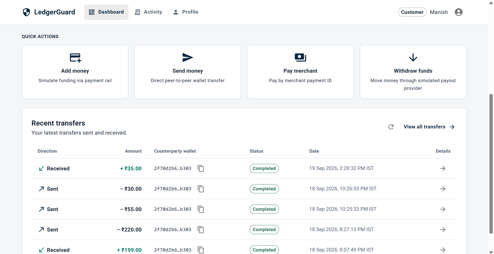
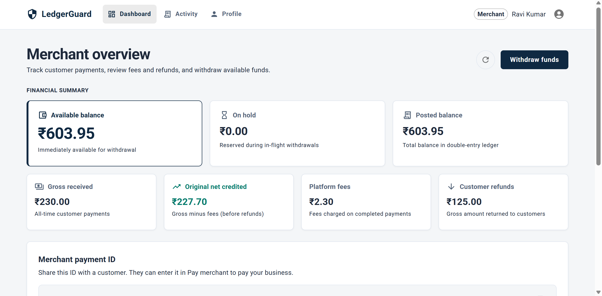
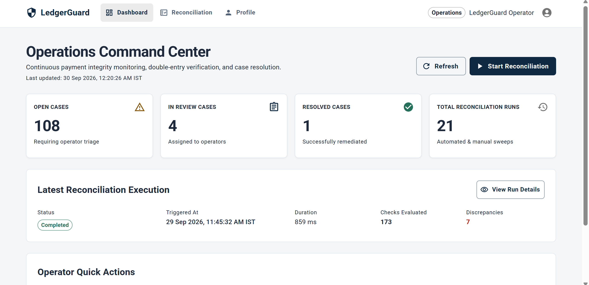
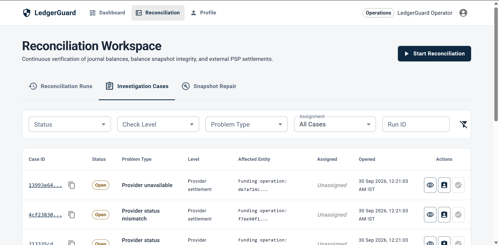
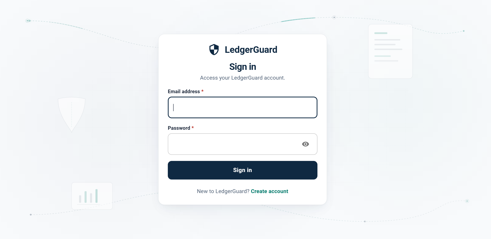
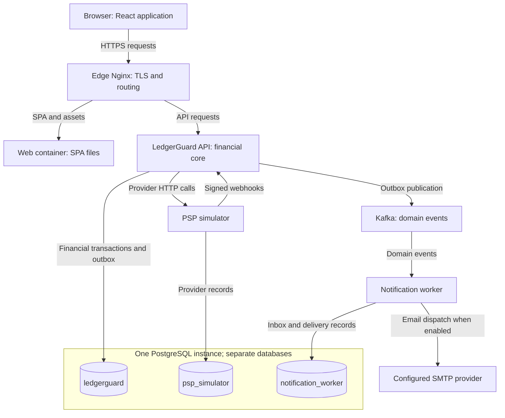
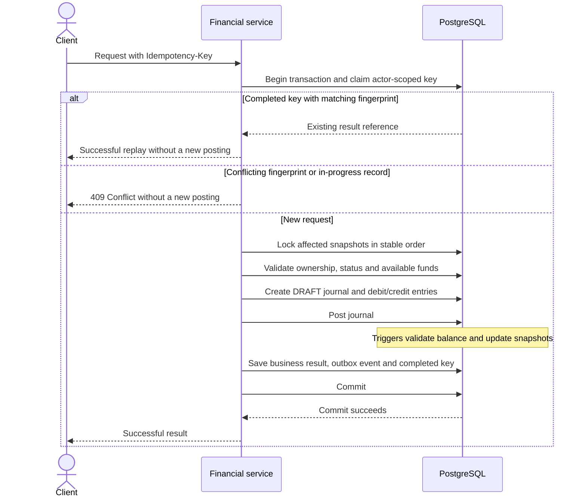
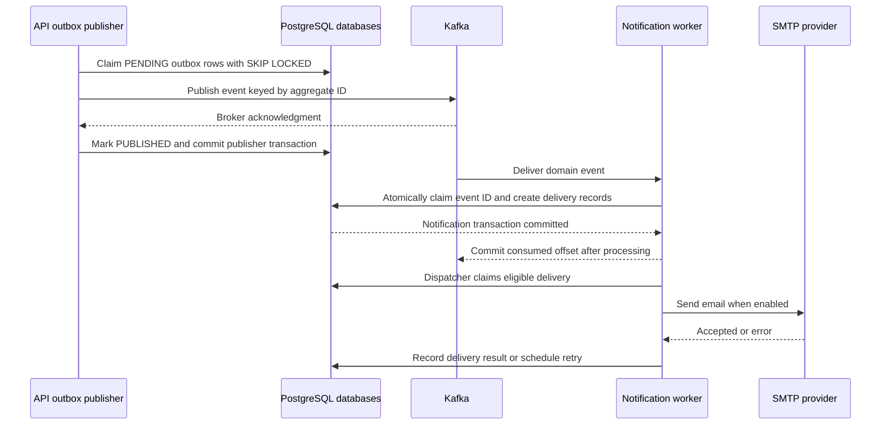
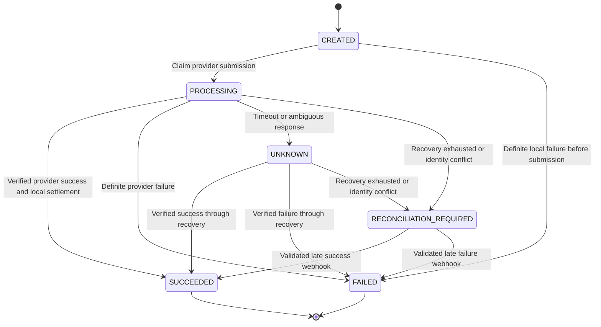

# LedgerGuard — Payment Integrity & Ledger Platform

**LedgerGuard** is a simulated payment and ledger platform with Customer, Merchant and Operations workspaces. It supports wallet funding, peer transfers, merchant payments, partial refunds and payouts, with tools for investigating financial discrepancies.

The Java backend keeps financial posting inside PostgreSQL transactions using a double-entry journal, ordered row locking and request idempotency. A transactional outbox feeds Kafka notifications, while a PSP simulator exercises ambiguous provider outcomes and recovery. **No real money is processed.**

---

## Live Demo

**[Open LedgerGuard](https://ledgerguard.duckdns.org)**

Register a Customer account to explore simulated wallet funding, peer transfers, merchant payments and payouts. Register a Merchant account to receive simulated payments, review fees and issue eligible refunds.

OPS access is operator-managed and is not available through public registration.

All wallet amounts and provider operations are simulated. No real money is processed. Use a unique password that you do not reuse elsewhere.

---

## Quick Navigation

- [Live Demo](#live-demo)
- [Product Tour](#product-tour)
- [Engineering Highlights](#engineering-highlights)
- [Roles and Workflows](#roles-and-workflows)
- [Why This Project Exists](#why-this-project-exists)
- [Core Correctness Guarantees](#core-correctness-guarantees)
- [Architecture](#architecture)
- [Financial Model](#financial-model)
- [Platform Capabilities](#platform-capabilities)
- [Distributed Systems & Reliability](#distributed-systems--reliability-patterns)
- [Security](#security-architecture)
- [Observability](#observability--telemetry)
- [Testing & Failure Lab](#testing--money-integrity-failure-lab)
- [Concurrency Benchmarks](#concurrency-benchmark-results)
- [Disaster Recovery & Runbooks](#disaster-recovery--operational-runbooks)
- [API Documentation](#api--swagger-documentation)
- [Technology Stack](#technology-stack)
- [Local Quickstart](#local-developer-quickstart)
- [Production-Like Docker Startup](#production-like-docker-compose-startup)
- [Repository Documentation](#repository-documentation-index)
- [Portfolio Scope](#portfolio-scope)
- [Current Project Status](#current-project-status)

---

## Engineering Highlights

- **Double-entry ledger:** Integer paise amounts, balanced postings and immutable posted history.
- **Concurrency controls:** Ordered row locks, available-balance checks and durable payout holds.
- **Request and event deduplication:** Database-backed idempotency plus transactional outbox/inbox processing.
- **Ambiguous outcome recovery:** `UNKNOWN != FAILED`; verified provider outcomes drive settlement.
- **Operational investigation:** Three-level reconciliation, case ownership, audit notes and explicit snapshot repair.
- **Verification:** Real PostgreSQL/Kafka integration tests, failure injection and measured transfer contention.

---

## Product Tour

### Customer Workspace

*Customer quick actions for funding, peer transfers, merchant payments and simulated withdrawals, with recent wallet activity.*

### Merchant Workspace

*Customer payment volume, platform fees, merchant net credits, refunds, and available wallet balance.*

### Operations Command Center

*Operations dashboard showing open, in-review and resolved case counts, reconciliation run totals and the latest execution result.*

<strong>More product views</strong>

 

#### Reconciliation Workspace

*Reconciliation investigation view for examining multi-level discrepancy items, operator claim workflows, and audit resolutions.*

#### Authentication & Role-Based Sign-In

*Secure authentication with role-based routing for Customer, Merchant, and OPS accounts.*

---

## Roles and Workflows

| Role | Main Capabilities |
| :--- | :--- |
| **Customer** | Fund a simulated wallet, transfer funds to peers, pay merchants, withdraw funds, and review transaction history |
| **Merchant** | Receive customer payments, inspect gross/fee/net amounts, issue full or partial pro-rata refunds, and request payouts |
| **OPS** | Trigger reconciliation runs, investigate discrepancy cases, claim and resolve cases with audit notes, and repair desynchronized balance snapshots |

---

## Why This Project Exists

The project explores four financial failure modes: concurrent overspending, database/message dual writes, ambiguous provider outcomes and derived-balance drift. Its design keeps core posting in one database transaction and uses durable recovery outside that boundary.

## Core Correctness Guarantees

| Invariant | Enforcement |
| --- | --- |
| Every posted journal has equal debits and credits | PostgreSQL posting triggers validate amounts and journal structure |
| Posted history is append-only during normal application operation | Database immutability triggers; corrections use new journals |
| Concurrent writes respect available funds | Stable snapshot lock ordering and checks that include active holds |
| Retried requests do not repeat financial execution | Actor/operation-scoped idempotency keys and request fingerprints |
| Financial data and events commit together | Outbox insertion inside the financial database transaction |
| Ambiguous provider outcomes do not trigger premature credit or release | Explicit operation states, protected payout holds and verified settlement |

These controls are tested across normal, concurrent and injected-failure scenarios. They are not a proof of correctness for every possible execution or protection against privileged database intervention.

---

## Architecture

### Runtime architecture

The financial core is a **modular monolith**. The web server, PSP simulator and notification worker are separate deployables. The production Compose stack uses one PostgreSQL instance with three logical databases and a single Kafka broker; it is not a high-availability deployment.

```mermaid
flowchart TD
    Browser["Browser: React application"]
    Edge["Edge Nginx: TLS and routing"]
    Web["Web container: SPA files"]
    API["LedgerGuard API: financial core"]
    PSP["PSP simulator"]
    Kafka["Kafka: domain events"]
    Worker["Notification worker"]
    SMTP["Configured SMTP provider"]
    subgraph PostgreSQL["One PostgreSQL instance; separate databases"]
        LedgerDB[("ledgerguard")]
        PSPDB[("psp_simulator")]
        NotificationDB[("notification_worker")]
    end
    Browser -->|HTTPS requests| Edge
    Edge -->|SPA and assets| Web
    Edge -->|API requests| API
    API -->|Financial transactions and outbox| LedgerDB
    API -->|Provider HTTP calls| PSP
    PSP -->|Signed webhooks| API
    PSP -->|Provider records| PSPDB
    API -->|Outbox publication| Kafka
    Kafka -->|Domain events| Worker
    Worker -->|Inbox and delivery records| NotificationDB
    Worker -->|Email dispatch when enabled| SMTP
```

Prometheus scrapes the API over the internal network; Grafana queries Prometheus. Their host ports bind to loopback by default. The Failure Lab runs separately against ephemeral test targets, not the live deployment database. See [architecture details](docs/ARCHITECTURE.md) for component boundaries and operational constraints.

### Atomic transfer and payment posting

This sequence describes synchronous internal transfers and merchant payments. External funding and payouts use separate submission and settlement transactions around provider calls.

```mermaid
sequenceDiagram
    actor Client
    participant API as Financial service
    participant DB as PostgreSQL
    Client->>API: Request with Idempotency-Key
    API->>DB: Begin transaction and claim actor-scoped key
    alt Completed key with matching fingerprint
        DB-->>API: Existing result reference
        API-->>Client: Successful replay without a new posting
    else Conflicting fingerprint or in-progress record
        API-->>Client: 409 Conflict without a new posting
    else New request
        API->>DB: Lock affected snapshots in stable order
        API->>DB: Validate ownership, status and available funds
        API->>DB: Create DRAFT journal and debit/credit entries
        API->>DB: Post journal
        Note over DB: Triggers validate balance and update snapshots
        API->>DB: Save business result, outbox event and completed key
        API->>DB: Commit
        DB-->>API: Commit succeeds
        API-->>Client: Successful result
    end
```

Any validation or posting failure rolls back the new financial transaction. The journal, derived snapshot update, business record and outbox event commit together. Kafka and email delivery are outside this financial commit.

### From committed event to email

```mermaid
sequenceDiagram
    participant Publisher as API outbox publisher
    participant DB as PostgreSQL databases
    participant Kafka
    participant Worker as Notification worker
    participant SMTP as SMTP provider
    Publisher->>DB: Claim PENDING outbox rows with SKIP LOCKED
    Publisher->>Kafka: Publish event keyed by aggregate ID
    Kafka-->>Publisher: Broker acknowledgment
    Publisher->>DB: Mark PUBLISHED and commit publisher transaction
    Kafka->>Worker: Deliver domain event
    Worker->>DB: Atomically claim event ID and create delivery records
    DB-->>Worker: Notification transaction committed
    Worker-->>Kafka: Commit consumed offset after processing
    Worker->>DB: Dispatcher claims eligible delivery
    Worker->>SMTP: Send email when enabled
    SMTP-->>Worker: Accepted or error
    Worker->>DB: Record delivery result or schedule retry
```

The ledger and notification records live in different databases; the shared PostgreSQL participant above is shorthand, not a cross-database transaction. A crash after Kafka acknowledgment but before the publisher database commit can cause an event to be published again. The worker deduplicates event IDs and creates delivery records in one local transaction.

**`PUBLISHED` means Kafka publication, not email delivery.** SMTP acceptance also does not prove arrival in a recipient's inbox. Email delivery uses its own dispatcher, retries and status records; inbox deduplication does not guarantee exactly-once SMTP delivery. The worker provisions the dead-letter topic for events that exhaust listener recovery. Local development uses Mailpit; public email requires a configured SMTP provider.

### Provider outcomes and recovery

The diagram shows the principal recovery paths using actual persisted operation statuses. Validated webhooks and polling can settle in-flight operations; reconciliation case resolution itself does not settle money.

```mermaid
stateDiagram-v2
    [*] --> CREATED
    CREATED --> PROCESSING: Claim provider submission
    CREATED --> FAILED: Definite local failure before submission
    PROCESSING --> SUCCEEDED: Verified provider success and local settlement
    PROCESSING --> FAILED: Definite provider failure
    PROCESSING --> UNKNOWN: Timeout or ambiguous response
    PROCESSING --> RECONCILIATION_REQUIRED: Recovery exhausted or identity conflict
    UNKNOWN --> SUCCEEDED: Verified success through recovery
    UNKNOWN --> FAILED: Verified failure through recovery
    UNKNOWN --> RECONCILIATION_REQUIRED: Recovery exhausted or identity conflict
    RECONCILIATION_REQUIRED --> SUCCEEDED: Validated late success webhook
    RECONCILIATION_REQUIRED --> FAILED: Validated late failure webhook
    SUCCEEDED --> [*]
    FAILED --> [*]
```

| Outcome | Funding | Payout |
| --- | --- | --- |
| Created or processing | No wallet credit until verified success | Funds reserved by an active hold |
| Unknown or reconciliation required | No premature wallet credit | Hold remains active |
| Succeeded | Balanced journal credits the customer | Balanced journal debits the wallet; hold is consumed |
| Failed | No success credit is posted | Hold is released, or was already expired before submission |

HTTP status alone is not sufficient evidence of provider settlement. Responses must satisfy the implemented identity, amount, currency and outcome validation. See [failure and recovery behavior](docs/FAILURE_MODEL.md).

---

## Financial Model

### Account Types & Normal Balances
All balances are calculated and stored in **INR** minor units (paise) as signed 64-bit integers (`BIGINT`), eliminating IEEE 754 floating-point rounding inaccuracies:

| Account Type | Normal Balance | Balance Calculation Formula | Ownership |
| :--- | :--- | :--- | :--- |
| **`CUSTOMER`** | **Credit-Normal** | $\text{balance} = \sum \text{Credits} - \sum \text{Debits}$ | Owned by authenticated User (`owner_user_id`) |
| **`MERCHANT`** | **Credit-Normal** | $\text{balance} = \sum \text{Credits} - \sum \text{Debits}$ | Owned by authenticated User (`owner_user_id`) |
| **`PLATFORM_FEES`** | **Credit-Normal** | $\text{balance} = \sum \text{Credits} - \sum \text{Debits}$ | System account (Platform fee revenue) |
| **`PSP_CLEARING`** | **Debit-Normal** | $\text{balance} = \sum \text{Debits} - \sum \text{Credits}$ | System account (Simulated provider clearing) |
| **`PLATFORM_RESERVE`** | **Debit-Normal** | $\text{balance} = \sum \text{Debits} - \sum \text{Credits}$ | System account (Liquidity buffer) |

### Balance Snapshots & Holds
- **Derived Snapshots**: The `ledger_balance_snapshots` table is maintained as an atomic projection updated by database trigger `trg_journal_transactions_update_snapshots` upon journal posting; authorized repair workflows can also reconstruct the projection from posted journals. Snapshots are fully reconstructible from append-only journal entries.
- **Balance Holds (`balance_holds`)**: Temporary fund reservations that separate spendable capacity from historical ledger balances without mutating journal history:
  $$\text{availableBalance} = \text{postedBalance} - \sum(\text{ACTIVE holds})$$
  Overdraft prevention asserts $\text{availableBalance} \ge \text{requestedAmount}$ before granting financial operations.

---

## Platform Capabilities

- **Internal Peer-to-Peer Transfers**: Generic wallet transfer creation is CUSTOMER -> CUSTOMER only. Transfers to merchants are prohibited (use Pay Merchant / `POST /api/payments`). Merchants retain historical transfer read access. Synchronous money movement with atomic debit/credit journal creation, deterministic row locking, and idempotency deduplication.
- **Merchant Payments**: Simulated checkout payments (`CUSTOMER` to `MERCHANT`) deducting a 100 bps integer platform fee (`PLATFORM_FEES`) in a balanced 3-leg atomic journal.
- **Pro-Rata Payment Refunds**: Synchronous full and partial refunds with telescoping pro-rata fee reversal (`original-payment-pro-rata:v1`), cumulative refund cap enforcement, parent payment serialization (`FOR UPDATE`), and original fee account resolution.
- **External Wallet Funding**: Simulated inbound wallet top-ups via PSP simulator with decoupled non-transactional HTTP calls and confirmed-success double-entry journal posting.
- **External Payouts**: Outbound withdrawals using pre-network balance hold reservations, definite-failure hold releases, and in-flight hold expiration protection.
- **Three-Level Reconciliation Engine**:
  - **Level 1 (Double-Entry Balance)**: Audits all posted journal transactions to detect unbalanced postings or malformed legs.
  - **Level 2 (Snapshot Parity)**: Single-statement MVCC scan comparing cached snapshots against cumulative journal entries.
  - **Level 3 (Provider Reconciliation)**: Reconciles internal funding/payout outcomes against simulated external PSP records without database transaction locks.
- **Discrepancy Detection & Case Review**: Case-scoped snapshot re-derivation under pessimistic lock for `SNAPSHOT_MISMATCH`, and an isolated manual review queue (`reconciliation_cases`) with mandatory audit notes.

---

## Distributed Systems & Reliability Patterns

- **Outbox and inbox:** Durable publication and event-ID deduplication separate financial commits from notification processing; delivery may be repeated across failure boundaries.
- **Provider resilience:** Circuit breaking, concurrency limits and bounded retries wrap simulated provider calls. Network calls execute outside financial database transactions.
- **Status recovery:** Polling and validated webhooks recover authoritative provider outcomes. Unresolved operations enter reconciliation review without rewriting posted journals.
- **Repair scope:** Operators can reconstruct derived snapshots through authorized case workflows. Resolving a review case does not itself settle a funding or payout operation.

See [docs/ARCHITECTURE.md](docs/ARCHITECTURE.md) and [docs/FAILURE_MODEL.md](docs/FAILURE_MODEL.md) for detailed boundaries and recovery paths.

---

## Security Architecture

- **JWT Authentication**: Short-lived HS256 access tokens (15-minute TTL) verified via Nimbus JOSE/JWT. Database-backed validation checks the account is ACTIVE and the token credential version matches the user.
- **Password Recovery & Change**: Eligible Customer and Merchant accounts can request expiring, single-use email reset links; only token hashes are persisted. Authenticated users can change their password by confirming the current password. Successful reset or change invalidates existing access and refresh credentials.
- **Atomic Refresh Token Rotation**: High-entropy opaque refresh tokens stored as SHA-256 hashes in PostgreSQL with a configured maximum lifetime (`expires_at`, default 7 days), delivered via `HttpOnly`, `SameSite=Strict`, `Secure` session-scoped cookies by default (without persistent `Max-Age` or `Expires`), using pessimistic row locking to prevent token reuse races.
- **Role-Based Access Control (RBAC)**: Strict segregation between `ROLE_CUSTOMER`, `ROLE_MERCHANT`, and `ROLE_OPS` enforced via Spring Security `@PreAuthorize`.
- **Token-Bucket Rate Limiting**: Bucket4j and Caffeine caching enforce admission quotas after security authorization:
  - Public Auth: 10 req/min per IP
  - Financial Writes: 20 req/min per authenticated user
  - Operations (OPS): 30 req/min per operator
  - General Authenticated: 50 req/min per user
- **Immutable Audit Trail**: Privileged actions (reconciliation claim, snapshot repair, manual resolution) append to `audit_events` with database triggers prohibiting `UPDATE`, `DELETE`, and `TRUNCATE`.
- **Hardened Security Headers**: Content Security Policy (`default-src 'none'`), HSTS (1 year), and control-character input sanitization (rejecting NUL, CR, LF, and DEL in sensitive payloads).

---

## Observability & Telemetry

- **Prometheus Metric Exposition**: Decoupled-scrape architecture exposing metrics at `/actuator/prometheus`. In-memory atomics sample financial integrity gauges (`unbalanced_journal_count`, `reconciliation_discrepancies`, `outbox_lag_seconds`) every 15s with zero database overhead during scrapes.
- **Pre-Provisioned Grafana Dashboards**:
  - `LedgerGuard Financial Integrity`: Live tracking of posted journal balances, discrepancy queues, outbox publication lag, and idempotency conflicts.
  - `LedgerGuard API Operations`: HTTP throughput by status, latency percentiles, JVM heap/threads, and HikariCP connection pool metrics.
- **Distributed Tracing & W3C Trace Context**: Micrometer Tracing with OpenTelemetry bridge propagates correlation IDs and W3C `traceparent` headers across HTTP ingress, database outbox rows, and Kafka message headers.

---

## Testing & Money Integrity Failure Lab

### Test Suite Baseline

Backend verification completed on 2026-10-04 using Java 21. Totals below were collected from Surefire and Failsafe XML reports across five Maven modules.

| Module | Passing tests |
| --- | ---: |
| LedgerGuard API | 828 |
| PSP simulator | 18 |
| Notification worker | 73 |
| Failure lab | 34 |
| E2E tests | 19 |
| **Backend total** | **972** |

Backend reports contain **0 failures, 0 errors and 0 skipped tests**.

Frontend verification on 2026-10-05 passed **119 tests across 5 test files**, bringing the combined baseline to **1,091 automated tests**.

Frontend lint and the production build passed during password-recovery implementation verification on 2026-10-04.

Historical release and phase-specific figures are preserved separately.

### Money Integrity Failure Lab
A standalone automated chaos testing engine (`backend/failure-lab`) that deliberately injects hostile operating conditions:
1. **`OPPOSING_TRANSFERS`**: Concurrent opposing transfers between identical accounts using thread barriers, verifying deterministic lock ordering and zero lost funds.
2. **`TIMEOUT_AFTER_COMMIT`**: External gateway drops connection after transaction commit, validating that the transaction transitions to `UNKNOWN`, holds remain `ACTIVE`, and status recovery settles the outcome.
3. **`CORRUPTED_SNAPSHOT`**: Deliberate out-of-band balance snapshot drift injection, validating detection by Level 2 reconciliation and case-scoped repair from immutable journals.
4. **`WEBHOOK_RACE`**: 5 concurrent duplicate HMAC-SHA256 signed webhooks, validating database deduplication and single economic effect.

The independent `FinancialInvariantOracle` verifies posted journal structure, per-journal and global debit/credit equality, reconstructed snapshot parity and available-balance consistency. Internal-transfer scenarios also check conservation across the two participating wallets:

$$B_{A,final} + B_{B,final} = B_{A,opening} + B_{B,opening}$$

This wallet-scoped equation must not be interpreted as a sum of every account's normal balance: customer and merchant accounts are credit-normal, while clearing and reserve accounts are debit-normal.

---

## Concurrency Benchmark Results

These Phase 39 measurements exercised `TransferService.createTransfer()` and PostgreSQL 17 directly. They are **service/database benchmarks, not public HTTP throughput measurements**.

| Measurement | Result |
| --- | --- |
| Workloads | Disjoint accounts, shared destination and opposing transfers |
| Successful measured transfers | 8,100; warmup excluded |
| Concurrency range | 1–50 threads |
| HikariCP pool sizes compared | 5, 10, 15 and 20 |
| Hot-account contention | Pools above 10 increased p95 latency by approximately 33% without a throughput gain in the measured workload |
| Retained default pool size | 10 |
| Observed deadlocks / transaction errors / connection timeouts | 0 / 0 / 0 |

The financial oracle checked journal balance, snapshot parity and participating-wallet conservation after each run. These results describe the tested environment, not a general capacity guarantee. See [docs/BENCHMARKS.md](docs/BENCHMARKS.md) for methodology and detailed results.

---

## Disaster Recovery & Operational Runbooks

Comprehensive disaster recovery procedures and automation scripts are established in Phase 40:
- **Logical Backup Automation (`scripts/backup-db.sh`)**: Generates compressed PostgreSQL custom-format archives (`pg_dump -Fc --no-owner --no-privileges`) with automated SHA-256 sidecar checksums and pre-success table-of-contents validation.
- **Verified Database Cutover (`scripts/restore-db.sh`)**: Restores into isolated recovery targets, verifies role ownership (`ledgerguard_app`), and runs an automated Mode A financial invariant verification suite before traffic cutover.
- **Mode A Invariant Verification**: Validates 21 required schema tables, Flyway history (API migrations V1..V20), zero-sum double-entry balance, snapshot parity against normal balance rules, trigger enablement, and outbox trace integrity.
- Detailed operational runbooks, Kafka lag remediation, and incident response checklists are documented in [docs/RUNBOOKS.md](docs/RUNBOOKS.md).

---

## API & Swagger Documentation

LedgerGuard exposes **34 authoritative REST operations** across 9 controllers, documented with OpenAPI 3.1:

- **Interactive Swagger UI (Runtime)**: [http://localhost:8080/swagger-ui/index.html](http://localhost:8080/swagger-ui/index.html)
- **Live OpenAPI 3.1 JSON (Runtime)**: [http://localhost:8080/v3/api-docs](http://localhost:8080/v3/api-docs)
- **Authoritative Repository Specification Export**: [`docs/openapi.json`](docs/openapi.json)
- **Comprehensive Markdown API Specification**: [`docs/API.md`](docs/API.md)

### API domains

| Domain | Capabilities | Access |
| --- | --- | --- |
| Authentication | Register, login, rotate refresh tokens, logout, identity, email password recovery and password change | Public registration/login/recovery; authenticated identity and password change |
| Wallets and transfers | Own wallet, customer peer transfers and participant history | Customer / Merchant, with operation-specific restrictions |
| Payments and refunds | Merchant payments, role-scoped totals, details and refunds | Customers pay; authorized merchants refund |
| Funding and payouts | Simulated provider operations and owner-scoped status | Customer funding; Customer / Merchant payouts |
| Provider webhooks | Receive validated provider outcomes | HMAC-authenticated provider messages |
| Reconciliation | Runs, discrepancy investigation and case-scoped repair | OPS only |

The complete method/path inventory, request examples and error contracts are in [docs/API.md](docs/API.md). Swagger URLs above are local development access points, not a claim that public Swagger is exposed.

---

## Technology Stack

- **Backend Runtime**: Java 21 LTS (OpenJDK Temurin)
- **Application Framework**: Spring Boot 4.1.1 (Spring Framework 7.0.9)
- **Security & Identity**: Spring Security, Nimbus JOSE/JWT (HS256), BCrypt
- **API Documentation**: Springdoc OpenAPI 3.1.1 (`springdoc-openapi-starter-webmvc-ui`)
- **Database & Persistence**: PostgreSQL 17.11, Spring Data JPA / Hibernate, Flyway Migration Engine (API migrations V1–V20)
- **Messaging Spine**: Apache Kafka 4.3.1 (KRaft mode, no ZooKeeper)
- **Fault Tolerance**: Resilience4j 2.4.0 (CircuitBreaker, Bulkhead, Retry)
- **Rate Limiting**: Bucket4j 8.19.0, Caffeine 3.x
- **Observability**: Micrometer, Prometheus 3.2.1, Grafana 11.5.2, OpenTelemetry Tracing
- **Web Frontend**: React 19, TypeScript 5.7, Vite 8, Material UI 9, TanStack Query, React Hook Form
- **Edge Proxy**: Nginx 1.27 unprivileged Alpine (TLSv1.2/1.3 termination, rate limiting, static asset caching)
- **Testing & Quality**: JUnit 5, Testcontainers 2.0.5, Mockito, ArchUnit, Maven Failsafe, Vitest

---

## Local Developer Quickstart

### Prerequisites

- Java 21 and the included Maven wrapper.
- Docker Engine and Docker Compose.
- Node.js 24 and npm.
- Commands below use Windows PowerShell from the repository root.

### 1. Configure local environment values

Copy the template only if `.env` does not already exist:

    if (-not (Test-Path .env)) { Copy-Item .env.example .env }

Edit `.env` locally. Fill `POSTGRES_PASSWORD`, `LEDGERGUARD_DB_PASSWORD`, `PSP_DB_PASSWORD`, `NOTIFICATION_DB_PASSWORD`, `GRAFANA_ADMIN_PASSWORD`, `LEDGERGUARD_JWT_SECRET` (at least 32 bytes) and `PSP_WEBHOOK_SECRET`.

Retain the default database usernames, ports and Mailpit settings for this quickstart. Never commit `.env`.

Compose reads `.env` automatically. Maven-launched services need the same values in their process environment. Run this loader in each backend-service terminal:

    Get-Content .env -Encoding UTF8 | ForEach-Object {
        if ($_ -match '^\s*([A-Za-z_][A-Za-z0-9_]*)=(.*)$') {
            [Environment]::SetEnvironmentVariable(
                $matches[1], $matches[2],
                [EnvironmentVariableTarget]::Process
            )
        }
    }

The loader supports plain, unquoted `KEY=value` entries. It treats values literally and does not execute file content.

### 2. Start local infrastructure

    docker compose config --quiet
    docker compose up -d
    docker compose ps

This starts PostgreSQL, Kafka, Prometheus, Grafana and Mailpit. Wait for PostgreSQL and Kafka readiness before starting the Java services.

Existing database volumes retain their initialized credentials; editing `.env` does not change existing database passwords.

### 3. Verify the backend

With Docker running:

    .\mvnw.cmd -B -ntp clean verify

### 4. Start the backend services

Use three separate PowerShell terminals at the repository root. Run the environment loader from step 1 in each terminal first.

**API terminal:**

    .\mvnw.cmd -pl backend/ledgerguard-api spring-boot:run "-Dspring-boot.run.profiles=dev"

**PSP simulator terminal:**

    .\mvnw.cmd -pl backend/psp-simulator spring-boot:run

**Notification worker terminal:**

    .\mvnw.cmd -pl backend/notification-worker spring-boot:run

The API development profile supports local HTTP cookies and the frontend origin. The PSP simulator handles simulated provider operations; the worker consumes domain events and sends local email through Mailpit.

### 5. Start the frontend

In another PowerShell terminal at the repository root:

    npm.cmd --prefix frontend/ledgerguard-web ci
    npm.cmd --prefix frontend/ledgerguard-web test -- --run
    npm.cmd --prefix frontend/ledgerguard-web run dev

### Local access points

| Component | URL |
| --- | --- |
| Web application | http://localhost:5173 |
| API Swagger UI | http://localhost:8080/swagger-ui/index.html |
| OpenAPI JSON | http://localhost:8080/v3/api-docs |
| Mailpit inbox | http://localhost:8025 |
| Grafana | http://localhost:3000 |
| Prometheus | http://localhost:9090 |

Register Customer and Merchant accounts through the application. For OPS provisioning, see [docs/RUNBOOKS.md](docs/RUNBOOKS.md).

Stop application processes with `Ctrl+C`. Stop infrastructure with `docker compose down`; retain database volumes to preserve local data.

---

## Production-Like Docker Compose Startup

This procedure tests the production Compose stack locally. Public deployment requires a hostname, trusted TLS certificates, renewal automation, backups and deployment-specific configuration.

### 1. Prepare a separate environment file

From the repository root in Windows PowerShell:

    if (-not (Test-Path .env.prod)) { Copy-Item .env.prod.example .env.prod }

Fill all required database passwords, the Grafana password, JWT signing secret and shared PSP webhook secret in `.env.prod`. Use high-entropy secrets and keep the file private. Both `.env` and `.env.prod` are ignored by Git.

Keep notification email disabled until an SMTP provider is configured. Enabling it also requires valid sender credentials and appropriate TLS settings.

### 2. Prepare local TLS certificates

The edge proxy expects `server.crt` and `server.key` in `infrastructure/nginx/certs`. Create the directory first:

    New-Item -ItemType Directory -Force infrastructure/nginx/certs | Out-Null

With OpenSSL installed, generate a self-signed certificate for local testing only. Do not overwrite an existing certificate or key:

    if ((Test-Path infrastructure/nginx/certs/server.key) -or (Test-Path infrastructure/nginx/certs/server.crt)) { throw "Existing TLS files found. Inspect them before proceeding." }
    openssl req -x509 -nodes -days 365 -newkey rsa:2048 -keyout infrastructure/nginx/certs/server.key -out infrastructure/nginx/certs/server.crt -subj "/CN=localhost" -addext "subjectAltName=DNS:localhost,IP:127.0.0.1"

Self-signed certificates cause browser trust warnings. Use a trusted certificate for the public demo.

Nginx runs as an unprivileged user. The mounted certificate and key must be readable inside the container. On Linux, grant narrowly scoped access to the container user/group; do not make the private key world-readable.

### 3. Validate, build and start

Run this on your local machine. Do not run it against the live deployment without its deployment-specific overrides.

    docker compose --project-name ledgerguard-local-prod --env-file .env.prod -f docker-compose.prod.yml config --quiet
    docker compose --project-name ledgerguard-local-prod --env-file .env.prod -f docker-compose.prod.yml up -d --build --wait --wait-timeout 300
    docker compose --project-name ledgerguard-local-prod --env-file .env.prod -f docker-compose.prod.yml ps

The stack contains 9 services. Services with health checks should become healthy; services without health checks should remain running. Inspect logs if startup fails.

Stop other local stacks that occupy the same host ports before starting this stack.

### Local access points

| Component | URL |
| --- | --- |
| HTTPS web application | https://localhost/ |
| API through edge proxy | https://localhost/api/ |
| Prometheus (loopback only) | http://127.0.0.1:9090/ |
| Grafana (loopback only) | http://127.0.0.1:3000/ |

### Stop the local stack

    docker compose --project-name ledgerguard-local-prod --env-file .env.prod -f docker-compose.prod.yml down

This retains named volumes. Keep backups before deleting volumes or changing initialized database credentials.

For operational procedures and OPS provisioning, see [docs/RUNBOOKS.md](docs/RUNBOOKS.md). The live Oracle deployment uses external configuration and trusted TLS; this local procedure does not reproduce those server-specific settings.

---

## Repository Documentation Index

| Document | Purpose |
| :--- | :--- |
| [`docs/ARCHITECTURE.md`](docs/ARCHITECTURE.md) | Deep system architecture, domain modularization, and sequence models |
| [`docs/API.md`](docs/API.md) | Comprehensive API specification, error catalogs, and payload schemas |
| [`docs/openapi.json`](docs/openapi.json) | Exported OpenAPI 3.1 specification for all 34 REST operations |
| [`docs/RUNBOOKS.md`](docs/RUNBOOKS.md) | Disaster recovery, point-in-time restore, cutover drills, and operations |
| [`docs/BENCHMARKS.md`](docs/BENCHMARKS.md) | Concurrency contention analysis, pool sizing, and performance reports |
| [`docs/BUILD_PLAN.md`](docs/BUILD_PLAN.md) | Authoritative 45-phase development constitution (Phases 0–44) |
| [`docs/DOMAIN_MODEL.md`](docs/DOMAIN_MODEL.md) | Entity relationships, mathematical invariants, and ER diagrams |
| [`docs/FAILURE_MODEL.md`](docs/FAILURE_MODEL.md) | Distributed failure matrix, timeout handling, and mitigations |
| [`docs/SECURITY.md`](docs/SECURITY.md) | Threat modeling, cryptographic standards, and RBAC policies |
| [`docs/TESTING.md`](docs/TESTING.md) | Testing taxonomy, testcontainers architecture, and failure lab |
| [`docs/STATUS.md`](docs/STATUS.md) | Real-time project phase execution tracker and historical milestones |
| [`docs/adr/`](docs/adr/) | Architecture Decision Records (ADRs 001–011) |

---

## Portfolio Scope

LedgerGuard is a portfolio and educational financial-infrastructure system. It operates entirely through simulated financial workflows, using simulated financial-provider integrations, and is not intended to process real money. The project models production-oriented transactional patterns, double-entry bookkeeping, failure recovery, and reconciliation in a controlled environment.

---

## Current Project Status

| Item | Verified snapshot |
| --- | --- |
| Public demo | https://ledgerguard.duckdns.org; simulated money only |
| Deployed API and frontend | `bff0b027dfd03deb61df74d6bd7756fad631f4be` — password recovery and secure password change |
| Deployed notification worker | `5ba057c2461617ec29b827552c100903b39f7149` |
| API database migrations | V1 through V20; V20 applied successfully on the live deployment |
| Backend verification | 2026-10-04: 972 tests; zero failures, errors or skips |
| Frontend verification | 2026-10-05: 119 passing tests across 5 test files |
| Combined test baseline | 1,091 automated tests |
| CI and CodeQL | Passed for password-recovery feature commit `d823adf6c362669add3861ac736e0d611692fe21`, merged through PR #100 |
| Published release | `v1.1.0` remains the preserved 2026-09-30 release baseline |
| Live checks | 2026-10-05 IST: operator-confirmed reset email delivery, password reset/change, old-password rejection, used-link rejection, merchant payment/email delivery and OPS dashboard access |
| Upgrade backup | Pre-upgrade database archive passed table-of-contents inspection and SHA-256 verification; this archive was not restore-tested during the upgrade |
| Operational safeguards | Certificate renewal and daily backups configured; an earlier isolated restoration and off-server backup copy were verified |
| Limitations | Single VM; monitoring and regular off-server backup copies remain operator responsibilities |

Password recovery uses expiring, single-use email links. Successful password reset or change invalidates existing access and refresh credentials.

Repository revisions, deployed component revisions and historical release records are recorded separately. Historical verification figures remain in [docs/STATUS.md](docs/STATUS.md) and [docs/TESTING.md](docs/TESTING.md).
