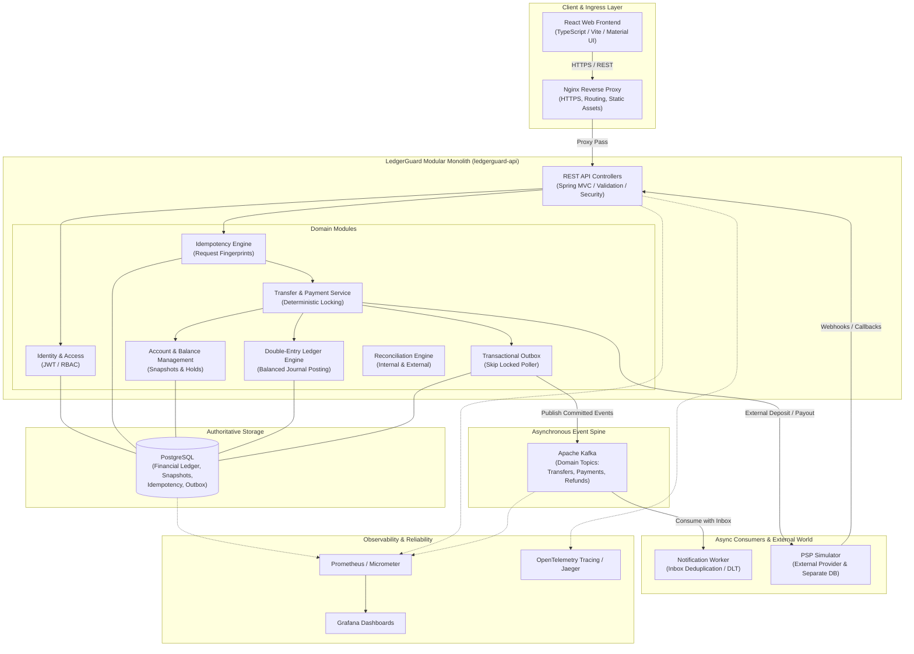

# LedgerGuard Architecture Specification

## 1. Goals & Non-Goals

### Goals
- **Correctness First**: Ensure financial invariants hold under all operating conditions (no lost funds, no unbacked balances, no ghost debits/credits).
- **Immutable Double-Entry Ledger**: Every financial event maps to balanced debit and credit entries with immutable journal history.
- **ACID Transactional Consistency**: Localize multi-account balance checks, debit/credit creation, hold adjustments, and outbox insertion inside a single PostgreSQL transaction.
- **Concurrency Resilience**: Guarantee safety under concurrent requests and opposing transfers using deterministic row locking.
- **Authoritative Idempotency**: Provide atomic request deduplication at the database boundary to guarantee at-most-once execution for financial operations.
- **Asynchronous Reliability**: Publish domain events reliably using the Transactional Outbox pattern with `FOR UPDATE SKIP LOCKED` and process via idempotent consumers.
- **Ambiguity-Aware Integration**: Handle external Payment Service Provider (PSP) and banking timeouts, duplicate webhooks, and out-of-order deliveries through explicit state machines and reconciliation.
- **Automated Verification**: Prove money conservation via the Money Integrity Failure Lab.

### Non-Goals
- **Not a Real-Money Gateway**: The platform is an educational and portfolio demonstration system; it will not integrate with live banking rails or live merchant APIs.
- **No Foreign Exchange (FX) Conversion**: Demonstration operations execute within a single currency context (defaulting to INR in minor units / paise).
- **No Distributed Transactions (2PC/Sagas) for Core Ledgering**: Core money movement is intentionally unified inside a modular monolith to preserve local ACID guarantees.
- **No Early Sharding or Microservice Splitting**: Architectural simplicity is prioritized over premature horizontal partitioning.

---

## 2. System Architecture Diagram



---

## 3. Main Deployables

1. **`ledgerguard-api`**:
   - Primary Spring Boot modular monolith.
   - Contains all financial boundaries: Ledger, Accounts, Transfers, Payments, Refunds, Holds, Outbox, Reconciliation, Identity, and Audit.
   - Authoritative for PostgreSQL transactions.

2. **`psp-simulator`**:
   - Independent Spring Boot service with its own dedicated PostgreSQL instance.
   - Simulates external banking behavior: variable network latency, pre-processing failures, post-commit dropouts, duplicate webhooks, out-of-order callbacks, and manual capture states.

3. **`notification-worker`**:
   - Standalone background consumer application listening to Kafka topics.
   - Implements consumer-side inbox pattern for idempotency, exponential backoff retries, and dead-letter topic (DLT) routing.

4. **`ledgerguard-web`**:
   - Single-Page Application (SPA) built with React 18, TypeScript, Vite, TanStack Query, and Material UI.
   - Features customer portals (wallet balance, transfers, payment checkout, ledger drilldown) and operational consoles (system health, outbox monitoring, reconciliation viewer, Failure Lab runner).

5. **`failure-lab`**:
   - Standalone resilience test framework and execution harness.
   - Injects orchestrated chaos (concurrent race conditions, network cuts, worker kills, corrupted balance snapshot injections) and validates financial invariants.

---

## 4. PostgreSQL Financial Authority

- **Single Source of Truth**: PostgreSQL is the authoritative system of record for all account balances, journal entries, holds, and state transitions. Immutable POSTED journal transactions and entries represent the sole authoritative financial history.
- **No JPA Schema Mutations in Production**: Flyway migrations strictly manage schema evolutions; Hibernate is configured with `ddl-auto=validate`.
- **ACID Transaction Boundary**: Every transfer, financial posting, or wallet provisioning event executes inside a single database transaction with appropriate isolation levels (Read Committed / Serializable where required).
- **Derived Balance Snapshots**: The `ledger_balance_snapshots` table acts as a read-optimized, transactionally maintained derived projection (updated atomically via PostgreSQL database triggers on `DRAFT -> POSTED` transition), fully reconstructible and verifiable against the append-only `journal_entries` table.
- **Wallet Projection**: Wallets are application-facing domain projections over owned `ledger_accounts` and their corresponding `ledger_balance_snapshots` without a redundant persistent `wallets` table.
- **PostgreSQL-Backed Idempotency**: Financial write operations coordinate via `idempotency_records` using unique scope `(actor_user_id, operation, idempotency_key)` and deterministic SHA-256 request fingerprints. First callers atomically claim slots via `INSERT ... ON CONFLICT DO NOTHING` inside `@Transactional REQUIRED` boundaries, committing slot completion alongside financial mutations in a single atomic database transaction. Completed records are trigger-enforced immutable.
- **Deterministic Pessimistic Row Locking & Overdraft Prevention**: Internal transfers and merchant payments acquire pessimistic write locks (`SELECT ... FOR UPDATE` via `PESSIMISTIC_WRITE`) on all participating `ledger_balance_snapshots` rows strictly in global `ORDER BY ledger_account_id ASC`. Sufficient funds is validated against the locked customer row inside the transaction before invoking `LedgerPostingService`. Insufficient funds throws `InsufficientFundsException` (HTTP 409 `INSUFFICIENT_FUNDS`), rolling back the transaction and leaving the idempotency key unpoisoned for future retries after funding. Generic `LedgerPostingService` remains a generic accounting primitive allowing debits, while domain services (`TransferService`, `PaymentService`) enforce overdraft prevention. No JVM locks or distributed locks are used.
- **Merchant Payments Domain Architecture**: Customer-to-merchant commercial transactions represent synchronous internal payments orchestrated by `PaymentService`. Payments map to immutable `Payment` records with explicit lifecycle state machine (`CREATED -> PROCESSING -> SUCCEEDED / FAILED`), backed by multi-line balanced double-entry journal transactions (`DEBIT customer gross`, `CREDIT merchant net`, `CREDIT platform_fees fee`). Platform fee is calculated via integer arithmetic at 100 basis points with floor rounding (zero floating point). Up to 3 snapshot rows (customer, merchant, platform fee) are locked in a single deterministic query. Successful payments link to the `POSTED` journal transaction, update snapshots, and complete the idempotency slot (`merchant-payment:v1`) in one single ACID transaction.
- **Payment Refund Domain Architecture (Phase 14)**: Full and partial refunds are executed synchronously by `RefundService`. Refunds produce immutable `Refund` business records and new compensating double-entry journal transactions (`CREDIT customer refundAmount`, `DEBIT merchant merchantDebitAmount`, `DEBIT platform_fees feeDebitAmount`). The original `Payment` and original `journal_transaction` remain strictly immutable and in `SUCCEEDED`/`POSTED` status. Concurrency control locks the parent `Payment` row `FOR UPDATE` before evaluating cumulative refunds; cumulative cap $\sum \text{Refunds} \le \text{grossAmountMinor}$ is enforced by both application logic and PostgreSQL trigger. Telescoping pro-rata fee reversal (`original-payment-pro-rata:v1`) computes exact integer allocations without rounding drift. Original platform fee account is resolved directly from the original payment journal. Participating snapshot rows (customer, merchant if debit > 0, fee account if fee debit > 0) are locked in global `ORDER BY ledger_account_id ASC FOR UPDATE`. The entire refund commits atomically with the idempotency slot (`payment-refund:v1`) in one single ACID transaction.
- **Balance Holds & Available-Balance Architecture (Phase 15)**: Implements temporary fund reservations (`balance_holds`) that separate immutable posted ledger history from spendable capacity without altering double-entry journals or snapshots. Hold capacity is enforced at the database trigger level (`V8__create_balance_holds.sql`) and application layer by locking the parent snapshot row `FOR UPDATE` and asserting $\sum \text{ACTIVE holds} + \text{newAmount} \le \text{postedBalance}$. Available balance is derived on-the-fly ($\text{availableBalance} = \text{postedBalance} - \sum \text{ACTIVE holds}$) and never stored in a separate table. Spending operations (`TransferService`, `PaymentService`) lock snapshots and validate against Available Balance. Hold lifecycle transitions (`ACTIVE -> CONSUMED`, `ACTIVE -> RELEASED`, `ACTIVE -> EXPIRED`) are strictly controlled and terminal states are immutable. Multi-instance safe background expiration (`HoldExpirationService`) transitions due holds with `expires_at <= now` to `EXPIRED`. Refund operations continue to debit merchant balances directly, allowing valid negative available balances when liabilities exceed unreserved funds.
- **Transactional Outbox Persistence Architecture (Phase 16)**: Implements the transactional outbox persistence foundation (`outbox_events` table created in `V9__create_outbox_events.sql`) to eliminate the dual-write problem. When a financial business operation completes successfully, its domain event intent (`TRANSFER_COMPLETED`, `PAYMENT_SUCCEEDED`, `REFUND_COMPLETED`) is appended to `outbox_events` within the *exact same PostgreSQL database transaction* via `OutboxService` (`Propagation.MANDATORY`). If the business transaction rolls back for any reason, the outbox event rolls back atomically. Direct insert of `PUBLISHED` events is prohibited by database trigger; events start in `PENDING` status with `published_at NULL`. Event content and identity fields are immutable, and `PENDING` events cannot be deleted. Outbox rows are indexed via partial index `idx_outbox_events_pending_created` on `(created_at, id) WHERE status = 'PENDING'`. Outbox events represent integration/delivery intent and are not event sourcing or the financial source of truth. Phase 16 persists events only; Kafka publishing is strictly deferred to Phase 17.

---

## 5. Modular Monolith Financial Core

To eliminate the hazards of distributed two-phase commits across microservice boundaries, the core financial modules reside inside a single deployable (`ledgerguard-api`):
- Modules communicate via explicit, strongly-typed internal Java domain interfaces and application services.
- Data structures are encapsulated per module.
- Package structures follow a feature-first approach (`account`, `ledger`, `transfer`, `payment`, `outbox`, etc.) divided into `api`, `application`, `domain`, and `infrastructure` layers.

---

## 6. External PSP Boundary & Asynchronous Kafka Architecture

- **Separation of External Calls**: External PSP HTTP calls are never executed while holding open a database row lock or active transaction.
- **Outbox Pattern**: Changes to financial state and outbox event records are committed together in one atomic PostgreSQL transaction.
- **Outbox Publisher**: An asynchronous poller claims pending outbox events using `SELECT ... FOR UPDATE SKIP LOCKED` and publishes them to Apache Kafka.
- **Consumer Deduplication**: The `notification-worker` consumes domain events with database-backed inbox deduplication to guarantee safe duplicate delivery handling.

---

## 7. External PSP & Banking Simulator Architecture (Phase 19)

- **Standalone Service Boundary**: `psp-simulator` is an independent Spring Boot application with its own dedicated PostgreSQL database (`psp_simulator`) and Flyway migration stream (`V1__create_provider_simulator_tables.sql`).
- **Zero Direct LedgerGuard State Mutation**: The simulator does not access or mutate LedgerGuard financial state, accounts, journals, holds, or outbox tables.
- **Provider Operation Persistence**: Authoritative provider operation state is stored in `provider_operations` with unique `client_operation_id`, exact integer minor units (`amount_minor BIGINT`), strict enum constraints (`CREDIT`, `DEBIT`), and minimal status model (`SUCCEEDED`).
- **Atomic Idempotency & Conflict Semantics**: First-time operation requests claim slots via `INSERT INTO provider_operations ... ON CONFLICT (client_operation_id) DO NOTHING`. Replay with identical parameters returns `200 OK` and the existing operation. Conflicting replays with altered amount, currency, or operation type are rejected with `409 Conflict`.
- **In-Memory Scenario Control Plane**: Test scenarios are injected per-`clientOperationId` via `PUT /api/simulator/scenarios/{clientOperationId}` into a thread-safe `ScenarioRegistry` (cleared upon successful scenario execution or application restart).
- **Deterministic Fault Injection Modes**:
  - `NORMAL_SUCCESS`: Operation persists as `SUCCEEDED`, returns `201 Created`, schedules 1 webhook at `now()`.
  - `TIMEOUT_AFTER_SUCCESS`: Operation commits as `SUCCEEDED` to the database *before* a deliberate post-commit controller delay causes client-side timeout. Status recovery endpoint confirms durable success.
  - `DELAYED_WEBHOOK`: Operation returns `201 Created` immediately; webhook delivery is scheduled for `now() + delayMs`.
  - `DUPLICATE_WEBHOOK`: Exactly 1 logical event ID is generated, stored across 2 delivery rows (`delivery_number` 1 and 2), and dispatched twice to test downstream idempotency.
  - `TEMPORARY_500`: Returns HTTP 500 for $N$ configured attempts without creating database records. Subsequent retry succeeds normally.
- **Asynchronous Webhook Dispatcher**: Background `@Scheduled` worker claims due webhooks via `SELECT ... FROM provider_webhooks WHERE status = 'SCHEDULED' AND scheduled_at <= :now ORDER BY scheduled_at, id FOR UPDATE SKIP LOCKED LIMIT :batchSize` and dispatches them via Spring `RestClient`. Webhook delivery failures update webhook status to `FAILED` without affecting provider operation success.

---

## 8. Reconciliation Architecture

LedgerGuard defines a three-tier reconciliation architecture:
1. **Journal Invariant Reconciliation**: Scans all posted journal transactions to ensure $\sum \text{Debits} = \sum \text{Credits}$ across the entire ledger.
2. **Balance Snapshot Reconciliation**: Recalculates historical balances by summing immutable journal entries from the beginning of time (or latest audited checkpoint) and asserts identity with `account_balances`.
3. **External Provider Reconciliation**: Ingests external settlement reports from the PSP simulator and reconciles them against internal `payments`, `funding_operations`, and `payouts` to resolve `UNKNOWN` or pending transactions.

---

## 8. Observability Architecture

- **Metrics**: Micrometer instruments application metrics exposed to Prometheus (unbalanced transaction count, outbox queue lag, duplicate idempotency keys, state transition rejections, lock wait durations).
- **Dashboards**: Grafana visualizes financial integrity KPIs, system throughput, and queue health.
- **Distributed Tracing**: OpenTelemetry traces request lifecycles from HTTP ingress through database transactions, outbox publication, Kafka brokering, and notification worker consumption via correlation IDs.
- **Structured Logging**: JSON-formatted logs containing correlation IDs, tenant/client IDs, and operation IDs without logging sensitive financial credentials.

---

## 9. Horizontal Scaling & Deferred Sharding

- **Stateless Monolith Instances**: Multiple instances of `ledgerguard-api` can run concurrently behind the Nginx reverse proxy.
- **Database-Enforced Safety**: Concurrency control relies on PostgreSQL row locks (ordered by account ID) and unique database constraints, never on single-JVM locks (`synchronized` / `ReentrantLock`).
- **Deferred Sharding**: Database sharding is intentionally deferred (ADR-011) until scale necessitates cross-partition settlement mechanisms.

---

## 10. Explicitly Excluded Technologies

To maintain focus on correctness and avoid resume-driven architecture, the following are strictly excluded:
- Kubernetes, Service Mesh, Eureka, Spring Cloud Gateway
- MongoDB, Cassandra, Elasticsearch, RabbitMQ
- GraphQL, gRPC, Keycloak, Spark, Flink
- Blockchain, Distributed SAGAs across artificial microservices
- Full Event Sourcing frameworks (the ledger itself is the event log)
- Redis used merely for transient caching or non-authoritative locking

---

---

## 11. Frontend Financial Experience Architecture

- **Server-Authoritative State**: No client-side optimistic balance calculations or optimistic transfer history insertions. All balance and transaction states are invalidated and refetched from server read endpoints upon confirmed mutation success.
- **Financial Precision Invariants**:
  - Minor-unit amounts and balances are serialized as decimal JSON strings (`"10000"`), preventing precision truncation from JavaScript 64-bit float conversions.
  - Client-side INR human inputs are parsed into minor units using exact string decomposition and `BigInt` (no `parseFloat`, `Math.round`, or floating multiplication).
  - Minor units are formatted back to display INR using `BigInt` and Indian numbering notation (`₹1,23,456.78`).
- **Idempotency Lifecycle in Browser**:
  - Client generates `Idempotency-Key` via `crypto.randomUUID()`.
  - For ambiguous network errors or timeouts on unchanged destination/amount payloads, the form reuses the same idempotency key to prevent double-charging.
  - Any edit to destination or amount invalidates the key and assigns a new key.
  - Confirmed mutation results reset the form and allocate a fresh key.
- **Double-Submit Prevention & Mutation Configuration**:
  - React mutations disable submit buttons with `isPending` spinners and configure `retry: false` to avoid silent automatic retries.

---

## 12. Architectural Invariants

1. **Balance Equation**: $\text{Available Balance} = \text{Posted Balance} - \text{Active Holds}$.
2. **Double-Entry Balance**: For every transaction $T$, $\sum_{e \in T} \text{Debit}(e) = \sum_{e \in T} \text{Credit}(e)$.
3. **Immutability**: Once written, rows in `journal_transactions`, `journal_entries`, and completed `funding_operations` cannot be updated or deleted.
4. **Deterministic Lock Ordering**: When locking multiple accounts, acquire locks in ascending lexicographical or numerical order of account IDs to prevent circular-wait deadlocks between opposing transfers.
5. **No Floating Point**: All monetary values are represented as `Money(Currency, long minorUnits)` on backend, and decimal strings / `BigInt` on frontend.

---

## 13. External Wallet Funding & Settlement Architecture (Phase 20)

- **Decoupled Three-Phase Pipeline**:
  1. `FundingCreationService` (`@Transactional`): Atomically registers the idempotency record and commits a durable `FundingOperation` row in `PROCESSING` status.
  2. `PspClient` (Non-transactional): Makes the external HTTP POST to the PSP simulator using `FundingOperation.id` as the stable `clientOperationId`. Zero database connections or locks are held across this network call.
  3. `FundingSettlementService` (`@Transactional`): Locks the `FundingOperation` row (`FOR UPDATE`), validates the PSP response identity and amount integrity, acquires deterministic snapshot row locks, posts a balanced double-entry journal transaction (DEBIT system `PSP_CLEARING` account, CREDIT customer wallet account), and marks `FundingOperation` as `SUCCEEDED`.
- **Authoritative Provider Invariant**: External funds enter the LedgerGuard internal ledger if and only if authoritative confirmation exists from the external provider (`status = 'SUCCEEDED'`).
- **Ambiguity & Timeout Semantics**: On provider timeouts or 5xx server errors, the funding operation safely remains in `PROCESSING` status with 0 wallet credit. Subsequent client retries with the same `Idempotency-Key` replay the request to the PSP using the existing `clientOperationId`, settling atomically once provider confirmation succeeds.

---

## 14. External Payouts / Withdrawals Architecture (Phase 21)

- **Balance Hold Reservation Before Network**:
  1. `PayoutCreationService` (`@Transactional`): Atomically validates wallet ownership and spendable available balance, registers the idempotency record, creates an `ACTIVE` `BalanceHold` (preventing double-spend of in-flight funds), and commits a durable `Payout` record in `PROCESSING` status referencing the hold ID.
  2. `PspClient` (Non-transactional): Calls the external PSP simulator (`operationType = DEBIT`) using `Payout.id` as the stable provider `clientOperationId`. No database transaction or locks are open during this outbound HTTP call.
  3. Authoritative Branching:
     - **Confirmed Success (`SUCCEEDED`)** -> `PayoutSettlementService` (`@Transactional`): Acquires pessimistic lock on Payout and deterministic snapshot locks, transitions the `BalanceHold` to `CONSUMED`, posts a balanced double-entry journal (DEBIT source wallet, CREDIT system `PSP_CLEARING` account), and marks `Payout` as `SUCCEEDED`.
     - **Definite Failure (`FAILED`)** -> `PayoutFailureService` (`@Transactional`): Releases the `BalanceHold` (`RELEASED`), marks `Payout` as `FAILED`, with 0 journal entries.
     - **Ambiguous Outcome (Timeout / Network / Malformed)**: Payout remains `PROCESSING`, `BalanceHold` remains `ACTIVE`, 0 ledger entries, and HTTP 202 Accepted is returned.
- **Hold Expiration Protection**: Generic background hold expiration queries explicitly filter out `ACTIVE` holds linked to in-flight `PROCESSING` payouts to ensure in-flight money remains reserved until authoritative provider resolution.
- **Flyway V11 Database Integrity**: PostgreSQL table `payouts` with lifecycle trigger `trg_fn_enforce_payouts_lifecycle_and_immutability()` enforcing that terminal `SUCCEEDED` payouts must link to a `CONSUMED` hold and a valid posted double-entry settlement journal, while `FAILED` payouts must link to a `RELEASED` hold with 0 journal. Terminal states are strictly immutable.

---

## 15. Inbound PSP Webhook Subsystem & Event Inbox Architecture (Phase 22)

- **Decoupled 3-Phase Webhook Ingress & Execution**:
  1. **Phase A: Ingress Authentication (Non-Transactional)**
     - Operates outside the database transaction to prevent connection starvation.
     - Validates presence and format of `X-PSP-Webhook-Timestamp` and `X-PSP-Webhook-Signature` (`^sha256=[0-9a-f]{64}$`).
     - Enforces overflow-safe UTC replay window ($\pm 300\text{s}$) and constant-time HMAC-SHA256 signature verification over exact canonical bytes (`UTF8(timestamp) + "." + rawBodyBytes`).
     - Parses and validates JSON payload without trusting external provider claims.
  2. **Phase B: Durable Ingress Persistence (`@Transactional(REQUIRES_NEW)`)**
     - Employs conflict-safe atomic insert: `INSERT INTO provider_events (...) VALUES (...) ON CONFLICT DO NOTHING`.
     - Deterministic classification:
       - If inserted = 1: fresh event, proceed to Phase C.
       - If inserted = 0: inspect existing records. If matching semantic identity exists, return idempotent duplicate (HTTP 200 OK, 0 duplicate processing). If existing sequence ownership or payload conflict exists, throw `ProviderEventConflictException` (HTTP 409 Conflict).
  3. **Phase C: Ordered Cursor Execution (`@Transactional(REQUIRES_NEW)`)**
     - Serializes per `providerOperationId` using PostgreSQL pessimistic write lock (`SELECT ... FOR UPDATE`).
     - `provider_events` is the exclusive state and sequence source (zero secondary tables or cache).
     - State cursor starts at `expectedSequence = 1`:
       - Previously `APPLIED` contiguous events advance cursor and update `lastKnownProviderStatus`.
       - Previously `IGNORED` contiguous events advance cursor without updating status.
       - `PENDING` contiguous event evaluates state transition against `lastKnownProviderStatus`:
         - Valid progression (e.g. `PROCESSING -> SUCCEEDED` or `PROCESSING -> FAILED`): invokes authoritative business handlers (`FundingSettlementService`, `PayoutSettlementService`, `PayoutFailureService`), updates `lastKnownProviderStatus`, marks event `APPLIED`.
         - Same-terminal event progression (`SUCCEEDED -> SUCCEEDED` or `FAILED -> FAILED`): marks event `APPLIED` with zero additional financial mutation or journals.
         - Illegal regression (e.g. `SUCCEEDED -> PROCESSING` or `FAILED -> SUCCEEDED`): marks event `IGNORED` with zero financial side-effects.
       - Gap detection: if next sequence is missing ($>\text{expectedSequence}$), cursor immediately halts. The event remains `PENDING` and returns HTTP 202 ACCEPTED until earlier sequence numbers arrive.
- **Flyway V12 Migration & Invariant Trigger**:
  - Table `provider_events` with unique constraint on `(provider_operation_id, event_sequence)`.
  - Trigger `trg_fn_enforce_provider_events_immutability()`:
    - On INSERT: requires `processing_status = 'PENDING'` and `processed_at IS NULL`.
    - On UPDATE: only allows `PENDING -> APPLIED` or `PENDING -> IGNORED` with non-null `processed_at`. Business columns and terminal statuses are immutable.
    - On DELETE: strictly rejected.

---

## 16. External State Machines & Ambiguous Outcomes Architecture (Phase 23)

### Six-State External Operation Lifecycle

Both `funding_operations` and `payouts` share a formal six-state machine enforced by PostgreSQL triggers (V13):

```
CREATED ──► PROCESSING ──► SUCCEEDED (terminal)
                │
                ├──► FAILED (terminal)
                │
                ├──► UNKNOWN ──► SUCCEEDED (terminal)
                │        │
                │        ├──► FAILED (terminal)
                │        │
                │        └──► RECONCILIATION_REQUIRED ──► SUCCEEDED (terminal)
                │                                   │
                └──► RECONCILIATION_REQUIRED ────────┴──► FAILED (terminal)
```

**Critical Invariant: `UNKNOWN != FAILED`**

`UNKNOWN` represents *"the network outcome is in doubt — we do not know if the provider processed this operation."* It must never be treated as a confirmed failure. Transitioning `UNKNOWN -> FAILED` without authoritative provider confirmation would destroy money that the provider may have already committed.

### Atomic Submission Claim (At-Most-One Provider POST)

`FundingSubmissionService.claimSubmission()` and `PayoutSubmissionService.claimSubmission()` each:
1. Acquire a pessimistic `FOR UPDATE` row lock on the target operation.
2. Re-read the current status inside the locked transaction.
3. If status is `CREATED`: transition `CREATED -> PROCESSING`, set `next_provider_poll_at = now`, and return `SubmissionPreparationResult(operation, submissionClaimed=true)`.
4. If status is any other state: return `SubmissionPreparationResult(operation, submissionClaimed=false)` without modifying any rows.
5. Commit the claim transaction **before** making the outbound HTTP request.

This guarantees at most ONE outbound `PspClient.createOperation(...)` POST per logical operation, regardless of concurrent replays.

### Network Transaction Boundary

Both `PspClient.createOperation(...)` and `PspClient.getOperationByClientOperationId(...)` execute with **no active PostgreSQL transaction**, verified by `TransactionSynchronizationManager.isActualTransactionActive() == false`. No row locks or DB connections are held across outbound HTTP calls.

### RFC-9457 Provider Error Classification

`PspClient` parses RFC-9457 ProblemDetail `type` URIs to classify provider errors deterministically:

| ProblemDetail Type | HTTP Status | Classification | Operation Outcome |
|---|---|---|---|
| `urn:ledgerguard:psp:error:temporary-failure` | 500 | Definite pre-acceptance failure | `PROCESSING -> FAILED`, hold `RELEASED` |
| `urn:ledgerguard:psp:error:conflicting-replay` | 409 | Conflicting replay | `PROCESSING/UNKNOWN -> RECONCILIATION_REQUIRED` |
| Absent, unrecognized, or malformed body | 500 | Ambiguous | `PROCESSING -> UNKNOWN`, hold `ACTIVE` |
| Transport error / connection timeout | — | Ambiguous | `PROCESSING -> UNKNOWN`, hold `ACTIVE` |

Generic HTTP 500 alone is **never** sufficient to transition to `FAILED`.

### Durable Status Poller (`ProviderStatusPollingService`)

The background polling service executes a four-phase cycle:

1. **Step 0 — Exhaustion Finalizer** (`@Transactional REQUIRES_NEW`): Queries `provider_poll_attempts >= maxAttempts AND next_provider_poll_at <= now AND status IN (PROCESSING, UNKNOWN)`. Transitions eligible rows to `RECONCILIATION_REQUIRED` with `next_provider_poll_at = NULL`.
2. **Step A — Claim Due** (`@Transactional REQUIRES_NEW`): `SELECT ... FOR UPDATE SKIP LOCKED` on due rows (`next_provider_poll_at <= now AND status IN (PROCESSING, UNKNOWN)`), increments `provider_poll_attempts`, advances `next_provider_poll_at = now + retryDelaySeconds`, commits. Exactly 1 outbound GET per claimed item.
3. **Step B — Provider GET** (non-transactional): Calls `PspClient.getOperationByClientOperationId(id)`. Response is validated for field-by-field identity match.
4. **Step C — Apply Outcome** (`@Transactional REQUIRES_NEW`): Re-reads operation under lock. If `SUCCEEDED`: `FundingSettlementService`/`PayoutSettlementService`. If `FAILED`: `FundingFailureService`/`PayoutFailureService`. If 404 or transport error: remains until attempt exhaustion triggers Step 0.

No in-memory queues, sleeping worker threads, or retry frameworks (`Resilience4j`, `Spring Retry`) are used. All poll metadata is stored durably in PostgreSQL.

### Payout Balance Hold Protection

Hold expiration queries explicitly exclude holds linked to payouts in `PROCESSING`, `UNKNOWN`, or `RECONCILIATION_REQUIRED` status. In-doubt payout funds cannot be released by background sweepers.

`CREATED` payouts are intentionally expirable: if the balance hold expires before the first provider submission attempt, the payout transitions `CREATED -> FAILED` locally with hold status `EXPIRED` and 0 journal entries.

### V13 Flyway Migration

- Adds `provider_poll_attempts INT NOT NULL DEFAULT 0`, `next_provider_poll_at TIMESTAMPTZ`, and `unknown_since TIMESTAMPTZ` to `funding_operations` and `payouts`.
- Immediately backfills existing Phase 22 `PROCESSING` rows with `next_provider_poll_at = CURRENT_TIMESTAMP`.
- Drops and replaces V10/V11 CHECK constraints to include `UNKNOWN` and `RECONCILIATION_REQUIRED` statuses.
- Upgrades lifecycle triggers with new transition rules, metadata invariants, and payout hold protection coverage.
- No PostgreSQL enum types are introduced. Status columns remain `VARCHAR` enforced by CHECK constraints.

### HTTP Response Codes for External Operations

| Condition | HTTP Status |
|---|---|
| Synchronous settlement confirmed (`SUCCEEDED`) | 201 Created (funding) / 202 Accepted (payout) |
| Provider in progress (`PROCESSING`) | 202 Accepted |
| Ambiguous timeout/error (`UNKNOWN`) | 202 Accepted |
| Definite pre-acceptance failure (`FAILED`) | 202 Accepted (failure is internal; API acknowledges request) |
| Conflicting replay (`RECONCILIATION_REQUIRED`) | 409 Conflict |

### RECONCILIATION_REQUIRED Semantics

`RECONCILIATION_REQUIRED` is a durable lifecycle state indicating that LedgerGuard has exhausted its polling capacity and requires authoritative external input (reconciliation engine, human operator, or late webhook) to determine the true outcome. It is NOT a terminal state. Both `RECONCILIATION_REQUIRED -> SUCCEEDED` and `RECONCILIATION_REQUIRED -> FAILED` are valid transitions via late webhooks or Phase 24 reconciliation.

---

## 17. Core Reconciliation Engine Architecture (Phase 24)

### Purpose & Detection-Only Principle

Phase 24 implements an automated three-level detection engine that verifies the integrity of the ledger across internal double-entry records, derived balance snapshots, and external provider settlement state.

**DETECTION ONLY**: The reconciliation engine **never** repairs, modifies, or mutates any financial or business entities (`journal_transactions`, `journal_entries`, `ledger_accounts`, `ledger_balance_snapshots`, `funding_operations`, `payouts`, `balance_holds`). All discovered problems are recorded as immutable `reconciliation_items` attached to a `reconciliation_run`.

### Three Reconciliation Levels

```
+-------------------------------------------------------------------------+
|                       Reconciliation Engine Run                         |
+-------------------------------------------------------------------------+
       |
       +---> Level 1: Journal Balance Checker
       |     * Scan POSTED journals with LEFT JOIN journal_entries
       |     * Unbounded NUMERIC debits vs credits sum
       |     * Detects UNBALANCED_JOURNAL, MALFORMED_JOURNAL (e.g. zero entries)
       |
       +---> Level 2: Snapshot Consistency Checker
       |     * Single-statement MVCC reconstruction from POSTED journal history
       |     * Excludes DRAFT entries via derived subquery
       |     * Matches against ledger_balance_snapshots
       |     * Detects SNAPSHOT_MISMATCH, SNAPSHOT_MISSING
       |
       +---> Level 3: Provider Settlement Checker
             * Scans SUCCEEDED, FAILED, PROCESSING, UNKNOWN, RECONCILIATION_REQUIRED
             * Phase A: collect IDs
             * Phase B: network GET outside DB transaction
             * Phase C: re-read under FOR UPDATE in REQUIRES_NEW, classify, persist
             * Classifies into DISCREPANCY vs UNRESOLVED
```

### Concurrency & Two-Phase Locking (2PL) Model

To prevent discrepancy items from being inserted into a run after it has been finalized:
1. `trg_recon_runs_lifecycle`:
   - Validates state transitions (`RUNNING -> COMPLETED`, `RUNNING -> FAILED`).
   - Terminal runs are immutable (no updates to status, completed_at, or counters once finalized).
2. `trg_recon_items_immutability`:
   - Enforces append-only semantics (no UPDATE or DELETE).
   - On INSERT, acquires a `FOR SHARE` row lock on `reconciliation_runs` for the parent run.
   - Verifies the parent run status is `RUNNING`.
3. `ReconciliationRunFinalizationService`:
   - In a `REQUIRES_NEW` transaction, executes `SELECT ... FROM reconciliation_runs WHERE id = ? FOR UPDATE`.
   - The exclusive `FOR UPDATE` lock serializes with any concurrent item inserts holding `FOR SHARE`.
   - Counts items while holding the lock: `discrepancy_count = COUNT(DISCREPANCY)`, `unresolved_count = COUNT(UNRESOLVED)`.
   - Updates run to `COMPLETED` (or `FAILED`) with exact derived counts and commits.
   - Once committed, subsequent item inserts fail the trigger check because the run is no longer `RUNNING`.

### V14 Flyway Migration Schema

- `reconciliation_runs`:
  - `id UUID PRIMARY KEY`
  - `status VARCHAR(32) NOT NULL` (`RUNNING`, `COMPLETED`, `FAILED`)
  - `trigger_source VARCHAR(32) NOT NULL` (`SCHEDULED`, `ON_DEMAND`)
  - `started_at TIMESTAMPTZ NOT NULL`
  - `completed_at TIMESTAMPTZ` (NULL while RUNNING, non-null on terminal)
  - `journals_checked BIGINT`, `accounts_checked BIGINT`, `operations_checked BIGINT`
  - `discrepancy_count BIGINT`, `unresolved_count BIGINT`
  - `failure_reason TEXT`
- `reconciliation_items`:
  - `id UUID PRIMARY KEY DEFAULT gen_random_uuid()`
  - `reconciliation_run_id UUID NOT NULL REFERENCES reconciliation_runs(id)`
  - `classification VARCHAR(32) NOT NULL` (`DISCREPANCY`, `UNRESOLVED`)
  - `level VARCHAR(32) NOT NULL` (`JOURNAL_BALANCE`, `SNAPSHOT_CONSISTENCY`, `PROVIDER_SETTLEMENT`)
  - `problem_type VARCHAR(64) NOT NULL`
  - `entity_type VARCHAR(64) NOT NULL`
  - `entity_id UUID NOT NULL`
  - `expected_value NUMERIC(38,0)`, `actual_value NUMERIC(38,0)`
  - `observed_local_status VARCHAR(32)`, `provider_status VARCHAR(32)`
  - `description TEXT NOT NULL`
  - `created_at TIMESTAMPTZ NOT NULL DEFAULT CURRENT_TIMESTAMP`
  - Cross-column CHECK constraints validate level-specific problem types, classification mapping, and mandatory fields.

---

## 17. Reconciliation Recovery & Manual Review Architecture (Phase 25)

Phase 25 introduces automated repair mechanisms and human-in-the-loop workflows for discrepancy resolution while strictly preserving the immutability of historical ledger entries and external state machines.

### 1. Separation of Workflow vs. Financial Mutations

- **Workflow Mutations**: Manual review resolution of discrepancy and unresolved items modifies only the `reconciliation_cases` table (`status = RESOLVED`, `resolution_action = MANUAL_REVIEW_COMPLETED`, audit timestamps, and non-blank notes).
- **Zero Financial Side Effects**: Manual review executes zero writes to `journal_transactions`, `journal_entries`, `ledger_balance_snapshots`, `funding_operations`, `payouts`, `balance_holds`, or `provider_events`.

### 2. Auto-Repair Boundary & Dynamic Balance Reconstruction

- **Strict Boundary**: Automated balance repair via `SnapshotAutoRepairService` is permitted **only** for `problem_type = SNAPSHOT_MISMATCH` where `entity_type = LEDGER_ACCOUNT`.
- **Exclusions**: `SNAPSHOT_MISSING`, unbalanced/malformed journals (`UNBALANCED_JOURNAL`, `MALFORMED_JOURNAL`), and provider settlement mismatches are barred from automated repair.
- **Dynamic Reconstruction**: Computes balance strictly from immutable `POSTED` journals:
  - CREDIT-normal accounts (`CUSTOMER_WALLET`, `MERCHANT_WALLET`, `PLATFORM_FEES`): $\sum \text{Credits} - \sum \text{Debits}$
  - DEBIT-normal accounts (`PSP_CLEARING`, `PLATFORM_RESERVE`): $\sum \text{Debits} - \sum \text{Credits}$
- **Concurrency & Pessimistic Locks**: Acquires row locks (`FOR UPDATE`) on both `reconciliation_cases` and `ledger_balance_snapshots`. If an incoming concurrent posting updates the snapshot to match the reconstructed balance before lock acquisition, the repair records `ALREADY_CONSISTENT` with zero snapshot modification.
- **Missing Snapshot Safeguard**: If `ledger_balance_snapshots` contains no row for the account, the repair aborts without creating artificial rows and returns HTTP 409 Conflict.

### 3. Case Claim Ownership & Trigger Lifecycle Invariants (V15)

- **Claim Before Resolve**: Cases begin in `OPEN` with `assigned_to_user_id IS NULL`. Operators must claim (`IN_REVIEW`) prior to resolution.
- **Null-Safe Claim Guard**: PostgreSQL trigger `trg_recon_cases_lifecycle` prevents reassignment or unassignment once claimed using null-safe comparison:
  ```sql
  IF OLD.assigned_to_user_id IS NOT NULL
     AND NEW.assigned_to_user_id IS DISTINCT FROM OLD.assigned_to_user_id THEN
      RAISE EXCEPTION 'reconciliation_case % cannot be reassigned or unassigned once claimed', OLD.id;
  END IF;
  ```
- **Historical Actor Preservation**: Foreign keys on `assigned_to_user_id` and `resolved_by_user_id` enforce `ON DELETE RESTRICT` against `users(id)`.
- **Terminal Immutability**: Cases in `RESOLVED` status cannot be updated. `DELETE` on `reconciliation_cases` is unconditionally rejected.

---

## 18. Resilient Provider Client Architecture (Phase 26)

Phase 26 hardens outbound communication to external Payment Service Providers (PSPs) by integrating Resilience4j 2.4.0 core modules programmatically, avoiding annotation-based magic or Spring Boot starters.

### 1. Decorator Pipeline & Invocation Ordering

Outbound PSP calls execute through an exact layered decorator chain:
```
Caller (FundingService / PayoutService / Poller / Reconciliation)
   │
   ▼
[CircuitBreaker: psp-remote]
   │ (Tracks aggregate logical outcome; rejects fast when OPEN)
   ▼
[Bulkhead: psp-create (20) | psp-status (20)]
   │ (Non-blocking semaphore isolation, maxWaitDuration = 0ms)
   ▼
[Aggregate Logical Outcome Context]
   │ (Multi-attempt history tracker: ambiguity dominance)
   ▼
[Retry: psp-create-retry | psp-status-retry]
   │ (Max 3 attempts, exponential backoff with 20% random jitter)
   ▼
[Raw HTTP RestClient]
   │ (TransactionSynchronizationManager.isActualTransactionActive() == false)
   ▼
External PSP Simulator
```

### 2. Core Resilience Components & Production Capacities

- **Circuit Breaker (`psp-remote`)**: Shared across all provider calls. Configured with a sliding window of 20 calls, 10 minimum calls before evaluation, 50% failure rate threshold, 10-second wait duration in OPEN state, and 5 permitted test probes in HALF_OPEN state. Counts logical outcomes rather than individual retry attempts (e.g. attempt 1 fail + attempt 2 success = 1 logical success).
- **Separate Semaphore Bulkheads**:
  - `psp-create`: 20 concurrent execution permits, `maxWaitDuration = 0ms`.
  - `psp-status`: 20 concurrent execution permits, `maxWaitDuration = 0ms`.
  - Independent semaphore allocations guarantee that high-volume status polling or background reconciliation scans never starve real-time customer funding or payout operations.
- **Retry Policies**:
  - `psp-create-retry`: Max 3 attempts, initial backoff 200ms, multiplier 2.0, max backoff 400ms, 20% jitter. Retries on transport exceptions (`PspTransportException`, socket/read timeouts), 5xx server errors, 408, 429, and decoding errors. Replay of existing `clientOperationId` is safe and idempotent.
  - `psp-status-retry`: Max 3 attempts, initial backoff 100ms, multiplier 2.0, max backoff 200ms, 20% jitter.

### 3. Financial Invariants Under Resilience

- **Authoritative Replay Resolution (`TIMEOUT_AFTER_SUCCESS`)**: If an initial physical attempt times out after provider-side transactional commitment, the subsequent retry receives the authoritative provider record (`SUCCEEDED`). LedgerGuard resolves the operation immediately to `SUCCEEDED`, writes balanced double-entry ledger entries, and transitions the linked balance hold from `ACTIVE` to `CONSUMED`.
- **Multi-Attempt Ambiguity Dominance**: If an initial attempt encounters transport ambiguity and subsequent retries fail with 5xx errors, the logical operation evaluates to `UNKNOWN`. Balance holds remain `ACTIVE` (never released, never consumed) until resolved by polling or late webhook.
- **Pre-Network Rejections**: Rejections occurring before network dispatch (due to `CircuitBreaker` being `OPEN` or `Bulkhead` being `FULL`) are deterministic local rejections. Funding transitions to `FAILED`; Payout transitions to `FAILED` and releases the linked balance hold (`ACTIVE` $\to$ `RELEASED`).
- **Poll Counter Isolation**: Physical HTTP retries executed during polling do not inflate durable database counters (`provider_poll_attempts` increments $N \to N+1$, never $N+3$).
- **Reconciliation Provider Unavailability**: Level 3 provider checks rejected by circuit breaker or bulkhead persist `classification = UNRESOLVED` and `problem_type = PROVIDER_UNAVAILABLE` strictly within the frozen V14 schema, without creating new problem types or migration V16.

---

## 19. Rate Limiting & Bounded Backpressure Architecture (Phase 27)

Phase 27 establishes multi-layer admission control and bounded thread/connection execution across all services, preventing resource exhaustion and unbounded queue growth under denial-of-service or high-concurrency spikes.

### 1. Token-Bucket Admission Control Pipeline

Rate limiting is implemented using `Bucket4j 8.19.0` (`bucket4j_jdk17-core`) paired with a bounded in-memory `Caffeine` cache (`maxEntries = 10,000`, `idleTtl = 1h`). The `RateLimitFilter` extends Spring's `OncePerRequestFilter` and is explicitly positioned **after** `AuthorizationFilter`:

```
Incoming HTTP Request
   │
   ▼
[SecurityFilterChain: CorsFilter]
   │
   ▼
[SecurityFilterChain: SecurityContextHolderFilter / JwtAuthenticationFilter]
   │ (Validates JWT; produces 401 Unauthorized if missing/expired)
   ▼
[SecurityFilterChain: AuthorizationFilter]
   │ (Validates HTTP route roles; produces 403 Forbidden if unpermitted)
   ▼
[RateLimitFilter]
   │ (Evaluates Token Bucket; produces 429 Too Many Requests if empty)
   ▼
[DispatcherServlet / Spring MVC Controllers]
   │ (Business logic, Transactional boundaries, DB locks)
   ▼
PostgreSQL / Outbox
```

### 2. Authorization Precedence & Identity Keying

1. **Precedence Guarantee**: Because `RateLimitFilter` executes after `AuthorizationFilter`, unauthorized (401) or forbidden (403) callers are rejected before consuming any rate-limit tokens. An attacker cannot starve legitimate users or trigger 429 errors by sending invalid or forbidden requests.
2. **Keying Strategy**:
   - `PUBLIC_AUTH` (`/api/auth/register`, `/api/auth/login`, `/api/auth/refresh`, `/api/auth/logout`): Keyed strictly by remote client IP (`PUBLIC_AUTH:ip:<ip>`), sanitized from `request.getRemoteAddr()`.
   - Authenticated endpoints: Keyed by policy and the authenticated JWT subject UUID (`FINANCIAL_WRITE:user:<uuid>`, `OPS:user:<uuid>`, `AUTHENTICATED_GENERAL:user:<uuid>`).
   - `EXEMPT` endpoints: `OPTIONS` preflight, `/actuator/health/**`, `/actuator/info`, and inbound PSP webhooks (`POST /api/provider/webhooks`) bypass rate limiting completely without allocating a bucket or key.

### 3. Policy Thresholds & Response Semantics

| Policy | Endpoints | Capacity | Refill Rate | Key Format |
| :--- | :--- | :---: | :---: | :--- |
| `PUBLIC_AUTH` | `/api/auth/register`, `/api/auth/login`, `/api/auth/refresh`, `/api/auth/logout` | 10 tokens | 10 tokens / 1 min greedy | `PUBLIC_AUTH:ip:<ip>` |
| `FINANCIAL_WRITE` | `POST /api/transfers`, `POST /api/payments`, `POST /api/payments/*/refund`, `POST /api/funding`, `POST /api/payouts` | 20 tokens | 20 tokens / 1 min greedy | `FINANCIAL_WRITE:user:<uuid>` |
| `OPS` | `/api/ops/**`, `/api/reconciliation/**` | 30 tokens | 30 tokens / 1 min greedy | `OPS:user:<uuid>` |
| `AUTHENTICATED_GENERAL` | All other authenticated `/api/**` routes | 50 tokens | 50 tokens / 1 min greedy | `AUTHENTICATED_GENERAL:user:<uuid>` |

When a bucket is exhausted:
- The filter returns `HTTP 429 Too Many Requests` with `application/problem+json` (RFC 9457).
- `errorCode`: `RATE_LIMIT_EXCEEDED`.
- `Retry-After`: Calculated from `ConsumptionProbe.getNanosToWaitForRefill()` converted to ceiling seconds ($\ge 1$).

### 4. Financial Safety & Bounded Resource Limits

- **Pure Admission Control**: HTTP 429 rejections occur before controller dispatch. Zero database connections are acquired from Hikari, zero idempotency records are inserted, zero ledger locks are requested, zero journals are written, and zero balance holds are modified.
- **Idempotent Retry Clean Execution**: A request that receives 429 does not record or poison its `Idempotency-Key`. Replaying the same request with the same idempotency key after the refill window executes cleanly as the first admitted attempt.
- **Tomcat Thread Bounds (`ledgerguard-api`)**:
  - `server.tomcat.threads.max: 50`
  - `server.tomcat.threads.min-spare: 10`
  - `server.tomcat.threads.max-queue-capacity: 50`
  - `server.tomcat.accept-count: 50`
  - `server.tomcat.max-connections: 1000`
- **Database Connection Pool Bound (`ledgerguard-api`)**:
  - `spring.datasource.hikari.maximum-pool-size: 10`
  - Prevents database connection starvation under high concurrency.
- **Kafka Consumer Backpressure (`notification-worker`)**:
  - `consumer.max-poll-records: 10`
  - `listener.concurrency: 3`
  - Limits in-flight processing memory and guarantees deterministic partition assignment across worker consumer threads.

---

## 18. Audit Trail & Security Hardening (Phase 28)

### 1. Database-Level Immutable Audit Persistence

- **`audit_events` Table (`V16__create_audit_events.sql`)**:
  - Primary persistence schema: `(id UUID PK, action VARCHAR, target_type VARCHAR, target_id UUID, actor_user_id UUID, details JSONB, occurred_at TIMESTAMPTZ DEFAULT NOW())`.
  - Check constraints strictly validate permissible domain actions:
    - `RECONCILIATION_CASE_CLAIMED`
    - `RECONCILIATION_SNAPSHOT_REPAIRED`
    - `RECONCILIATION_ALREADY_CONSISTENT`
    - `RECONCILIATION_CASE_MANUALLY_RESOLVED`
  - Check constraint validates permissible target type: `RECONCILIATION_CASE`.
  - Foreign key constraint: `actor_user_id REFERENCES users(id) ON DELETE RESTRICT`.
- **Database Engine Immutability Trigger (`trg_audit_events_immutability`)**:
  - Attached to `audit_events` as `BEFORE UPDATE OR DELETE OR TRUNCATE`.
  - Explicitly rejects mutations:
    - `UPDATE`: `RAISE EXCEPTION 'audit_events is append-only: updates are prohibited'`
    - `DELETE`: `RAISE EXCEPTION 'audit_events is append-only: deletes are prohibited'`
    - `TRUNCATE`: `RAISE EXCEPTION 'audit_events is append-only: truncations are prohibited'`

### 2. Transactional Audit Service & Atomicity

- **`AuditService` (`com.ledgerguard.audit.application.AuditService`)**:
  - Enforces `Propagation.MANDATORY`: auditing must always run within the caller's active business transaction.
  - Omission of `occurred_at` in SQL insert: PostgreSQL `DEFAULT NOW()` supplies authoritative engine timestamp.
  - Zero arbitrary `Map<String, Object>` methods: public API accepts strongly-typed domain enums (`AuditAction`, `AuditTargetType`), domain UUIDs, and action-specific fields.
  - Transactional atomicity: if the reconciliation case or snapshot update fails or encounters a concurrency conflict, the audit row rolls back cleanly. If audit logging fails, the business operation rolls back completely.
  - Zero Audit on Idempotent Replays: replaying an already claimed case or already resolved case performs a read check under lock and skips audit emission, guaranteeing audit records correspond 1:1 with actual state transitions.

### 3. Security Header Hardening & Input Sanitization

- **Explicit Security Headers**:
  - `Content-Security-Policy`: `default-src 'none'; frame-ancestors 'none'; base-uri 'none'; form-action 'none'`
  - `Strict-Transport-Security`: `max-age=31536000; includeSubDomains` (enforced on HTTPS)
  - `X-Content-Type-Options`: `nosniff`
  - `X-Frame-Options`: `DENY`
  - `CORS`: Configured via `ledgerguard.security.cors.allowed-origins`, credentials allowed, and `Retry-After` exposed.
- **Input Hardening**:
  - `ResolutionNoteValidation`: Rejects ASCII C0 control characters (0x00 through 0x1F, including NUL, CR, LF, TAB) and DEL (0x7F) on raw input *prior* to whitespace trimming, preventing bypass of character sanitation. Enforces non-blank validation and $\le 1000$ character length limit.

---

## 19. Business & Financial Integrity Metrics (Phase 29)

### 1. Architectural Purpose & Decoupled Scrape Model

Phase 29 establishes Prometheus metrics exposition via Micrometer (`io.micrometer:micrometer-registry-prometheus`) exposed at `/actuator/prometheus`.

To protect financial system stability and avoid database connection exhaustion under scraper load:
- **Zero Database Work on Scrape**: `/actuator/prometheus` reads exclusively from in-memory atomics (`AtomicReference<IntegritySnapshot>` and Micrometer `Counter`). An HTTP GET request to `/actuator/prometheus` executes zero SQL queries, acquires zero Hikari connections, acquires zero row locks, and consumes zero database CPU cycles.
- **Asynchronous Periodic Sampling**: Database observations are gathered periodically in the background by `IntegrityMetricsSampler` (default every 15s) and published atomically to the in-memory cache.
- **Strict Read-Only Observability**: Metric collection performs zero financial mutations, zero outbox claiming, and zero reconciliation run creation.

```
+--------------------------+
|  Prometheus Scraper      |
+--------------------------+
             | HTTP GET /actuator/prometheus (no JWT, rate-limit exempt, no CORS)
             v
+--------------------------+
| Spring Actuator Endpoint |
+--------------------------+
             | reads in-memory values directly
             v
+-------------------------------------------------------------+
|                      IntegrityMetrics                       |
|  - AtomicReference<IntegritySnapshot>                       |
|  - unbalanced_journal_count (Gauge)                         |
|  - reconciliation_discrepancies (Gauge)                     |
|  - outbox_lag_seconds (Gauge)                               |
|  - duplicate_idempotency_keys_total (Counter, 3 tags)       |
+-------------------------------------------------------------+
             ^
             | atomic snapshot reference update
+-------------------------------------------------------------+
|                  IntegrityMetricsSampler                    |
|  - @Scheduled(fixedDelay = 15s)                             |
|  - ledgerguard.metrics.integrity.scheduler-enabled          |
|  - Single-failure WARN with exception class logging         |
+-------------------------------------------------------------+
             |
             | single consolidated SQL query (readOnly = true)
             v
+-------------------------------------------------------------+
|              IntegrityMetricsSnapshotReader                 |
+-------------------------------------------------------------+
             | 1 round-trip SQL query
             v
+-------------------------------------------------------------+
|                 PostgreSQL Database                         |
|  - invalid journals subquery                                |
|  - active discrepancy cases subquery                        |
|  - oldest pending outbox event subquery                     |
+-------------------------------------------------------------+
```

### 2. Consolidated Single-Query Database Snapshot

To guarantee all three database metrics reflect a single coherent database state, `IntegrityMetricsSnapshotReader.readSnapshot()` executes exactly **one consolidated SQL statement** returning all three values in a single network round trip:

```sql
SELECT
    (
        SELECT COUNT(*)
        FROM (
            SELECT jt.id
            FROM journal_transactions jt
            LEFT JOIN journal_entries je
                ON je.journal_transaction_id = jt.id
            WHERE jt.status = 'POSTED'
            GROUP BY jt.id
            HAVING COUNT(je.id) < 2
                OR COUNT(je.id) FILTER (WHERE je.direction = 'DEBIT') < 1
                OR COUNT(je.id) FILTER (WHERE je.direction = 'CREDIT') < 1
                OR COALESCE(
                    SUM(je.amount_minor::NUMERIC) FILTER (WHERE je.direction = 'DEBIT'),
                    0::NUMERIC
                ) <>
                COALESCE(
                    SUM(je.amount_minor::NUMERIC) FILTER (WHERE je.direction = 'CREDIT'),
                    0::NUMERIC
                )
        ) invalid_journals
    ) AS unbalanced_journal_count,

    (
        SELECT COUNT(*)
        FROM reconciliation_cases rc
        JOIN reconciliation_items ri
            ON ri.id = rc.reconciliation_item_id
        WHERE rc.status IN ('OPEN', 'IN_REVIEW')
          AND ri.classification = 'DISCREPANCY'
    ) AS reconciliation_discrepancies,

    (
        SELECT COALESCE(
            GREATEST(
                0,
                EXTRACT(
                    EPOCH FROM (
                        CURRENT_TIMESTAMP - MIN(created_at)
                    )
                )
            ),
            0
        )
        FROM outbox_events
        WHERE status = 'PENDING'
    ) AS outbox_lag_seconds;
```

- Executed with `@Transactional(readOnly = true)`.
- The `unbalanced_journal_count` subquery uses a `LEFT JOIN` on `journal_entries` to guarantee that:
  - **Zero-entry POSTED journals** produce a row with `COUNT(je.id) = 0`, satisfying `COUNT(je.id) < 2` and being visibly counted as malformed journals.
  - **Malformed journals** (having $< 2$ entries, 0 debit entries, or 0 credit entries) are reliably detected.
  - **Arithmetic imbalances** where $\sum \text{DEBIT} \ne \sum \text{CREDIT}$ in minor units are detected with exact `NUMERIC` comparison.
- If the outbox has no pending events or created_at is future-skewed, `COALESCE(GREATEST(0, ...), 0)` safely guarantees non-negative `0.0`.


### 3. Atomic Metric Snapshot Publication

- An immutable `IntegritySnapshot` record holds `(long unbalancedJournalCount, long reconciliationDiscrepancies, double outboxLagSeconds)`.
- The in-memory holder `IntegrityMetrics` maintains an `AtomicReference<IntegritySnapshot>`.
- Initial pre-sample state: `AtomicReference` holds `null`. All three DB-backed gauges expose `Double.NaN` prior to the first successful sample.
- The sampler writes a new snapshot via `snapshotRef.set(newSnapshot)`.
- Each gauge reads from the current snapshot reference:
  - `unbalanced_journal_count`: `snapshotRef.get() == null ? Double.NaN : (double) s.unbalancedJournalCount()`
  - `reconciliation_discrepancies`: `snapshotRef.get() == null ? Double.NaN : (double) s.reconciliationDiscrepancies()`
  - `outbox_lag_seconds`: `snapshotRef.get() == null ? Double.NaN : s.outboxLagSeconds()`
- All three gauges are registered eagerly in `MeterRegistry` upon application startup, guaranteeing they appear immediately in `/actuator/prometheus` without waiting for first lazy access.

### 4. Bounded Idempotency Encounter Metric

- Metric: `duplicate_idempotency_keys_total`
- Meter Type: `Counter`
- Initial value: `0.0`
- Bounded Tag: `reason` with exactly three permissible values:
  - `replay`: identical request payload replayed after initial completion.
  - `fingerprint_conflict`: same idempotency key submitted with different payload fingerprint.
  - `in_progress`: concurrent or replayed request received while initial transaction is still in-flight.
- Zero high-cardinality tags: key strings, user UUIDs, request paths, and IPs are strictly excluded from tags to prevent Prometheus memory exhaustion.

### 5. Sampler Resilience & Scheduler Control

- Configurable via `ledgerguard.metrics.integrity`:
  - `sample-interval: 15s` (validated strictly $> 0$)
  - `scheduler-enabled: true` (default `true` in production; set to `false` in `application-test.yml` for deterministic, isolated integration testing)
- Public `sampleNow()` ignores `scheduler-enabled`, allowing explicit on-demand sampling in integration tests.
- Failure Resilience: On database failure or query timeout:
  - Logs exactly one `WARN` per outage transition (`firstFailure = lastSampleFailed.compareAndSet(false, true)`), outputting the exception class name only (`e.getClass().getSimpleName()`, suppressing sensitive database exception messages and stack traces).
  - Continued failures during an ongoing outage do NOT log WARN repeatedly (logged at DEBUG level).
  - Preserves the last-known snapshot in memory, preventing gauges from flickering to zero during transient database unavailability.
  - On recovery, logs exactly one `INFO` message indicating successful sampling resumption (`Integrity metrics database sampling recovered`).
  - Any subsequent outage following recovery triggers a new `WARN` for the new failure transition.

### 6. Security, Rate Limiting & Network Isolation

- **Authentication**: `/actuator/prometheus` is configured with `permitAll()` in Spring Security `SecurityConfig`.
- **CORS Exclusion**: No Prometheus origin is added to the LedgerGuard CORS allowlist, so browser JavaScript from an untrusted cross-origin origin is not granted permission to read the response through CORS. Server-to-server Prometheus scraping is unaffected.
- **Rate Limit Exemption**: Exempt from application token-bucket rate limiting (`RateLimitPolicy.EXEMPT` in `RateLimitFilter` along with `/actuator/health/**` and `/actuator/info`). Prometheus scrapes perform zero custom integrity database queries and consume no LedgerGuard application rate-limit bucket. Phase 27 Tomcat/backpressure bounds still apply.

---

## 20. OpenTelemetry Distributed Tracing & Correlation IDs (Phase 30)

Phase 30 implements end-to-end distributed tracing and correlation ID propagation across synchronous HTTP ingress, asynchronous transactional outbox persistence, Kafka event publication, and notification worker event consumption.

### 1. In-Process Tracing Architecture & OpenTelemetry Bridge

```
[Inbound HTTP Request: X-Correlation-Id]
                    │
                    ▼
          [CorrelationIdFilter]  ──> [MDC: correlationId, Response: X-Correlation-Id]
                    │
                    ▼
        [Spring Security FilterChain]
                    │
                    ▼
          [DispatcherServlet]  ──> [Micrometer Tracing: Active Span (traceId, spanId)]
                    │
                    ▼
             [OutboxService]   ──> [Flyway V17: Persist traceparent, tracestate, correlationId in outbox_events]
                    │
                    ▼
         [PostgreSQL Commit]
                    │
                    ▼
      [OutboxPublisherService] ──> [Extract W3C parent context, makeCurrent(), Deduplicate headers, MDC: correlationId]
                    │
                    ▼
       [Kafka Producer (Record)]
                    │
                    ▼
       [Kafka Topic: ledgerguard.domain-events.v1]
                    │
                    ▼
  [notification-worker: Consumer] ──> [Extract trace context & X-Correlation-Id into MDC]
```

- **Micrometer Tracing Bridge & Exporter**: Both `ledgerguard-api` and `notification-worker` incorporate `io.micrometer:micrometer-tracing-bridge-otel` and `io.opentelemetry:opentelemetry-exporter-otlp` with versions managed centrally by `spring-boot-dependencies:4.1.1` (no explicit version overrides, no Brave, no Sleuth, no javaagent).
- **Spring Boot 4.1.1 OTLP Configuration Properties**:
  - `management.tracing.export.otlp.enabled`: `${MANAGEMENT_TRACING_EXPORT_OTLP_ENABLED:false}` — Disabled by default so that application startup and headless/test environments run reliably without requiring a live OpenTelemetry collector.
  - `management.opentelemetry.tracing.export.otlp.endpoint`: `${MANAGEMENT_OPENTELEMETRY_TRACING_EXPORT_OTLP_ENDPOINT:${OTEL_EXPORTER_OTLP_TRACES_ENDPOINT:http://localhost:4318/v1/traces}}` — Conforms to standard Spring Boot 4.x Actuator OTLP tracing configuration and respects the standard OpenTelemetry environment variable `OTEL_EXPORTER_OTLP_TRACES_ENDPOINT`.
  - `management.tracing.sampling.probability: 1.0` — 100% trace sampling across services.
- **Database & Trace Context Execution Semantics**:
  - Database operations executed as part of an observed HTTP request or observed Kafka listener invocation execute while that enclosing trace context is active.
  - Phase 30 does **not** add individual JDBC query spans.
  - Phase 30 does **not** add `@Transactional` spans.
  - Phase 30 does **not** add a JDBC observation/proxy dependency (e.g. no datasource-proxy, p6spy, or javaagent).
  - Flyway startup migrations are **not** child operations of an HTTP request or Kafka consumer trace.
  - Background/scheduled operations (such as periodic metrics sampling) are also **not** assumed to inherit a prior request context.
  - The special outbox publisher path explicitly restores persisted W3C context via `W3CTraceContextPropagator` because ThreadLocal context does not survive the durable asynchronous database delay.
  - Zero SQL parameters, zero financial amounts/balances, and zero SQL bodies/texts are captured or emitted to spans.
- **Standardized W3C Propagation**: Trace context is formatted and propagated using W3C Trace Context specifications (`traceparent` format: `00-{traceId}-{spanId}-{traceFlags}` and optional `tracestate`).
- **Structured Logging MDC Format**:
  `%5p [${spring.application.name:},%X{traceId:-},%X{spanId:-},%X{correlationId:-}]`
  Logs include application name, trace ID, span ID, and correlation ID, providing instant end-to-end correlation across microservices and log aggregators. `traceId` and `spanId` are managed exclusively by the active Micrometer/OTel span scope (zero manual MDC writing of traceId or spanId).

### 2. Ingress Correlation ID Filter & Security

- **Filter Placement & Registration**: `CorrelationIdFilter` is positioned **before** `SecurityContextHolderFilter` in Spring Security's filter chain. To prevent double invocation by the servlet container, it is registered via `FilterRegistrationBean<CorrelationIdFilter>` with `setEnabled(false)`.
- **Sanitization Specification**:
  - Valid: Non-empty ASCII string matching `^[a-zA-Z0-9_-]{1,64}$` (or standard UUID string $\le 64$ characters).
  - Invalid/Missing: Any header exceeding 64 characters, containing whitespace, control characters (CR, LF, TAB, NUL, DEL), HTML tags, or quotes is rejected and substituted with a clean server-generated UUIDv4.
- **Header Echo & CORS Exposure**:
  - The sanitized correlation ID is echoed in the HTTP response `X-Correlation-Id` across all status codes (200, 400, 401, 403, 409, 429, 500).
  - CORS configuration in `SecurityConfig` includes `X-Correlation-Id` in `allowedHeaders` and `exposedHeaders` (`Retry-After, X-Correlation-Id`).
- **MDC Isolation & Scope Restoration Guarantee**:
  - Inbound correlation ID is recorded; if an outer correlation ID was already present in the calling thread, it is remembered.
  - `MDC.put("correlationId", correlationId)` is set upon entry.
  - The `finally` block restores any pre-existing outer correlation ID, or invokes `MDC.remove("correlationId")` if none existed, preventing thread-local leakage across thread-pool reuse.

### 3. Durable Outbox Trace Context (Flyway V17)

- **Database Migration `V17__add_outbox_trace_context.sql`**:
  - Columns:
    - `traceparent VARCHAR(128) NULL`
    - `tracestate VARCHAR(512) NULL`
    - `correlation_id VARCHAR(64) NULL`
  - Bounded check constraints:
    - `chk_outbox_events_traceparent_len`: `LENGTH(traceparent) <= 128`
    - `chk_outbox_events_correlation_id_len`: `LENGTH(correlation_id) <= 64`
  - Trigger Immutability: The existing trigger function `trg_fn_enforce_outbox_events_integrity()` is updated to enforce strict immutability of `traceparent`, `tracestate`, and `correlation_id` across all `UPDATE` statements (`IS DISTINCT FROM` validation).
- **Non-Invasive Capture Invariant**:
  - `OutboxService` captures active W3C `traceparent` and `tracestate` via `W3CTraceContextPropagator.getInstance().inject()` and extracts MDC `correlationId`.
  - Any tracing capture failure is isolated within a try/catch block so that tracing anomalies never abort, fail, or roll back financial transactions.

### 4. Asynchronous Kafka Trace Context Propagation & Header Deduplication

- **Context Extraction & Restoration**:
  - In `OutboxPublisherService`, the persisted `traceparent` and `tracestate` are converted into an OpenTelemetry `Context` via `W3CTraceContextPropagator.getInstance().extract()`.
  - The extracted context is made current (`parentContext.makeCurrent()`) during Kafka record preparation, ensuring the outgoing Kafka producer span correctly links as a child of the original business transaction.
  - Inbound `correlation_id` is restored into SLF4J MDC and propagated as an `X-Correlation-Id` Kafka record header.
  - Outer thread MDC values are preserved and cleanly restored in `finally`.
- **Strict Pre-Send Header Deduplication**:
  - Kafka's `RecordHeaders` are marked read-only by the producer during serialization inside `kafkaTemplate.send(record)`.
  - Header inspection and deduplication occur strictly **before** `kafkaTemplate.send(record)`:
    - Any pre-existing `traceparent` header is removed before injecting the W3C traceparent (exactly 1 header).
    - Any pre-existing `tracestate` header is removed before injecting (0 or 1 header).
    - Any pre-existing `X-Correlation-Id` header is removed before injecting the correlation ID (exactly 1 header).
  - Guarantees exactly zero duplicate trace headers on published Kafka records.
- **Worker Consumer Continuation**:
  - `notification-worker` enables observation on Kafka listener containers (`factory.getContainerProperties().setObservationEnabled(true)`).
  - `DomainEventListener` inspects inbound Kafka record headers, extracts `X-Correlation-Id`, sanitizes the value, populates SLF4J MDC, and restores/clears MDC in a `finally` block upon listener completion.

### 5. Client Observation & Metric Cardinality Protection

- **PSP Client Observation**: `PspClient` leverages an observed `RestClient.Builder` to automatically trace outbound HTTP calls to the payment gateway simulator while maintaining existing Resilience4j decorators (CircuitBreaker, Bulkhead, Retry).
- **Zero Cardinality Inflation**: Distributed tracing IDs (`traceId`, `spanId`, `correlationId`) are strictly confined to MDC structured logs and W3C headers. They are never registered as Prometheus metric tags or labels, preserving zero memory explosion risk.
- **Actuator Web Exposure Set**: Web exposure in `ledgerguard-api` is strictly locked to `"health,info,prometheus"`. The diagnostic `/actuator/metrics` endpoint is unexposed (returns 404). In `notification-worker`, default minimal non-web Actuator behavior applies with zero diagnostic endpoint exposure.

---

## 27. Grafana Operations & Financial Integrity Dashboards Architecture (Phase 31)

### 1. Prometheus Scraper Architecture
- **Service Container**: `prom/prometheus:v3.2.1` in `docker-compose.yml` on port `9090` (configured via `${PROMETHEUS_PORT:-9090}`), mounted with read-only static configuration `infrastructure/prometheus/prometheus.yml` and persistent volume `ledgerguard-prometheus-data`.
- **Scrape Network Alignment**:
  - Prometheus runs inside the Docker bridge network (`ledgerguard-network`).
  - Scrapes host-running `ledgerguard-api` via `host.docker.internal:8080` enabled by `extra_hosts: ["host.docker.internal:host-gateway"]`.
  - Scrape interval is aligned to 15s (`scrape_interval: 15s`), matching the global interval and the Phase 29 integrity sampler cycle.
- **Security Hardening**:
  - `--web.enable-lifecycle` is disabled (prohibiting unauthorized `POST /-/reload` and `POST /-/quit`).
  - Admin APIs, remote write receivers, and OTLP receivers are not enabled.

### 2. Grafana Provisioning Architecture
- **Service Container**: `grafana/grafana:11.5.2` on port `3000` (configured via `${GRAFANA_PORT:-3000}`), mounted with persistent volume `ledgerguard-grafana-data`.
- **Automated Datasource Provisioning**: Mounted at `/etc/grafana/provisioning/datasources/prometheus.yml`, provisions `ledgerguard-prometheus` pointing to `http://prometheus:9090` as default and read-only.
- **Automated Dashboard Provisioning**: Mounted at `/etc/grafana/provisioning/dashboards/dashboards.yml`, provisions all JSON files from `/etc/grafana/dashboards` into folder `LedgerGuard`.
- **Authentication Hardening**:
  - Anonymous access is strictly disabled (`GF_AUTH_ANONYMOUS_ENABLED=false`).
  - Mandatory local administrator password (`GRAFANA_ADMIN_PASSWORD:?GRAFANA_ADMIN_PASSWORD must be set in .env` without default fallback).

### 3. Dashboard Specifications & Financial Semantics
- **Financial Integrity Dashboard (`ledgerguard-financial-integrity.json`, UID: `ledgerguard-financial-integrity`)**:
  - **Unbalanced / Malformed Posted Journals** (`unbalanced_journal_count`): Stat panel. Represents count of POSTED journals violating Phase 24 journal integrity rules (fewer than 2 entries, missing debit side, missing credit side, or debit/credit sum mismatch). Must strictly be 0.
  - **Active Reconciliation Discrepancies** (`reconciliation_discrepancies`): Stat panel. Active reconciliation cases whose associated reconciliation item is classified `DISCREPANCY` and whose status is `OPEN` or `IN_REVIEW`. Originates from journal, snapshot, or provider reconciliation; does not imply every discrepancy means money loss.
  - **Oldest Pending Outbox Lag** (`outbox_lag_seconds`): Stat and Time Series panels. Age in seconds of oldest pending message in `outbox_events`. Visual threshold indicators (0–5s green, 5–30s yellow, >30s red) represent local/portfolio visualization thresholds, not financial correctness rules, provider SLAs, or data corruption.
  - **Idempotency Conflict Rate** (`duplicate_idempotency_keys_total`): Stat and Time Series panels partitioned by bounded operational reason (`replay`, `fingerprint_conflict`, `in_progress`).
- **API Operations Dashboard (`ledgerguard-api-operations.json`, UID: `ledgerguard-api-operations`)**:
  - **HTTP Request Throughput by Status** (`sum by (status) (rate(http_server_requests_seconds_count[1m]))`).
  - **HTTP 5xx Server Errors & 429 Rate Limits** (`sum(rate(http_server_requests_seconds_count{status=~"5.."}[1m]))` and `status="429"`).
  - **Average HTTP Request Duration**: Aggregate mean duration across all endpoints: `sum(rate(http_server_requests_seconds_sum[5m])) / clamp_min(sum(rate(http_server_requests_seconds_count[5m])), 1e-12)`.
  - **JVM Heap Memory Usage** (`jvm_memory_used_bytes`, `jvm_memory_committed_bytes`, `jvm_memory_max_bytes` with `area="heap"`).
  - **Process & System CPU Utilization** (`process_cpu_usage * 100`, `system_cpu_usage * 100`).
  - **HikariCP Connection Pool** (`hikaricp_connections_active`, `idle`, `pending`, `max`).
  - **JVM Thread Pool Utilization** (`jvm_threads_live_threads`, `daemon_threads`, `peak_threads`, `states_threads{state="runnable"}`).

### 4. Non-Invasive Observability Invariant
- Prometheus and Grafana operate strictly as read-only telemetry collectors outside the financial transaction path.
- An outage or failure of Prometheus or Grafana cannot alter, corrupt, or block LedgerGuard financial transactions.
- Zero production Java code changes, zero database migrations (V1–V17 frozen, V18 strictly absent).

---

## 28. Money Integrity Failure Lab Architecture (Phase 32)

Phase 32 introduces the **Money Integrity Failure Lab**, an automated programmatic chaos execution engine and mathematical financial verification suite contained entirely within the `backend/failure-lab` module.

### 1. Decoupled Standalone Engine Architecture (Model C)

```
+-------------------------------------------------------------------------+
|                        Failure Lab Engine Runner                        |
|                                                                         |
|  +------------------+   +-------------------+   +--------------------+  |
|  | EnvironmentGuard |-->| ConcurrencyGuard  |-->|  ScenarioRunner    |  |
|  | (Safety Gate)    |   | (Semaphore Lock)  |   |  (Bounded History) |  |
|  +------------------+   +-------------------+   +--------------------+  |
|                                                            |            |
|                                 +--------------------------+            |
|                                 |                                       |
|                                 v                                       |
|              +-------------------------------------+                    |
|              |         ChaosScenario Runner        |                    |
|              +-------------------------------------+                    |
|                |                                 |                      |
|       Step 1-4 | Chaos Operations       Step 5   | Audit Invariants     |
|                v                                 v                      |
|     +---------------------+           +--------------------------+      |
|     |  PostgreSQL Server  |           | FinancialInvariantOracle |      |
|     |  (Testcontainers /  |<----------| (Independent SQL Checks) |      |
|     |   Local Lab DB)     |           +--------------------------+      |
|     +---------------------+                                             |
+-------------------------------------------------------------------------+
```

- **Architectural Decoupling**: Rather than coupling directly to `ledgerguard-api` internal service beans (which are packaged into a Spring Boot executable fat-jar with internal classes located under `BOOT-INF/classes`), `failure-lab` operates as an independent, decoupled test runner and chaos harness.
- **Protocol**: Direct JDBC connectivity using standard SQL and database trigger contracts, ensuring zero compile-time or runtime classpath pollution of production application artifacts.
- **Zero Production Java Mutations**: Zero lines of code in `ledgerguard-api/src/main/java` are modified.
- **Zero Database Migrations**: Migrations V1–V17 remain completely frozen; V18 is strictly absent.

### 2. Fail-Closed Safety Gate (`EnvironmentGuard`)

- **Purpose**: Prevents chaos scenarios, artificial snapshot corruption, and concurrent load injection from executing against production, staging, or unverified databases.
- **Verification Rule**:
  1. Inspects the JDBC connection URL (parsing host and database path prior to query parameters).
  2. Rejects any URL containing forbidden environment keywords: `prod`, `production`, `staging`, `stage`, `live`, `cloud`, `replica`.
  3. Verifies that the host is explicitly a local development or test address (`localhost`, `127.0.0.1`, `[::1]`, `host.docker.internal`, or `testcontainers`).
  4. Inspects the database catalog name, confirming it matches safe lab patterns (`ledgerguard_lab`, `lab`, `test`, `testcontainers`) or has an explicit lab test container signature.
  5. Throws `UnsafeEnvironmentException` and halts execution if any check fails.

### 3. Independent Financial Invariant Oracle (`FinancialInvariantOracle`)

The oracle executes direct, independent SQL queries against PostgreSQL to verify the five core financial invariants without relying on the application's own service layer:

1. **Balanced Journal Structure (`checkPostedJournalBalance`)**:
   - Every `POSTED` journal transaction must have at least 2 entries.
   - Every `POSTED` journal must contain at least 1 `DEBIT` entry and at least 1 `CREDIT` entry.
   - Every journal entry must have a strictly positive amount (`amount_minor > 0`).
   - The sum of debits must equal the sum of credits exactly: $\sum \text{DEBIT} - \sum \text{CREDIT} = 0$.
2. **Snapshot Reconstruction Consistency (`checkSnapshotReconstruction`)**:
   - Reconstructs expected account balances directly from the sum of debits and credits of all historical `POSTED` journal entries:
     $$\text{expected} = \sum \text{CREDIT} - \sum \text{DEBIT} \quad (\text{for liability/wallet accounts})$$
   - Compares the mathematical reconstruction against `ledger_balance_snapshots.balance_minor`.
   - Flags any discrepancy as a snapshot drift or corruption.
3. **Available Balance Invariant (`checkAvailableBalanceInvariant`)**:
   - For all accounts, available balance must equal posted balance minus the sum of all `ACTIVE` holds:
     $$\text{available\_minor} = \text{balance\_minor} - \sum_{\text{status} = \text{'ACTIVE'}} \text{hold\_amount\_minor}$$
   - Non-credit accounts must strictly maintain $\text{available\_minor} \ge 0$.
4. **Conservation of Money (`checkSystemMoneyConservation`)**:
   - Asserts that across any closed internal transfer cycle:
     $$\Delta \text{Balance}(A) + \Delta \text{Balance}(B) = 0$$
   - Total system currency is conserved; zero currency units are lost or created.
5. **Single Economic Effect (`checkSingleEconomicEffect`)**:
   - Asserts that for any business operation (such as a payout, payment, or webhook settlement), the number of associated `POSTED` double-entry journals is at most 1 ($\le 1$), and duplicate submissions produce zero additional postings.

### 4. Concurrency Guard & Scenario Execution Runner

- **`ConcurrencyGuard`**: Uses a `Semaphore(1)` to enforce that at most **one** chaos scenario executes at any time across the process, preventing concurrent test interference and resource exhaustion.
- **`ScenarioRunner`**:
  - Validates environment safety via `EnvironmentGuard` before every run.
  - Acquires the concurrency permit.
  - Enforces a strict execution timeout (default 30 seconds) via `CompletableFuture`.
  - Captures structured timeline events (`ScenarioStepEvent`) recording timestamps, step descriptions, and contextual metadata.
  - Maintains a bounded in-memory execution history of the last 100 scenario runs (`ConcurrentLinkedDeque` capped at 100).
  - Guarantees permit release in all success, error, and timeout outcomes.

### 5. Automated Chaos Scenarios

1. **Scenario 1: Opposing Concurrent Transfers (`OPPOSING_TRANSFERS`)**:
   - Simulates high-concurrency opposing transfers between Account A and Account B.
   - Synchronizes competing threads using `CyclicBarrier(2)` so that A $\to$ B and B $\to$ A transfers hit the database concurrently.
   - Validates that deterministic account locking (`ORDER BY ledger_account_id ASC`) completely eliminates circular-wait deadlocks.
   - Confirms money conservation ($\Delta A + \Delta B = 0$) and balanced journal entries.
2. **Scenario 2: PSP Timeout After Commit (`TIMEOUT_AFTER_COMMIT`)**:
   - Simulates an external PSP network drop after the provider successfully commits a payout transaction (`TIMEOUT_AFTER_SUCCESS`).
   - Validates that the system correctly marks the local payout as `UNKNOWN` rather than `FAILED` (`UNKNOWN != FAILED`).
   - Verifies that reserved customer funds remain securely held (`balance_holds.status = 'ACTIVE'`).
   - Executes status recovery: confirms provider success, marks payout `SUCCEEDED`, consumes the hold (`CONSUMED`), and verifies exactly one double-entry settlement journal.
3. **Scenario 3: Corrupted Snapshot Detection & Auto-Repair (`CORRUPTED_SNAPSHOT`)**:
   - Deliberately injects balance corruption into `ledger_balance_snapshots.balance_minor` (simulating bit-flip or out-of-band modification).
   - Validates that `POSTED` journal entries remain strictly immutable and untampered.
   - Simulates Level 2 reconciliation to detect the `SNAPSHOT_MISMATCH` discrepancy.
   - Triggers dynamic snapshot auto-repair by recalculating the exact balance from immutable historical journals and updating the snapshot under row-level lock (`FOR UPDATE`).
   - Asserts that post-repair snapshot balance perfectly matches reconstructed journal history.
4. **Scenario 4: Webhook Race & Deduplication (`WEBHOOK_RACE`)**:
   - Dispatches 5 concurrent duplicate signed HMAC-SHA256 webhooks for the same provider operation.
   - Validates that the unique constraint on `provider_events(provider_id, provider_event_id)` ensures exactly 1 event is accepted for processing and 4 are safely deduplicated.
   - Validates that exactly 1 double-entry settlement journal is posted and customer/clearing balances reflect strictly a single economic effect.

### 6. Interactive Operations Console & Runtime Architecture (Phase 33)

Phase 33 delivers an interactive operations console and visualizer that bridges the gap between programmatic chaos test suites and real-time operations visibility:

```
Browser (React / MUI / TanStack Query)
  |
  |  HTTP REST (127.0.0.1:8083, JSON only, Strict CORS)
  v
backend/failure-lab (FailureLabApplication - Spring Boot Web)
  |-- LabRunCoordinator (Single-Thread Executor + ConcurrencyGuard = 1 active run)
  |-- LabDatabaseTarget (Fail-closed Positive Authorization + Ephemeral Tokens)
  |-- ScenarioRegistry (OPPOSING_TRANSFERS, TIMEOUT_AFTER_COMMIT, CORRUPTED_SNAPSHOT, WEBHOOK_RACE)
  |     |
  |     +---> Real Production Beans (TransferService, PayoutService, PspClient, etc.)
  |             |
  |             v
  |-- Ephemeral Testcontainers (PostgreSQL 17.11 + Kafka 4.3.1)
  |-- In-Process HttpProviderTestAdapter (Ephemeral HTTP port)
  +-- Independent FinancialInvariantOracle (Pure Direct JDBC SQL Assertions)
```

1. **Local Executable Runtime (`FailureLabApplication`)**:
   - Binds strictly to `127.0.0.1:8083` (loopback only), preventing any external network ingress.
   - Imports `LedgerGuardApplication`, including production service beans and registering production controllers against the isolated ephemeral database.
   - Dedicated lab control surface is `/api/lab/**`, which is `permitAll` under `failureLabSecurityFilterChain` (`@Order(1)`).
   - Normal production application endpoints registered on port 8083 (e.g. `/api/transfers/**`, `/api/payouts/**`) remain protected by the standard JWT/RBAC `securityFilterChain` (`@Order(2)`); unauthenticated requests receive HTTP 401 Unauthorized.
   - Manages its own disposable PostgreSQL 17.11 and Kafka 4.3.1 Testcontainers instances, with zero connection to production/developer databases (`ledgerguard_db`).
   - Requires explicit enablement (`ledgerguard.lab.enabled=true`, default `false`).
   - Generates high-entropy passwords and tokens dynamically via `SecureRandom` Base64 encoding.
2. **Asynchronous Execution & Single-Run Concurrency Guard**:
   - `LabRunCoordinator` guarantees that at most one scenario run is active across the process.
   - Concurrent launch attempts are rejected immediately with `409 Conflict`.
   - Dispatches scenario execution asynchronously on a dedicated single-thread executor with a 30-second bounded timeout.
   - Incremental timeline steps are streamed in real time to the polling UI via `ScenarioEventSink`.
   - Maintains a bounded in-memory ring buffer of the latest 100 runs.
3. **Interactive Operations Console (`frontend/ledgerguard-web/src/failure-lab`)**:
   - Route `/app/failure-lab` guarded by `OpsRoute` (accessible only to authenticated users with role `OPS`; non-OPS users redirected to authenticated app home `/app`).
   - Real-time container health status banner (PostgreSQL, Kafka, Mock PSP Adapter) with graceful offline backend detection.
   - Responsive scenario selection grid with fault mechanisms and verified invariant contracts.
   - Active run monitor with copyable Run ID, live elapsed duration timer, status badges (`PENDING`, `RUNNING`, `PASSED`, `FAILED`, `TIMED_OUT`), step timeline, and error inspection.
   - Five mathematical invariant report cards visualizing live verification evidence, dynamically filtered to show only scenario-relevant invariants:
     1. Journal Integrity ($\sum \text{Debit} = \sum \text{Credit}$, Difference $= 0$)
     2. Snapshot Parity ($\text{Snapshot} = \sum \text{Posted Entries}$)
     3. Available Balance Bound ($\text{Available} = \text{Balance} - \sum \text{Active Holds} \ge 0$, scoped to payout/hold workflows)
     4. Internal Transfer Conservation ($\Delta \text{Balance}(A) + \Delta \text{Balance}(B) = 0$, scoped strictly to opposing transfers)
     5. Exactly-Once Settlement ($\text{Settlement Journal Count} = 1$, scoped strictly to external payout/webhook settlement)
   - Bounded execution history table with run selection and inspection.

---

## 29. Complete Testcontainers & Cross-Service End-to-End Suite Architecture (Phase 34)

### 1. Architectural Scope & Purpose
The end-to-end test suite in `backend/e2e-tests` provides hermetic, cross-service validation of the entire LedgerGuard platform. Unlike unit and single-service integration tests, the E2E suite tests real packaged fat JARs inside real JVM containers running on an isolated virtual network alongside real infrastructure (PostgreSQL 17.11 and Apache Kafka 4.3.1). While Phase 34 focuses on non-adversarial cross-service journeys of packaged applications, adversarial transport failure modes and ambiguous provider timeout recovery remain authoritatively covered by the dedicated Failure Lab (`backend/failure-lab`).

```
+---------------------------------------------------------------------------------------------------+
|                                 Testcontainers Virtual Bridge Network                             |
|                                                                                                   |
|  +------------------+      +------------------+      +-------------------+                        |
|  | PostgreSQL 17.11 |      |   Kafka 4.3.1    |      |   PSP Simulator   |                        |
|  | (Flyway V1-V17)  |      |   (Broker + ZK)  |      |   (:8081 / JVM)   |                        |
|  +--------^---------+      +--------^---------+      +---------^---------+                        |
|           |                         |                          |                                  |
|           +-------------------------+--------------------------+                                  |
|                                     |                                                             |
|                          +----------v---------+      +---------v---------+                        |
|                          |  LedgerGuard API   |      |   Notification    |                        |
|                          |   (:8080 / JVM)    |----->|      Worker       |                        |
|                          |                    |      |     (JVM)         |                        |
|                          +----------^---------+      +-------------------+                        |
+-------------------------------------|-------------------------------------------------------------+
                                      | HTTP REST / JDBC Verification
                           +----------+----------+
                           |   JUnit 5 Flow Test |
                           |  (E2EDatabaseProbe) |
                           +---------------------+
```

### 2. Multi-Service Container Topology
- **PostgreSQL 17.11**: Provisions separate logical databases (`ledgerguard`, `psp_simulator`, and `notification_worker`). Flyway automatically runs migrations independently for each service.
- **Apache Kafka 4.3.1**: Ephemeral broker configured with advertised internal listener on private network alias `kafka:19092`.
- **PSP Simulator Container**: Runs `psp-simulator-0.1.0-SNAPSHOT.jar` listening on internal port 8081, handling external operations and HTTP webhook callbacks to `http://ledgerguard-api:8080/api/provider/webhooks`.
- **Notification Worker Container**: Asynchronous non-web worker running `notification-worker-0.1.0-SNAPSHOT.jar`, consuming transactional outbox events from Kafka `kafka:19092`.
- **LedgerGuard API Container**: Runs `ledgerguard-api-0.1.0-SNAPSHOT-exec.jar` listening on internal port 8080 with all production services active (transfer, funding, payout, outbox publisher, status polling). Readiness verified via `/actuator/health`.

### 3. Packaging & Classpath Decoupling
To ensure module interoperability:
- `ledgerguard-api` configures `<classifier>exec</classifier>` on its Spring Boot repackage goal. This keeps the primary `ledgerguard-api.jar` as a clean library JAR (allowing `backend/failure-lab` to depend on it without duplicate nested jar classloader conflicts) while producing `ledgerguard-api-0.1.0-SNAPSHOT-exec.jar` for containerized execution.
- `psp-simulator` and `notification-worker` configure standard Spring Boot repackage without explicit mainClass overrides, allowing Spring Boot to auto-detect their single main application classes.
- `backend/e2e-tests` resolves executable JARs deterministically via `JarResolver`, verifying file existence, size (> 1 MB), and `Main-Class` manifest attributes before mounting into `eclipse-temurin:21-jre` containers.

### 4. Real Provider Contract Compliance
Phase 34 E2E testing uncovered a genuine integration contract mismatch: `PspOperationResponse` in the API expected `boolean replayed`, but `OperationResponse` in `psp-simulator` did not serialize it.
This was corrected at the real production provider boundary:
- `OperationResponse` in `backend/psp-simulator` includes `boolean replayed`.
- `ProviderOperationController` serializes `replayed=false` on fresh operation creation and status lookup GETs, and `replayed=true` on idempotent replay.
- Deserialization in `PspClient` succeeds out-of-the-box using the real packaged Jackson 3 configuration without any javaagent, bytecode manipulation, or Jackson property tampering.

### 5. Outbox & Asynchronous Settlement Validation
The E2E suite verifies the complete transactional outbox pattern:
1. Business mutation persists outbox records atomically with financial journal entries.
2. `OutboxPublisherService` poller scans pending records and dispatches them to Kafka with W3C distributed trace headers.
3. `notification-worker` consumes Kafka records asynchronously.
4. `E2EDatabaseProbe` audits outbox status transitions from `PENDING` to `SENT` directly in PostgreSQL.

### 6. Non-Invasive Invariant Verification
The E2E suite verifies domain invariants through external HTTP REST calls and direct read-only SQL assertions via `E2EDatabaseProbe`:
- **Double-Entry Balance**: $\sum \text{Debit} = \sum \text{Credit}$ across all generated journal entries.
- **Snapshot Parity**: Balance snapshot reconstructed from immutable journal history matches current snapshot state.
- **Available Balance Bound**: Available balance $\ge 0$ across holds and settlements.
- **Zero-Sum Transfer Conservation**: Sender and recipient balances conserve funds exactly without leakage or creation.

---

## 30. Production Multi-Stage Docker Images & Compose Topology (Phase 35)

Phase 35 packages all LedgerGuard microservices and client web assets into lightweight, security-hardened, multi-stage Docker container images, orchestrating the full platform via an all-in-one local production Compose stack (`docker-compose.prod.yml`).

```
+---------------------------------------------------------------------------------------------------+
|                                 ledgerguard-prod-network (Bridge)                                 |
|                                                                                                   |
|  +--------------------------------+                  +--------------------------------+           |
|  |     ledgerguard-web            |                  |      ledgerguard-api           |           |
|  |   (Nginx Unprivileged :8080)   |                  |     (Temurin 21 JRE :8080)     |           |
|  |   Non-root: nginx (UID 101)    |                  |  Non-root: ledgerguard (UID 1001) |           |
|  +--------------------------------+                  +--------------------------------+           |
|                                                              |                 |                  |
|                                     +------------------------+                 |                  |
|                                     v                                          v                  |
|                      +-----------------------------+            +-----------------------------+   |
|                      |         postgres            |            |           kafka             |   |
|                      |    (PostgreSQL 17.11)       |            |     (Apache Kafka 4.3.1)    |   |
|                      |  ledgerguard / psp_simulator|            |       KRaft Mode (:9092)    |   |
|                      |    / notification_worker    |            +-----------------------------+   |
|                      +-----------------------------+                           |                  |
|                                     ^                                          v                  |
|                                     |                           +-----------------------------+   |
|                                     |                           |     notification-worker     |   |
|                                     |                           |    (Temurin 21 JRE Non-web) |   |
|                                     |                           | Non-root: ledgerguard (1001)|   |
|                                     |                           +-----------------------------+   |
|                                     |                                                             |
|                      +-----------------------------+                                              |
|                      |        psp-simulator        |                                              |
|                      |    (Temurin 21 JRE :8081)   |                                              |
|                      | Non-root: ledgerguard (1001)|                                              |
|                      +-----------------------------+                                              |
|                                                                                                   |
|  +--------------------------------+                  +--------------------------------+           |
|  |          prometheus            |                  |            grafana             |           |
|  |    (Prometheus 3.2.1 :9090)    |                  |     (Grafana 11.5.2 :3000)     |           |
|  |  Scrapes api:8080/actuator/... |                  |    Provisioned Dashboards      |           |
|  +--------------------------------+                  +--------------------------------+           |
+---------------------------------------------------------------------------------------------------+
```

### 1. Multi-Stage Dockerfile Architecture

All container images are built using multi-stage pipelines to separate compiler toolchains and development dependencies from final production runtimes:

1. **Backend Microservices (`backend/*/Dockerfile`)**:
   - **Build Stage**: Uses `eclipse-temurin:21-jdk-jammy`. Maximizes build caching by copying the root Maven wrapper (`mvnw`, `.mvn`) and all module POM files (`pom.xml`) before copying source code. Runs `mvn dependency:go-offline` to cache project dependencies in Docker layer caches.
   - **Compilation**: Packages deployable fat JARs with `RUN ./mvnw clean package -DskipTests -pl <module> -am`. For `ledgerguard-api`, extracts the executable classifier artifact (`target/ledgerguard-api-*-exec.jar`).
   - **Runtime Stage**: Uses minimal `eclipse-temurin:21-jre-jammy` base image. Copies only the packaged JAR file into `/app/app.jar`.
   - **Execution**: Starts the application via `ENTRYPOINT ["java", "-jar", "/app/app.jar"]`.

2. **Frontend Web Client (`frontend/ledgerguard-web/Dockerfile`)**:
   - **Build Stage**: Uses `node:24-alpine`. Copies `package.json` and `package-lock.json`, installs dependencies with `npm ci`, copies source files, and executes `npm run build` to generate optimized production static assets in `/dist`.
   - **Runtime Stage**: Uses `nginxinc/nginx-unprivileged:1.27-alpine`. Copies static HTML/JS/CSS assets to `/usr/share/nginx/html`.
   - **Web Server Configuration (`nginx.conf`)**: Listens on unprivileged port 8080 with dual-stack IPv4/IPv6 support (`listen 8080; listen [::]:8080;`), serves static assets from `/usr/share/nginx/html`, and routes SPA client paths via `try_files $uri $uri/ /index.html;`. Edge reverse proxy capabilities, SSL termination, edge security headers, static asset cache policies, gzip compression, and rate limiting are explicitly deferred to Phase 36.

### 2. Principle of Least Privilege & Container Hardening

- **Non-Root Execution**:
  - Java microservices create a dedicated system group and user `ledgerguard:ledgerguard` (`UID 1001:1001`) and run with `USER ledgerguard:ledgerguard`.
  - Frontend runs under the pre-configured unprivileged `nginx` user (`UID 101:101`).
- **Network Isolation & Port Minimization**: Services communicate over private bridge network `ledgerguard-prod-network`. PostgreSQL and Kafka do not expose host ports, keeping internal communication private.
- **Stateful Volume Integrity**: Dedicated named Docker volumes ensure persistent state for PostgreSQL, Kafka, Prometheus, and Grafana across container restarts without volume permission corruption.

### 3. Production Compose Topology & Environment Management

The production stack (`docker-compose.prod.yml`) connects all 8 services across an isolated bridge network (`ledgerguard-prod-network`):

- **Database Credentials**: Managed through environment variables (`POSTGRES_PASSWORD`, `LEDGERGUARD_DB_PASSWORD`, `PSP_SIMULATOR_DB_PASSWORD`, `NOTIFICATION_WORKER_DB_PASSWORD`).
- **Database Initialization**: PostgreSQL container executes `01-init-databases.sh` on initial volume boot, creating three distinct databases (`ledgerguard`, `psp_simulator`, `notification_worker`) with separate user roles and revoking public connection permissions.
- **Service Coordination**: Strong healthcheck dependencies (`depends_on: condition: service_healthy`) ensure PostgreSQL and Kafka achieve full readiness before microservices launch.
- **Secret Hygiene**: Template configuration is published in `.env.prod.example` with empty secret placeholders. The `.gitignore` and `.dockerignore` files prevent local environment files or development artifacts from leaking into git repositories or container images.
- **Observability**: Prometheus scrapes `ledgerguard-api:8080/actuator/prometheus` inside the container network, and Grafana connects directly to Prometheus at `http://prometheus:9090`.

### 4. Zero Production Source & Schema Mutation

Phase 35 maintains the strict zero-impact invariant:
- 0 lines of production Java code modified in `src/main/java/**`.
- 0 modifications to Maven POM files (`pom.xml`).
- 0 Flyway migrations added (V1–V17 frozen, V18 absent).
- 0 modifications to internal application configuration (`application.yml`).

---

## 22. Production Edge Ingress Gateway & SSL Configuration (Phase 36)

### 1. Ingress Architecture & Port Minimization
In Phase 36, an unprivileged Nginx edge reverse proxy (`nginx-edge`) is introduced as the single authoritative public web ingress gateway for the platform:
- **Client Traffic**: `Browser -> nginx-edge:80 (HTTP) / nginx-edge:443 (HTTPS) -> internal containers`.
- **Port Minimization**: Direct host port exposures (`ports:`) are removed from `ledgerguard-api` and `ledgerguard-web`. Application and web tier containers communicate exclusively across the internal `ledgerguard-prod-network` bridge.
- **Operator Boundaries**: Prometheus (`9090`), Grafana (`3000`), and PSP Simulator (`8081`) remain on dedicated host ports for administrative monitoring and failure injection, while end-user and API traffic is funneled through `nginx-edge`.
- **Direct Internal Callbacks**: The PSP Simulator delivers webhook notifications directly across the internal network (`http://ledgerguard-api:8080/api/provider/webhooks`), bypassing the public edge.

### 2. Deterministic Prefix Routing (`^~`) & Fallthrough Prevention
To eliminate the risk of static regex matching intercepting API calls (e.g. `/api/example.json`), Nginx utilizes exact and prefix-match modifiers:
- `location ^~ /api/auth/`: Prioritized auth routing to `ledgerguard-api:8080` with dedicated rate limiting.
- `location ^~ /api/`: General API reverse proxy to `ledgerguard-api:8080`. The `^~` modifier stops regex scanning immediately, guaranteeing that nonexistent API routes return backend HTTP 404 ProblemDetail responses, never React SPA HTML.
- `location ^~ /assets/`: Static asset routing to `ledgerguard-web:8080` with 1-year immutable caching (`public, max-age=31536000, immutable`).
- `location /`: SPA client fallback routing to `ledgerguard-web:8080` with `Cache-Control: no-cache, no-store, must-revalidate`.
- `location ^~ /actuator`: Blocked at the edge (HTTP 404) to prevent external surface discovery, while internal Prometheus scraping continues unhindered.

### 3. Layered Rate Limiting Defense
Rate limiting is split deliberately between edge infrastructure and application domain logic:
- **Edge Gateway (Nginx)**: Coarse per-IP volumetric abuse defense using shared memory zones (`api_general: 30r/s, burst=50 nodelay; api_auth: 10r/s, burst=10 nodelay`) returning HTTP `429 Too Many Requests`.
- **Application Core (Spring Boot + Bucket4j)**: Granular, tenant-aware, and authenticated-principal business rate limiting preserving financial idempotency semantics.

### 4. TLS Termination & Certificate Security
- **SSL Termination**: Terminates TLSv1.2 and TLSv1.3 on port 8443 (mapped to host 443).
- **Zero Committed Secrets**: Certificates and private keys are mounted read-only from `infrastructure/nginx/certs` at runtime and strictly excluded by `.gitignore` and `.dockerignore`.
- **Localhost Policy**: `Strict-Transport-Security` (HSTS) is intentionally omitted for the local self-signed validation stack to prevent sticky browser state, while `X-Frame-Options: DENY`, `X-Content-Type-Options: nosniff`, `Referrer-Policy: strict-origin-when-cross-origin`, and `Permissions-Policy` are enforced on all routes.
