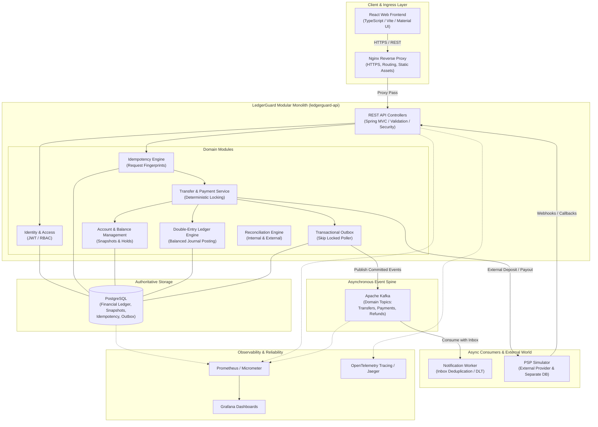

# LedgerGuard Architecture Specification

## 1. Goals & Non-Goals

### Goals
- **Correctness First**: Ensure financial invariants hold under all operating conditions (no lost funds, no unbacked balances, no ghost debits/credits).
- **Immutable Double-Entry Ledger**: Every financial event maps to balanced debit and credit entries with immutable journal history.
- **ACID Transactional Consistency**: Localize multi-account balance checks, debit/credit creation, hold adjustments, and outbox insertion inside a single PostgreSQL transaction.
- **Concurrency Resilience**: Guarantee safety under concurrent requests and opposing transfers using deterministic row locking.
- **Authoritative Idempotency**: Provide atomic request deduplication at the database boundary to guarantee at-most-once execution for financial operations.
- **Asynchronous Reliability**: Publish domain events reliably using the Transactional Outbox pattern with `FOR UPDATE SKIP LOCKED` and process via idempotent consumers.
- **Ambiguity-Aware Integration**: Handle external Payment Service Provider (PSP) and banking timeouts, duplicate webhooks, and out-of-order deliveries through explicit state machines and reconciliation.
- **Automated Verification**: Prove money conservation via the Money Integrity Failure Lab.

### Non-Goals
- **Not a Real-Money Gateway**: The platform is an educational and portfolio demonstration system; it will not integrate with live banking rails or live merchant APIs.
- **No Foreign Exchange (FX) Conversion**: Demonstration operations execute within a single currency context (defaulting to INR in minor units / paise).
- **No Distributed Transactions (2PC/Sagas) for Core Ledgering**: Core money movement is intentionally unified inside a modular monolith to preserve local ACID guarantees.
- **No Early Sharding or Microservice Splitting**: Architectural simplicity is prioritized over premature horizontal partitioning.

---

## 2. System Architecture Diagram

---

## 3. Main Deployables

1. **`ledgerguard-api`**:
   - Primary Spring Boot modular monolith.
   - Contains all financial boundaries: Ledger, Accounts, Transfers, Payments, Refunds, Holds, Outbox, Reconciliation, Identity, and Audit.
   - Authoritative for PostgreSQL transactions.

2. **`psp-simulator`**:
   - Independent Spring Boot service with its own dedicated PostgreSQL instance.
   - Simulates external banking behavior: variable network latency, pre-processing failures, post-commit dropouts, duplicate webhooks, out-of-order callbacks, and manual capture states.

3. **`notification-worker`**:
   - Standalone background consumer application listening to Kafka topics.
   - Implements consumer-side inbox pattern for idempotency, exponential backoff retries, and dead-letter topic (DLT) routing.

4. **`ledgerguard-web`**:
   - Single-Page Application (SPA) built with React 18, TypeScript, Vite, TanStack Query, and Material UI.
   - Features customer portals (wallet balance, transfers, payment checkout, ledger drilldown) and operational consoles (system health, outbox monitoring, reconciliation viewer, Failure Lab runner).

5. **`failure-lab`**:
   - Standalone resilience test framework and execution harness.
   - Injects orchestrated chaos (concurrent race conditions, network cuts, worker kills, corrupted balance snapshot injections) and validates financial invariants.

---

## 4. PostgreSQL Financial Authority

- **Single Source of Truth**: PostgreSQL is the authoritative system of record for all account balances, journal entries, holds, and state transitions. Immutable POSTED journal transactions and entries represent the sole authoritative financial history.
- **No JPA Schema Mutations in Production**: Flyway migrations strictly manage schema evolutions; Hibernate is configured with `ddl-auto=validate`.
- **ACID Transaction Boundary**: Every transfer, financial posting, or wallet provisioning event executes inside a single database transaction with appropriate isolation levels (Read Committed / Serializable where required).
- **Derived Balance Snapshots**: The `ledger_balance_snapshots` table acts as a read-optimized, transactionally maintained derived projection (updated atomically via PostgreSQL database triggers on `DRAFT -> POSTED` transition), fully reconstructible and verifiable against the append-only `journal_entries` table.
- **Wallet Projection**: Wallets are application-facing domain projections over owned `ledger_accounts` and their corresponding `ledger_balance_snapshots` without a redundant persistent `wallets` table.
- **PostgreSQL-Backed Idempotency**: Financial write operations coordinate via `idempotency_records` using unique scope `(actor_user_id, operation, idempotency_key)` and deterministic SHA-256 request fingerprints. First callers atomically claim slots via `INSERT ... ON CONFLICT DO NOTHING` inside `@Transactional REQUIRED` boundaries, committing slot completion alongside financial mutations in a single atomic database transaction. Completed records are trigger-enforced immutable.
- **Deterministic Pessimistic Row Locking & Overdraft Prevention**: Internal transfers acquire pessimistic write locks (`SELECT ... FOR UPDATE` via `PESSIMISTIC_WRITE`) on both source and destination `ledger_balance_snapshots` rows strictly in global `ORDER BY ledger_account_id ASC`. Sufficient funds (`sourceSnapshot.balanceMinor >= transferAmountMinor`) is validated against the locked row inside the transaction before invoking `LedgerPostingService`. Insufficient funds throws `InsufficientFundsException` (HTTP 409 `INSUFFICIENT_FUNDS`), rolling back the transaction and leaving the idempotency key unpoisoned for future retries after funding. Generic `LedgerPostingService` remains a generic accounting primitive allowing debits, while `TransferService` enforces source wallet overdraft prevention for internal transfers. No JVM locks or distributed locks are used.

---

## 5. Modular Monolith Financial Core

To eliminate the hazards of distributed two-phase commits across microservice boundaries, the core financial modules reside inside a single deployable (`ledgerguard-api`):
- Modules communicate via explicit, strongly-typed internal Java domain interfaces and application services.
- Data structures are encapsulated per module.
- Package structures follow a feature-first approach (`account`, `ledger`, `transfer`, `payment`, `outbox`, etc.) divided into `api`, `application`, `domain`, and `infrastructure` layers.

---

## 6. External PSP Boundary & Asynchronous Kafka Architecture

- **Separation of External Calls**: External PSP HTTP calls are never executed while holding open a database row lock or active transaction.
- **Outbox Pattern**: Changes to financial state and outbox event records are committed together in one atomic PostgreSQL transaction.
- **Outbox Publisher**: An asynchronous poller claims pending outbox events using `SELECT ... FOR UPDATE SKIP LOCKED` and publishes them to Apache Kafka.
- **Post-Commit Messaging**: Kafka is strictly an asynchronous post-commit event stream; it is **never** the source of truth for financial balances or ledger transactions.

---

## 7. Reconciliation Architecture

LedgerGuard defines a three-tier reconciliation architecture:
1. **Journal Invariant Reconciliation**: Scans all posted journal transactions to ensure $\sum \text{Debits} = \sum \text{Credits}$ across the entire ledger.
2. **Balance Snapshot Reconciliation**: Recalculates historical balances by summing immutable journal entries from the beginning of time (or latest audited checkpoint) and asserts identity with `account_balances`.
3. **External Provider Reconciliation**: Ingests external settlement reports from the PSP simulator and reconciles them against internal `payments`, `funding_operations`, and `payouts` to resolve `UNKNOWN` or pending transactions.

---

## 8. Observability Architecture

- **Metrics**: Micrometer instruments application metrics exposed to Prometheus (unbalanced transaction count, outbox queue lag, duplicate idempotency keys, state transition rejections, lock wait durations).
- **Dashboards**: Grafana visualizes financial integrity KPIs, system throughput, and queue health.
- **Distributed Tracing**: OpenTelemetry traces request lifecycles from HTTP ingress through database transactions, outbox publication, Kafka brokering, and notification worker consumption via correlation IDs.
- **Structured Logging**: JSON-formatted logs containing correlation IDs, tenant/client IDs, and operation IDs without logging sensitive financial credentials.

---

## 9. Horizontal Scaling & Deferred Sharding

- **Stateless Monolith Instances**: Multiple instances of `ledgerguard-api` can run concurrently behind the Nginx reverse proxy.
- **Database-Enforced Safety**: Concurrency control relies on PostgreSQL row locks (ordered by account ID) and unique database constraints, never on single-JVM locks (`synchronized` / `ReentrantLock`).
- **Deferred Sharding**: Database sharding is intentionally deferred (ADR-011) until scale necessitates cross-partition settlement mechanisms.

---

## 10. Explicitly Excluded Technologies

To maintain focus on correctness and avoid resume-driven architecture, the following are strictly excluded:
- Kubernetes, Service Mesh, Eureka, Spring Cloud Gateway
- MongoDB, Cassandra, Elasticsearch, RabbitMQ
- GraphQL, gRPC, Keycloak, Spark, Flink
- Blockchain, Distributed SAGAs across artificial microservices
- Full Event Sourcing frameworks (the ledger itself is the event log)
- Redis used merely for transient caching or non-authoritative locking

---

## 11. Architectural Invariants

1. **Balance Equation**: $\text{Available Balance} = \text{Posted Balance} - \text{Active Holds}$.
2. **Double-Entry Balance**: For every transaction $T$, $\sum_{e \in T} \text{Debit}(e) = \sum_{e \in T} \text{Credit}(e)$.
3. **Immutability**: Once written, rows in `journal_transactions` and `journal_entries` cannot be updated or deleted.
4. **Deterministic Lock Ordering**: When locking multiple accounts, acquire locks in ascending lexicographical or numerical order of account IDs to prevent circular-wait deadlocks between opposing transfers.
5. **No Floating Point**: All monetary values are represented as `Money(Currency, long minorUnits)`.
