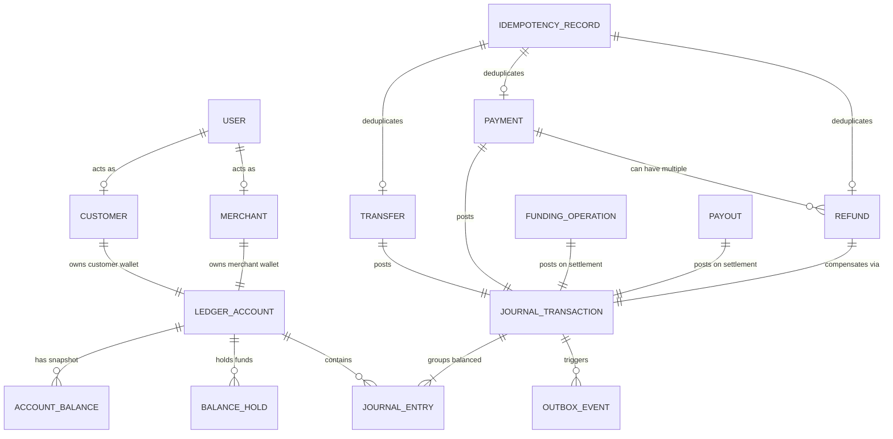

# LedgerGuard Domain Model Specification

## 1. Core Financial & Domain Glossary

This document formalizes the domain concepts, state models, and fundamental invariants of LedgerGuard.

---

### Identity & Actor Concepts

- **User**: The root security principal representing an authenticated entity in the platform. Users hold credentials and authenticate via JWT tokens.
- **Customer**: A User role representing an individual end-user who owns a personal wallet account, executes peer-to-peer transfers, deposits funds, and purchases goods/services.
- **Merchant**: A User role representing a commercial entity with a merchant settlement wallet, capable of accepting customer payments and initiating refunds.
- **Operations User (OPS)**: An administrative principal authorized to inspect system integrity, review discrepancies, monitor outbox pipelines, and trigger the Money Integrity Failure Lab.

---

### Double-Entry Accounting Concepts

- **Ledger Account (`ledger_accounts`)**: The fundamental unit of financial recording. Each account belongs to a classification (`ASSET`, `LIABILITY`, `REVENUE`, `EXPENSE`, `EQUITY`) and a specific type:
  - `CUSTOMER_WALLET`: Liability of the platform to a customer.
  - `MERCHANT_WALLET`: Liability of the platform to a merchant.
  - `PSP_CLEARING`: Asset representing in-transit funds held by an external banking/PSP partner.
  - `PLATFORM_RESERVE`: Asset/Equity backing initial or baseline platform liquidity.
  - `PLATFORM_FEES`: Revenue earned from transaction processing fees.
- **Journal Transaction (`journal_transactions`)**: An immutable atomic financial transaction grouping two or more balanced journal entries. It possesses a status (`POSTED`, `REVERSED`), a timestamp, and a transaction type (e.g., `TRANSFER`, `PAYMENT`, `REFUND`, `DEPOSIT`, `WITHDRAWAL`).
- **Journal Entry (`journal_entries`)**: An individual line item within a journal transaction. Every entry targets exactly one `ledger_account`, carries a monetary amount, and specifies an entry type (`DEBIT` or `CREDIT`).
- **Debit & Credit Rules**:
  - In our double-entry framework, asset accounts increase with Debits and decrease with Credits.
  - Liability and revenue accounts increase with Credits and decrease with Debits.
- **Money Value Object**: Represents a financial quantity defined by a standard ISO-4217 Currency (e.g., `INR`) and an exact integer quantity in minor units (e.g., paise, stored as a 64-bit signed integer `BIGINT`). Floating-point types (`float`, `double`) are strictly prohibited.

---

### Balances & Holds

- **Wallet**: An application-facing domain projection combining an owned `ledger_accounts` row and its derived `ledger_balance_snapshots` row. Each `CUSTOMER` or `MERCHANT` user possesses at most one owned wallet account (enforced via partial unique index). OPS users do not have wallets.
- **Account Balance Snapshot (`ledger_balance_snapshots`)**: A high-performance read-optimized derived snapshot reflecting the current state of a ledger account. Maintained atomically via PostgreSQL triggers on journal posting:
  - CREDIT-normal accounts (`CUSTOMER`, `MERCHANT`, `PLATFORM_FEES`): $\text{Balance} = \sum \text{Credits} - \sum \text{Debits}$
  - DEBIT-normal accounts (`PSP_CLEARING`, `PLATFORM_RESERVE`): $\text{Balance} = \sum \text{Debits} - \sum \text{Credits}$
- **Posted Balance**: The settled, historical sum of all debits and credits posted to an account up to the present moment.
- **Balance Hold (`balance_holds`)**: A temporary reservation of funds on a specific account (e.g., for an in-flight withdrawal or pending authorization). Holds prevent double-spending without immediately mutating posted ledger balances.
  - States: `ACTIVE`, `CONSUMED`, `RELEASED`, `EXPIRED`.
- **Available Balance**: The spendable balance calculated dynamically as:
  $$\text{Available Balance} = \text{Posted Balance} - \sum \text{Active Holds}$$

---

### Business Transactions

- **Transfer (`transfers`)**: A peer-to-peer internal fund movement between two `CUSTOMER_WALLET` accounts, debited from the sender and credited to the recipient atomically.
- **Payment (`payments`)**: A commercial transaction between a `CUSTOMER_WALLET` and a `MERCHANT_WALLET`, with dedicated metadata, payment lifecycle states (`CREATED`, `PROCESSING`, `SUCCEEDED`, `FAILED`), and platform fee split (100 bps / 1% via integer arithmetic with floor rounding). Transitions to `SUCCEEDED` atomically post double-entry journals (`DEBIT customer gross`, `CREDIT merchant net`, `CREDIT platform_fees fee`).
- **Platform Fee Policy (`com.ledgerguard.payment.domain.PlatformFeePolicy`)**: Calculates platform fees at 100 basis points (1.00%) using integer floor division: `(grossAmountMinor * 100) / 10000`. When `feeAmountMinor == 0` (e.g. gross < 100 minor units), no zero-amount `PLATFORM_FEES` journal entry is posted. Floating point arithmetic is strictly forbidden.
- **Refund (`refunds`)**: An immutable business record representing a full or partial reversal of a previously settled `SUCCEEDED` payment. A refund produces a new compensating double-entry journal transaction (`CREDIT customer gross`, `DEBIT merchant merchantDebitAmount`, `DEBIT platform_fees feeDebitAmount`). A persisted `Refund` record guarantees the compensating operation completed synchronously. Unsuccessful attempts leave 0 `Refund` records.
- **Refund Allocation Policy (`com.ledgerguard.refund.domain.RefundAllocationPolicy`)**: Telescoping proportional reversal algorithm (`original-payment-pro-rata:v1`) using integer floor division:
  $$\text{targetCumulativeFee}(R) = \left\lfloor \frac{F \times R}{G} \right\rfloor$$
  $$\text{feeDebitAmountMinor} = \text{targetCumulativeFee}(\text{alreadyRefunded} + \text{requestedRefund}) - \text{targetCumulativeFee}(\text{alreadyRefunded})$$
  $$\text{merchantDebitAmountMinor} = \text{requestedRefund} - \text{feeDebitAmountMinor}$$
  Guarantees exact sum equality ($\text{feeDebit} + \text{merchantDebit} = \text{refundAmount}$), full refund total fee restoration, and monotonicity. Zero-amount journal lines (e.g. 0-merchant debit on a 1-paise fee-only rounding refund) are omitted from journal postings.
- **Funding Operation (`funding_operations`)**: A durable business record representing an inflow of funds from an external bank or PSP into a `CUSTOMER_WALLET`.
  - **Lifecycle**: Initialized in `PROCESSING` status (with `provider_operation_id = NULL`, `journal_transaction_id = NULL`, `completed_at = NULL`). Transitions to `SUCCEEDED` upon receiving authoritative provider confirmation (`status = SUCCEEDED`).
  - **Settlement Double-Entry**: Posts exactly 2 balanced journal entries:
    $$\text{DEBIT } \text{PSP\_CLEARING} \quad (\text{amountMinor}), \quad \text{CREDIT } \text{CUSTOMER} \quad (\text{amountMinor})$$
  - **Database Constraints & Trigger**: Direct inserts must be `PROCESSING` and reference an active INR `CUSTOMER` account owned by the initiator. Transitions to `SUCCEEDED` require non-null `provider_operation_id`, `completed_at`, and a valid `POSTED` settlement journal. Completed funding operations are immutable and cannot be updated or deleted.
- **Payout (`payouts`)**: An outflow of funds from a `CUSTOMER_WALLET` or `MERCHANT_WALLET` to an external bank account (Wallet $\to$ PSP Clearing), secured with balance holds during transit.

---

### Reliability & Operational Infrastructure

- **Idempotency Record (`idempotency_records`)**: An atomic persistence record mapping `(actor_user_id, operation, idempotency_key)` to a cryptographic SHA-256 request fingerprint, lifecycle status (`IN_PROGRESS`, `COMPLETED`), and committed result identifier (`result_id UUID`). Completed records are immutable.
- **Outbox Event (`outbox_events`)**: An immutable, reliable domain event record persisted inside the primary PostgreSQL transaction alongside the financial state changes (transfers, payments, refunds).
  - Structure: `(id UUID PK, aggregate_type VARCHAR, aggregate_id UUID, event_type VARCHAR, event_version INT, payload JSONB, status VARCHAR, occurred_at TIMESTAMPTZ, created_at TIMESTAMPTZ, published_at TIMESTAMPTZ NULL)`.
  - Minimal Events: `TRANSFER_COMPLETED`, `PAYMENT_SUCCEEDED`, `REFUND_COMPLETED` (event_version = 1).
  - Monetary fields in payload JSON are serialized as decimal strings (`"amountMinor": "10000"`) to guarantee precision safety.
  - Lifecycle: `PENDING` on direct insertion (enforced via database trigger), transitioning to `PUBLISHED` upon asynchronous Kafka broker acknowledgment in Phase 17.
  - Invariant: A committed financial outcome must never lose its event delivery intent, and an uncommitted/rolled-back transaction never leaves an outbox event.
- **Provider Operation (`provider_operations`)**: Tracks the state of an external call initiated to the PSP simulator, including attempt history, latency, and provider reference IDs.
- **Provider Event (`provider_events`)**: An immutable log of inbound webhooks received from the PSP simulator, enforcing signature verification and deduplication.
- **Reconciliation Run (`reconciliation_runs`) & Reconciliation Item (`reconciliation_items`)**: Records the execution, findings, discrepancy classification (`MATCH`, `MISSING_INTERNAL`, `MISSING_EXTERNAL`, `AMOUNT_MISMATCH`), and resolution actions of automated reconciliation jobs.
- **Audit Event (`audit_events`)**: An immutable, append-only operational log recording administrative decisions (manual reconciliation, account freeze/unfreeze, system reconfigurations).

---

## 2. Conceptual Relationships Diagram

---

## 3. Fundamental Domain Invariants

### Invariant 1: The Balanced Double-Entry Rule
Every posted journal transaction $T$ must satisfy:
$$\sum_{e \in T, e.\text{type} = \text{DEBIT}} e.\text{amount} = \sum_{e \in T, e.\text{type} = \text{CREDIT}} e.\text{amount}$$
An unbalanced transaction must be rejected by the posting engine with an immediate database rollback.

### Invariant 2: Immutability of Posted Financial History
- No `UPDATE` or `DELETE` SQL operations are permitted on `journal_transactions`, `journal_entries`, `payments`, or `refunds`.
- Erroneous or canceled transactions must be reversed by creating a new `JOURNAL_TRANSACTION` with opposing credit/debit entries.

### Invariant 3: Single-Currency Transaction Consistency
All entries within a single `journal_transaction` must share the exact same currency code. Multi-currency transactions or FX conversions are outside the boundary of a single journal entry posting.

### Invariant 4: Demonstration Currency Standard
- While the domain structures support standard ISO-4217 currency codes, the default demonstration currency is **Indian Rupee (`INR`)**.
- Monetary amounts are represented internally in **paise** (1 INR = 100 paise).
- Business logic is written agnostically to support arbitrary standard currencies without hard-coded currency-specific math.

### Invariant 5: Overdraft Prevention & Available Balance Spending Bounds
- **Transfer Spending Decision (Phase 11, Phase 15)**: Internal wallet transfers (`TransferService`) acquire deterministic row-level locks on `LedgerBalanceSnapshot` and enforce `sourceAvailableBalance >= transferAmountMinor` where $\text{sourceAvailableBalance} = \text{sourceSnapshot.balanceMinor} - \text{sourceActiveHolds}$. If available funds are insufficient, `InsufficientFundsException` is thrown, rolling back the transaction and leaving the idempotency key unpoisoned.
- **Payment Spending Decision (Phase 13, Phase 15)**: Merchant payments (`PaymentService`) acquire deterministic row-level locks on all involved snapshots in ascending ID order and enforce `customerAvailableBalance >= grossAmountMinor` where $\text{customerAvailableBalance} = \text{customerSnapshot.balanceMinor} - \text{customerActiveHolds}$.
- **Balance Holds & Capacity (Phase 15)**: Temporary reservations (`BalanceHold`) reduce available spending capacity without mutating posted double-entry history. Hold creation locks the snapshot row `FOR UPDATE` and verifies $\sum \text{Active Holds} + \text{newHold} \le \text{Posted Balance}$.
- **Available Balance Formula**:
$$\text{Available Balance} = \text{Posted Balance} - \sum \text{Active Holds}$$
- **Generic Ledger vs. Spending Layer Distinction**: `LedgerPostingService` remains a pure, generic double-entry primitive without overdraft constraints (generic accounting postings may legitimately produce negative balances, e.g., fees or system adjustments). Overdraft and available-balance restrictions are enforced as application-layer and trigger-level business rules in `TransferService`, `PaymentService`, and `HoldService`.

### Invariant 6: Cumulative Refund Cap & Reversal Bounds
- **Cumulative Cap**: $\sum \text{Refunds} \le \text{Payment.grossAmountMinor}$. Attempting a refund where $\text{alreadyRefunded} + \text{requestedRefund} > \text{grossAmountMinor}$ is rejected with HTTP 409 `REFUND_LIMIT_EXCEEDED` at both application and database trigger levels.
- **Parent Payment Lock**: Concurrency control locks the parent `payments` row (`SELECT ... FOR UPDATE`) before calculating cumulative refunds.
- **Merchant Liability & Negative Available Balance**: Refunds represent merchant obligations to customers; merchant balance checks are not performed. When refunds occur on a merchant wallet with active holds or zero posted balance, negative posted and negative available balances are representable and valid.

### Invariant 7: Transactional Outbox & At-Least-Once Event Delivery
- **Dual-Write Safety**: Financial mutations, idempotency records, and outbox event intents commit atomically inside the same PostgreSQL ACID transaction boundary. Outbox is an asynchronous integration intent mechanism; the PostgreSQL double-entry journal remains the sole authoritative financial source of truth.
- **Delivery Guarantee**: The outbox delivery model is strictly **AT-LEAST-ONCE**. End-to-end exactly-once delivery is not claimed.
- **Event Identity & Retries**: Outbox events possess stable, immutable UUID identifiers (`outbox_events.id`). Retries following broker timeouts or post-ACK database rollback windows produce duplicate Kafka messages with the exact same event ID, enabling idempotent deduplication at consumer inboxes.
- **Partition Affinity & Ordering**:
  - `aggregate_id` message key guarantees **partition affinity** (all events for a given aggregate are routed to the same Kafka partition).
  - Kafka guarantees record ordering within a partition in the order records are appended to the broker log.
  - LedgerGuard does **NOT** claim global ordering across partitions.
  - LedgerGuard does **NOT** claim strict original database outbox ordering across concurrent workers for multiple events of the same aggregate (unless explicitly serialized).
  - Current Phase 17 domain producers (`Transfer`, `Payment`, `Refund`) emit exactly ONE terminal event per aggregate lifecycle (`TRANSFER_COMPLETED`, `PAYMENT_SUCCEEDED`, `REFUND_COMPLETED`).
- **Producer Idempotence Scope**: Kafka producer idempotence (`enable.idempotence=true`, `acks=all`) prevents duplicate writes during transport retries within a single producer session. It does not eliminate application-level duplicates caused by post-ACK database rollback windows.
- **Send Timeout Delivery Ambiguity**: A timeout on `future.get(timeout)` is an ambiguous delivery outcome from the publisher's perspective. The PostgreSQL transaction rolls back, leaving the row `PENDING` for future retry, while the message may or may not have reached the broker.

### Invariant 8: External PSP Simulator & Provider Operations (Phase 19)
- **External State Boundary**: `ProviderOperation` and `ProviderWebhook` entities reside exclusively in the independent `psp_simulator` database. They represent external provider state observations and are **never** authoritative for LedgerGuard wallet balances or double-entry ledgers.
- **Provider Idempotency**: `client_operation_id` is unique and authoritative. Duplicate submissions with identical parameters return the existing operation (`200 OK`). Submissions with conflicting parameters (different amount, currency, or operation type) return `409 Conflict`.
- **Fault Injection & Ambiguity Invariant**:
  - `TEMPORARY_500`: Known failure before provider acceptance. Zero database rows are created.
  - `TIMEOUT_AFTER_SUCCESS`: Ambiguous outcome to caller. Provider operation and webhook are committed durably *prior* to transport delay. Subsequent status query or retry safely confirms success.
- **Webhook Delivery Independence**: Webhook delivery status (`SCHEDULED`, `DELIVERED`, `FAILED`) is decoupled from provider operation status (`SUCCEEDED`). A network failure delivering a webhook marks the webhook `FAILED` without failing or rolling back the `SUCCEEDED` provider operation.
