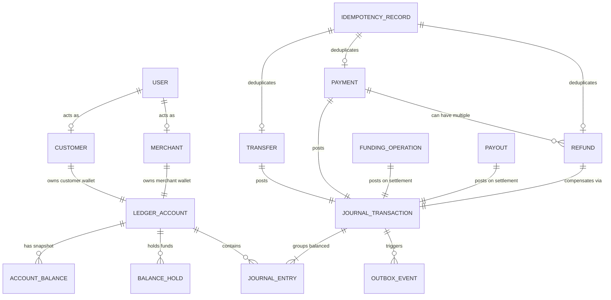

# LedgerGuard Domain Model Specification

## 1. Core Financial & Domain Glossary

This document formalizes the domain concepts, state models, and fundamental invariants of LedgerGuard.

---

### Identity & Actor Concepts

- **User**: The root security principal representing an authenticated entity in the platform. Users hold credentials and authenticate via JWT tokens.
- **Customer**: A User role representing an individual end-user who owns a personal wallet account, executes peer-to-peer transfers, deposits funds, and purchases goods/services.
- **Merchant**: A User role representing a commercial entity with a merchant settlement wallet, capable of accepting customer payments and initiating refunds.
- **Operations User (OPS)**: An administrative principal authorized to inspect system integrity, review discrepancies, monitor outbox pipelines, and trigger the Money Integrity Failure Lab.

---

### Double-Entry Accounting Concepts

- **Ledger Account (`ledger_accounts`)**: The fundamental unit of financial recording. Each account belongs to a classification (`ASSET`, `LIABILITY`, `REVENUE`, `EXPENSE`, `EQUITY`) and a specific type:
  - `CUSTOMER_WALLET`: Liability of the platform to a customer.
  - `MERCHANT_WALLET`: Liability of the platform to a merchant.
  - `PSP_CLEARING`: Asset representing in-transit funds held by an external banking/PSP partner.
  - `PLATFORM_RESERVE`: Asset/Equity backing initial or baseline platform liquidity.
  - `PLATFORM_FEES`: Revenue earned from transaction processing fees.
- **Journal Transaction (`journal_transactions`)**: An immutable atomic financial transaction grouping two or more balanced journal entries. It possesses a status (`POSTED`, `REVERSED`), a timestamp, and a transaction type (e.g., `TRANSFER`, `PAYMENT`, `REFUND`, `DEPOSIT`, `WITHDRAWAL`).
- **Journal Entry (`journal_entries`)**: An individual line item within a journal transaction. Every entry targets exactly one `ledger_account`, carries a monetary amount, and specifies an entry type (`DEBIT` or `CREDIT`).
- **Debit & Credit Rules**:
  - In our double-entry framework, asset accounts increase with Debits and decrease with Credits.
  - Liability and revenue accounts increase with Credits and decrease with Debits.
- **Money Value Object**: Represents a financial quantity defined by a standard ISO-4217 Currency (e.g., `INR`) and an exact integer quantity in minor units (e.g., paise, stored as a 64-bit signed integer `BIGINT`). Floating-point types (`float`, `double`) are strictly prohibited.

---

### Balances & Holds

- **Wallet**: An application-facing domain projection combining an owned `ledger_accounts` row and its derived `ledger_balance_snapshots` row. Each `CUSTOMER` or `MERCHANT` user possesses at most one owned wallet account (enforced via partial unique index). OPS users do not have wallets.
- **Account Balance Snapshot (`ledger_balance_snapshots`)**: A high-performance read-optimized derived snapshot reflecting the current state of a ledger account. Maintained atomically via PostgreSQL triggers on journal posting:
  - CREDIT-normal accounts (`CUSTOMER`, `MERCHANT`, `PLATFORM_FEES`): $\text{Balance} = \sum \text{Credits} - \sum \text{Debits}$
  - DEBIT-normal accounts (`PSP_CLEARING`, `PLATFORM_RESERVE`): $\text{Balance} = \sum \text{Debits} - \sum \text{Credits}$
- **Posted Balance**: The settled, historical sum of all debits and credits posted to an account up to the present moment.
- **Balance Hold (`balance_holds`)**: A temporary reservation of funds on a specific account (e.g., for an in-flight withdrawal or pending authorization). Holds prevent double-spending without immediately mutating posted ledger balances.
  - States: `ACTIVE`, `CONSUMED`, `RELEASED`, `EXPIRED`.
- **Available Balance**: The spendable balance calculated dynamically as:
  $$\text{Available Balance} = \text{Posted Balance} - \sum \text{Active Holds}$$

---

### Business Transactions

- **Transfer (`transfers`)**: A peer-to-peer internal fund movement between two `CUSTOMER_WALLET` accounts, debited from the sender and credited to the recipient atomically.
- **Payment (`payments`)**: A commercial transaction between a `CUSTOMER_WALLET` and a `MERCHANT_WALLET`, with dedicated metadata, payment lifecycle states (`CREATED`, `PROCESSING`, `SUCCEEDED`, `FAILED`), and platform fee split (100 bps / 1% via integer arithmetic with floor rounding). Transitions to `SUCCEEDED` atomically post double-entry journals (`DEBIT customer gross`, `CREDIT merchant net`, `CREDIT platform_fees fee`).
- **Platform Fee Policy (`com.ledgerguard.payment.domain.PlatformFeePolicy`)**: Calculates platform fees at 100 basis points (1.00%) using integer floor division: `(grossAmountMinor * 100) / 10000`. When `feeAmountMinor == 0` (e.g. gross < 100 minor units), no zero-amount `PLATFORM_FEES` journal entry is posted. Floating point arithmetic is strictly forbidden.
- **Refund (`refunds`)**: An immutable business record representing a full or partial reversal of a previously settled `SUCCEEDED` payment. A refund produces a new compensating double-entry journal transaction (`CREDIT customer gross`, `DEBIT merchant merchantDebitAmount`, `DEBIT platform_fees feeDebitAmount`). A persisted `Refund` record guarantees the compensating operation completed synchronously. Unsuccessful attempts leave 0 `Refund` records.
- **Refund Allocation Policy (`com.ledgerguard.refund.domain.RefundAllocationPolicy`)**: Telescoping proportional reversal algorithm (`original-payment-pro-rata:v1`) using integer floor division:
  $$\text{targetCumulativeFee}(R) = \left\lfloor \frac{F \times R}{G} \right\rfloor$$
  $$\text{feeDebitAmountMinor} = \text{targetCumulativeFee}(\text{alreadyRefunded} + \text{requestedRefund}) - \text{targetCumulativeFee}(\text{alreadyRefunded})$$
  $$\text{merchantDebitAmountMinor} = \text{requestedRefund} - \text{feeDebitAmountMinor}$$
  Guarantees exact sum equality ($\text{feeDebit} + \text{merchantDebit} = \text{refundAmount}$), full refund total fee restoration, and monotonicity. Zero-amount journal lines (e.g. 0-merchant debit on a 1-paise fee-only rounding refund) are omitted from journal postings.
- **Funding Operation (`funding_operations`)**: A durable business record representing an inflow of funds from an external bank or PSP into a `CUSTOMER_WALLET`.
  - **Lifecycle**: Initialized in `PROCESSING` status (with `provider_operation_id = NULL`, `journal_transaction_id = NULL`, `completed_at = NULL`). Transitions to `SUCCEEDED` upon receiving authoritative provider confirmation (`status = SUCCEEDED`).
  - **Settlement Double-Entry**: Posts exactly 2 balanced journal entries:
    $$\text{DEBIT } \text{PSP\_CLEARING} \quad (\text{amountMinor}), \quad \text{CREDIT } \text{CUSTOMER} \quad (\text{amountMinor})$$
  - **Database Constraints & Trigger**: Direct inserts must be `PROCESSING` and reference an active INR `CUSTOMER` account owned by the initiator. Transitions to `SUCCEEDED` require non-null `provider_operation_id`, `completed_at`, and a valid `POSTED` settlement journal. Completed funding operations are immutable and cannot be updated or deleted.
- **Payout (`payouts`)**: An outflow of funds from a `CUSTOMER_WALLET` or `MERCHANT_WALLET` to an external bank account (Wallet $\to$ PSP Clearing), secured with balance holds during transit.

---

### Reliability & Operational Infrastructure

- **Idempotency Record (`idempotency_records`)**: An atomic persistence record mapping `(actor_user_id, operation, idempotency_key)` to a cryptographic SHA-256 request fingerprint, lifecycle status (`IN_PROGRESS`, `COMPLETED`), and committed result identifier (`result_id UUID`). Completed records are immutable.
- **Outbox Event (`outbox_events`)**: An immutable, reliable domain event record persisted inside the primary PostgreSQL transaction alongside the financial state changes (transfers, payments, refunds).
  - Structure: `(id UUID PK, aggregate_type VARCHAR, aggregate_id UUID, event_type VARCHAR, event_version INT, payload JSONB, status VARCHAR, occurred_at TIMESTAMPTZ, created_at TIMESTAMPTZ, published_at TIMESTAMPTZ NULL)`.
  - Minimal Events: `TRANSFER_COMPLETED`, `PAYMENT_SUCCEEDED`, `REFUND_COMPLETED` (event_version = 1).
  - Monetary fields in payload JSON are serialized as decimal strings (`"amountMinor": "10000"`) to guarantee precision safety.
  - Lifecycle: `PENDING` on direct insertion (enforced via database trigger), transitioning to `PUBLISHED` upon asynchronous Kafka broker acknowledgment in Phase 17.
  - Invariant: A committed financial outcome must never lose its event delivery intent, and an uncommitted/rolled-back transaction never leaves an outbox event.
- **Provider Operation (`provider_operations`)**: Tracks the state of an external call initiated to the PSP simulator, including attempt history, latency, and provider reference IDs.
- **Provider Event (`provider_events`)**: An immutable log of inbound webhooks received from the PSP simulator, enforcing signature verification and deduplication.
- **Reconciliation Run (`reconciliation_runs`) & Reconciliation Item (`reconciliation_items`)**: Records the execution, findings, discrepancy classification (`MATCH`, `MISSING_INTERNAL`, `MISSING_EXTERNAL`, `AMOUNT_MISMATCH`), and resolution actions of automated reconciliation jobs.
- **Audit Event (`audit_events`)**: An immutable, append-only operational log recording administrative decisions (manual reconciliation, account freeze/unfreeze, system reconfigurations).

---

## 2. Conceptual Relationships Diagram

---

## 3. Fundamental Domain Invariants

### Invariant 1: The Balanced Double-Entry Rule
Every posted journal transaction $T$ must satisfy:
$$\sum_{e \in T, e.\text{type} = \text{DEBIT}} e.\text{amount} = \sum_{e \in T, e.\text{type} = \text{CREDIT}} e.\text{amount}$$
An unbalanced transaction must be rejected by the posting engine with an immediate database rollback.

### Invariant 2: Immutability of Posted Financial History
- No `UPDATE` or `DELETE` SQL operations are permitted on `journal_transactions`, `journal_entries`, `payments`, or `refunds`.
- Erroneous or canceled transactions must be reversed by creating a new `JOURNAL_TRANSACTION` with opposing credit/debit entries.

### Invariant 3: Single-Currency Transaction Consistency
All entries within a single `journal_transaction` must share the exact same currency code. Multi-currency transactions or FX conversions are outside the boundary of a single journal entry posting.

### Invariant 4: Demonstration Currency Standard
- While the domain structures support standard ISO-4217 currency codes, the default demonstration currency is **Indian Rupee (`INR`)**.
- Monetary amounts are represented internally in **paise** (1 INR = 100 paise).
- Business logic is written agnostically to support arbitrary standard currencies without hard-coded currency-specific math.

### Invariant 5: Overdraft Prevention & Available Balance Spending Bounds
- **Transfer Spending Decision (Phase 11, Phase 15)**: Internal wallet transfers (`TransferService`) acquire deterministic row-level locks on `LedgerBalanceSnapshot` and enforce `sourceAvailableBalance >= transferAmountMinor` where $\text{sourceAvailableBalance} = \text{sourceSnapshot.balanceMinor} - \text{sourceActiveHolds}$. If available funds are insufficient, `InsufficientFundsException` is thrown, rolling back the transaction and leaving the idempotency key unpoisoned.
- **Payment Spending Decision (Phase 13, Phase 15)**: Merchant payments (`PaymentService`) acquire deterministic row-level locks on all involved snapshots in ascending ID order and enforce `customerAvailableBalance >= grossAmountMinor` where $\text{customerAvailableBalance} = \text{customerSnapshot.balanceMinor} - \text{customerActiveHolds}$.
- **Balance Holds & Capacity (Phase 15)**: Temporary reservations (`BalanceHold`) reduce available spending capacity without mutating posted double-entry history. Hold creation locks the snapshot row `FOR UPDATE` and verifies $\sum \text{Active Holds} + \text{newHold} \le \text{Posted Balance}$.
- **Available Balance Formula**:
$$\text{Available Balance} = \text{Posted Balance} - \sum \text{Active Holds}$$
- **Generic Ledger vs. Spending Layer Distinction**: `LedgerPostingService` remains a pure, generic double-entry primitive without overdraft constraints (generic accounting postings may legitimately produce negative balances, e.g., fees or system adjustments). Overdraft and available-balance restrictions are enforced as application-layer and trigger-level business rules in `TransferService`, `PaymentService`, and `HoldService`.

### Invariant 6: Cumulative Refund Cap & Reversal Bounds
- **Cumulative Cap**: $\sum \text{Refunds} \le \text{Payment.grossAmountMinor}$. Attempting a refund where $\text{alreadyRefunded} + \text{requestedRefund} > \text{grossAmountMinor}$ is rejected with HTTP 409 `REFUND_LIMIT_EXCEEDED` at both application and database trigger levels.
- **Parent Payment Lock**: Concurrency control locks the parent `payments` row (`SELECT ... FOR UPDATE`) before calculating cumulative refunds.
- **Merchant Liability & Negative Available Balance**: Refunds represent merchant obligations to customers; merchant balance checks are not performed. When refunds occur on a merchant wallet with active holds or zero posted balance, negative posted and negative available balances are representable and valid.

### Invariant 7: Transactional Outbox & At-Least-Once Event Delivery
- **Dual-Write Safety**: Financial mutations, idempotency records, and outbox event intents commit atomically inside the same PostgreSQL ACID transaction boundary. Outbox is an asynchronous integration intent mechanism; the PostgreSQL double-entry journal remains the sole authoritative financial source of truth.
- **Delivery Guarantee**: The outbox delivery model is strictly **AT-LEAST-ONCE**. End-to-end exactly-once delivery is not claimed.
- **Event Identity & Retries**: Outbox events possess stable, immutable UUID identifiers (`outbox_events.id`). Retries following broker timeouts or post-ACK database rollback windows produce duplicate Kafka messages with the exact same event ID, enabling idempotent deduplication at consumer inboxes.
- **Partition Affinity & Ordering**:
  - `aggregate_id` message key guarantees **partition affinity** (all events for a given aggregate are routed to the same Kafka partition).
  - Kafka guarantees record ordering within a partition in the order records are appended to the broker log.
  - LedgerGuard does **NOT** claim global ordering across partitions.
  - LedgerGuard does **NOT** claim strict original database outbox ordering across concurrent workers for multiple events of the same aggregate (unless explicitly serialized).
  - Current Phase 17 domain producers (`Transfer`, `Payment`, `Refund`) emit exactly ONE terminal event per aggregate lifecycle (`TRANSFER_COMPLETED`, `PAYMENT_SUCCEEDED`, `REFUND_COMPLETED`).
- **Producer Idempotence Scope**: Kafka producer idempotence (`enable.idempotence=true`, `acks=all`) prevents duplicate writes during transport retries within a single producer session. It does not eliminate application-level duplicates caused by post-ACK database rollback windows.
- **Send Timeout Delivery Ambiguity**: A timeout on `future.get(timeout)` is an ambiguous delivery outcome from the publisher's perspective. The PostgreSQL transaction rolls back, leaving the row `PENDING` for future retry, while the message may or may not have reached the broker.

### Invariant 8: External PSP Simulator & Provider Operations (Phase 19)
- **External State Boundary**: `ProviderOperation` and `ProviderWebhook` entities reside exclusively in the independent `psp_simulator` database. They represent external provider state observations and are **never** authoritative for LedgerGuard wallet balances or double-entry ledgers.
- **Provider Idempotency**: `client_operation_id` is unique and authoritative. Duplicate submissions with identical parameters return the existing operation (`200 OK`). Submissions with conflicting parameters (different amount, currency, or operation type) return `409 Conflict`.
- **Fault Injection & Ambiguity Invariant**:
  - `TEMPORARY_500`: Known failure before provider acceptance. Zero database rows are created.
  - `TIMEOUT_AFTER_SUCCESS`: Ambiguous outcome to caller. Provider operation and webhook are committed durably *prior* to transport delay. Subsequent status query or retry safely confirms success.
- **Webhook Delivery Independence**: Webhook delivery status (`SCHEDULED`, `DELIVERED`, `FAILED`) is decoupled from provider operation status (`SUCCEEDED`). A network failure delivering a webhook marks the webhook `FAILED` without failing or rolling back the `SUCCEEDED` provider operation.

### Invariant 9: External Wallet Funding / Top-Ups (Phase 20)
- **Authoritative Confirmation**: External wallet funding credits the customer wallet if and only if authoritative confirmation exists from the external provider (`status = 'SUCCEEDED'`).
- **Pessimistic Locking & Idempotent Replay**: Matching retries acquire pessimistic lock on `funding_operations`, return existing state without duplicate PSP calls or double-posting, and fail with HTTP 409 Conflict on payload mismatch.

### Invariant 10: External Payouts / Withdrawals & Hold Lifecycle (Phase 21)
- **Pre-Network Balance Hold Reservation**: Outbound payouts create an `ACTIVE` `BalanceHold` before initiating external PSP communication. Money is never deducted from the posted balance until authoritative provider confirmation is received.
- **Confirmed-Success Consumption**: When PSP returns `SUCCEEDED`, the `BalanceHold` transitions to `CONSUMED`, and a balanced double-entry settlement journal (DEBIT source wallet, CREDIT `PSP_CLEARING`) posts atomically.
- **Definite-Failure Hold Release**: When PSP returns a definite failure (`FAILED`), the `BalanceHold` transitions to `RELEASED`, the payout marks `FAILED`, and zero double-entry journal entries are created.
- **Hold Expiration Immunity**: Holds linked to `PROCESSING` payouts are excluded from generic background hold expiration to prevent premature release of funds while an external payout is in flight.

### Invariant 11: Provider Webhook Ingress, Deduplication & Ordering (Phase 22)
- **Authenticity Before Mutation**: An external callback must never move money until its authenticity, identity, sequence order, and business content have all been verified.
- **PostgreSQL-Exclusive Sequence Source**: `provider_events` is the sole durable source of truth for provider sequence ordering and state transitions. No secondary state tables, in-memory caches, or Redis keys are used.
- **Strict Contiguous Progression**: For each `providerOperationId`, the ordered cursor begins at `expectedSequence = 1`. Processing halts immediately on any sequence gap ($>\text{expectedSequence}$), leaving out-of-order events safely `PENDING` until missing sequence numbers arrive.
- **Terminal Progression & Idempotency**:
  - `SUCCEEDED -> SUCCEEDED`: Legal duplicate/progression. Event marked `APPLIED`, 0 duplicate financial side-effects, 0 duplicate journals.
  - `FAILED -> FAILED`: Legal duplicate/progression. Event marked `APPLIED`, 0 additional hold releases, 0 journals.
- **Status Regressions**: Provider state regressions (`SUCCEEDED -> PROCESSING`, `SUCCEEDED -> FAILED`, `FAILED -> PROCESSING`, `FAILED -> SUCCEEDED`) are marked `IGNORED` and move zero money.
- **Lifecycle & Trigger Immutability**:
  - All incoming events enter `provider_events` strictly as `PENDING` with `processed_at IS NULL`.
  - Allowed status transitions: `PENDING -> APPLIED` or `PENDING -> IGNORED` (both requiring non-null `processed_at`).
  - Terminal statuses and business columns are strictly immutable; `DELETE` is permanently prohibited at the database trigger level (`trg_fn_enforce_provider_events_immutability`).

### Invariant 12: External State Machines & Ambiguous Outcomes (Phase 23)

- **Six-State Lifecycle**: `funding_operations` and `payouts` follow a formal six-state lifecycle enforced by PostgreSQL triggers (`V13`):
  - `CREATED`: Durable intent record. No provider POST has been attempted. Hold exists on payouts. Expireable.
  - `PROCESSING`: Provider POST has been claimed and attempted. Outcome is pending. Payout hold is `ACTIVE` and protected from expiration.
  - `UNKNOWN`: Network outcome is definitively in doubt (transport error, timeout, ambiguous 5xx). Provider may or may not have committed. Payout hold is `ACTIVE` and protected.
  - `RECONCILIATION_REQUIRED`: Poller exhausted max attempts, conflicting replay received, or provider GET returned a validation mismatch. Requires authoritative external input. Payout hold remains `ACTIVE`.
  - `SUCCEEDED` (terminal): Authoritative provider confirmation received. Balanced double-entry journal posted exactly once. Payout hold is `CONSUMED`.
  - `FAILED` (terminal): Definite failure confirmed (pre-acceptance `FAILED` or post-acceptance `FAILED`). No journal posted. Payout hold is `RELEASED` or `EXPIRED`.

- **`UNKNOWN != FAILED` (Money Safety)**: `UNKNOWN` means "we do not know." Treating `UNKNOWN` as `FAILED` would destroy money that the provider may have already committed. Any ambiguous outcome must remain `UNKNOWN` or `RECONCILIATION_REQUIRED` until authoritative external evidence resolves it.

- **At-Most-One Provider POST**: The `CREATED -> PROCESSING` transition is an atomic, pessimistic row-lock claim. Only the thread that claims `CREATED` may make the outbound `PspClient.createOperation(...)` POST. All concurrent replays observing non-`CREATED` status skip the POST and replay the current state.

- **Provider POST & GET Outside DB Transactions**: `PspClient` network calls execute with `TransactionSynchronizationManager.isActualTransactionActive() == false`. No database row locks are held across HTTP boundaries.

- **RFC-9457 ProblemDetail Classification**: `PspClient` uses machine-readable `type` URIs to classify provider errors. Generic HTTP 500 status codes alone are never sufficient to trigger `FAILED` transitions.

- **Durable Poll Metadata**: `provider_poll_attempts` (int), `next_provider_poll_at` (timestamptz), and `unknown_since` (timestamptz) are stored durably in PostgreSQL. No in-memory retry state exists.

- **Exactly 1 Journal on Successful Settlement**: Every `SUCCEEDED` settlement posts exactly 1 `POSTED` journal transaction with exactly 2 balanced journal entries (1 `DEBIT` + 1 `CREDIT`, equal amounts). This invariant holds whether settlement is triggered by synchronous provider response, status poller GET, or late webhook delivery.

- **Payout Hold Protection Under Ambiguity**: Balance hold expiration queries exclude holds linked to payouts in `PROCESSING`, `UNKNOWN`, or `RECONCILIATION_REQUIRED`. These holds cannot be released by background sweepers until the operation reaches a terminal state.

- **Late Webhook Recovery**: `RECONCILIATION_REQUIRED` is not a terminal state. Authoritative signed webhook deliveries (via `ProviderEventProcessingService`) can transition `RECONCILIATION_REQUIRED -> SUCCEEDED` or `RECONCILIATION_REQUIRED -> FAILED` atomically, settling exactly 1 journal (2 entries) or releasing holds without double-posting.

- **Bounded Poll Exhaustion**: After `maxAttempts` provider GETs, the Step 0 exhaustion finalizer transitions any `PROCESSING` or `UNKNOWN` operation to `RECONCILIATION_REQUIRED`. No stranded rows exist.

### Invariant 13: Core Reconciliation Engine & Detection Immutability (Phase 24)

- **Strict Detection-Only Semantics**: The reconciliation engine must NEVER alter financial records, mutate balances, modify snapshots, or alter funding/payout statuses. Its sole mutation capability is appending to `reconciliation_runs` and `reconciliation_items`.
- **Three-Level Independence**:
  1. *Level 1 (Journal Balance)*: Verifies $\sum \text{DEBIT} = \sum \text{CREDIT}$ across all `POSTED` journals using unbounded `NUMERIC` arithmetic and `LEFT JOIN` to catch zero-entry journals. Detects `UNBALANCED_JOURNAL` and `MALFORMED_JOURNAL`.
  2. *Level 2 (Snapshot Consistency)*: Single-statement MVCC reconstruction from immutable `POSTED` journals excluding `DRAFT` entries, verifying reconstructed balance against `ledger_balance_snapshots`. Detects `SNAPSHOT_MISMATCH` and `SNAPSHOT_MISSING`.
  3. *Level 3 (Provider Settlement)*: Phase-isolated scan of all non-created operations (`SUCCEEDED`, `FAILED`, `PROCESSING`, `UNKNOWN`, `RECONCILIATION_REQUIRED`), comparing local state against external provider truth.
- **Classification Invariant**:
  - `DISCREPANCY`: A hard ledger violation or provider state mismatch where local state conflicts with external ground truth or internal accounting laws.
  - `UNRESOLVED`: An in-doubt state where ground truth could not be definitively verified (e.g. `PROVIDER_UNAVAILABLE` during network timeout, or in-flight `PROCESSING`/`UNKNOWN` 404s).
- **Run & Item Immutability**:
  - `reconciliation_runs`: Starts `RUNNING` with `completed_at IS NULL`. Terminal state (`COMPLETED` or `FAILED`) is immutable; status, completed timestamp, and checked/discrepancy counters cannot be modified after finalization.
  - `reconciliation_items`: Append-only; `UPDATE` and `DELETE` are prohibited by trigger `trg_recon_items_immutability`.
- **Lock Escalation Serialization**:
  - Item insertion takes `FOR SHARE` on the parent run, failing if the run is no longer `RUNNING`.
  - Finalization takes `FOR UPDATE` on the run, serializing behind all concurrent item insertions, counting items from the database, and locking out any future insertions before committing.

### Invariant 14: Reconciliation Recovery & Manual Review Workflows (Phase 25)

- **Workflow State Separation**: Manual review of discrepancy or unresolved items operates strictly on `reconciliation_cases`. Zero mutations are made to financial tables (`journal_transactions`, `journal_entries`, `ledger_balance_snapshots`, `balance_holds`, `funding_operations`, `payouts`, `provider_events`, `outbox_events`, `idempotency_records`).
- **Strict Auto-Repair Boundary**: Automated snapshot repair is restricted exclusively to `problem_type = SNAPSHOT_MISMATCH` where `entity_type = LEDGER_ACCOUNT`.
  - `SNAPSHOT_MISSING` is NEVER auto-repaired (missing snapshot row indicates schema or account creation anomaly).
  - Unbalanced or malformed journals (`UNBALANCED_JOURNAL`, `MALFORMED_JOURNAL`) are NEVER auto-repaired.
  - Provider settlement mismatches (`PROVIDER_STATUS_MISMATCH`, etc.) are NEVER auto-repaired.
- **Snapshot Dynamic Reconstruction & Normal Balance**: Balance repair derives the account's balance exclusively from immutable `POSTED` journals:
  - CREDIT-normal accounts (`CUSTOMER_WALLET`, `MERCHANT_WALLET`, `PLATFORM_FEES`): $\sum \text{Credits} - \sum \text{Debits}$
  - DEBIT-normal accounts (`PSP_CLEARING`, `PLATFORM_RESERVE`): $\sum \text{Debits} - \sum \text{Credits}$
- **Concurrency & Pessimistic Row Locking**:
  - `SnapshotAutoRepairService` locks the `reconciliation_cases` row `FOR UPDATE` and the target `ledger_balance_snapshots` row `FOR UPDATE` to serialize against concurrent journal postings.
  - If a snapshot is already consistent upon acquiring locks, resolution records `ALREADY_CONSISTENT` with zero snapshot mutation.
- **Claim Ownership & Null-Safe Trigger Enforcement**:
  - A case must be claimed (`IN_REVIEW`) before resolution.
  - Trigger `trg_recon_cases_lifecycle` enforces that once claimed (`assigned_to_user_id IS NOT NULL`), the assigned operator cannot be reassigned or unassigned using null-safe `NEW.assigned_to_user_id IS DISTINCT FROM OLD.assigned_to_user_id`.
  - Idempotent claims by the same operator succeed; competing claims by different operators fail with HTTP 409 Conflict.
- **Terminal Immutability**:
  - Cases in `RESOLVED` status cannot be updated or un-resolved.
  - `DELETE` on `reconciliation_cases` is unconditionally prohibited.
  - Foreign keys on `assigned_to_user_id` and `resolved_by_user_id` reference `users(id)` with `ON DELETE RESTRICT` to preserve historical operator identity.

### Invariant 15: Resilient Provider Client & Multi-Attempt Financial Invariants (Phase 26)

- **Authoritative Replay Resolution (`TIMEOUT_AFTER_SUCCESS`)**:
  - If a physical attempt times out after provider-side transactional commitment, a subsequent retry or poller query returns the authoritative provider operation (`SUCCEEDED`).
  - LedgerGuard treats this authoritative response as conclusive: the operation transitions immediately to `SUCCEEDED`, posts exactly 1 balanced double-entry journal, and consumes the linked `BalanceHold` (`ACTIVE` $\to$ `CONSUMED`).
  - Prior transport ambiguity is superseded by authoritative proof of provider settlement.
- **Multi-Attempt Ambiguity Dominance**:
  - A logical CREATE operation comprising multiple physical HTTP attempts evaluates its final business outcome against the entire physical history.
  - If any attempt experienced transport ambiguity (timeout, connection drop) and subsequent retries fail with 5xx errors without an authoritative response, the operation transitions to `UNKNOWN`.
  - The linked `BalanceHold` remains `ACTIVE`. Funds are never prematurely released or marked failed when provider liability may exist.
- **Pre-Network Rejections**:
  - Rejections occurring before network dispatch (due to `CircuitBreaker` being `OPEN` or `Bulkhead` being `FULL`) are deterministic local rejections with 0 raw HTTP requests dispatched.
  - Funding operations transition to `FAILED` with `provider_operation_id = NULL`.
  - Payout operations transition to `FAILED` and immediately release the linked `BalanceHold` (`ACTIVE` $\to$ `RELEASED`).
- **Poll Counter Isolation**:
  - Physical HTTP retries executed by Resilience4j under `psp-status-retry` (max 3 attempts) do not inflate durable database counters.
  - The durable counter `provider_poll_attempts` increments by exactly 1 per scheduled poller run ($N \to N+1$, never $N+3$).
- **Reconciliation Provider Unavailability**:
  - Level 3 provider checks rejected by circuit breaker or bulkhead persist `classification = UNRESOLVED` and `problem_type = PROVIDER_UNAVAILABLE` strictly within the frozen V14 schema, without creating new problem types or migration V16.

### Invariant 16: Rate Limiting Admission Control & Financial Safety (Phase 27)

- **Pure Admission Control**:
  - Rate limiting operates strictly as an ingress gatekeeper (`RateLimitFilter`) positioned after Spring Security `AuthorizationFilter` but before Spring MVC controllers and transactional service methods.
  - An `HTTP 429 Too Many Requests` rejection executes with zero transactional side-effects:
    - Zero rows inserted into `idempotency_records`
    - Zero rows inserted into `transfers`, `payments`, `refunds`, `funding_operations`, or `payouts`
    - Zero `journal_transactions` or `journal_entries` written
    - Zero balance snapshot mutations or row locks acquired
    - Zero `balance_holds` created, consumed, or released
    - Zero `outbox_events` appended
    - Zero outbound network calls made to PSPs
- **Clean Idempotency Replay After Refill**:
  - Because an HTTP 429 rejection does not record an idempotency claim in `idempotency_records`, the caller's `Idempotency-Key` remains completely unpoisoned.
  - Once the caller waits the duration specified in the `Retry-After` header and the token bucket refills, replaying the exact same request with the same `Idempotency-Key` executes cleanly as the first admitted attempt.
- **Security Precedence Invariant**:
  - Authentication (401) and Authorization (403) strictly precede token bucket consumption.
  - Unauthenticated requests and forbidden requests (e.g. `CUSTOMER` attempting `/api/ops/**`) are rejected by Spring Security before reaching `RateLimitFilter`.
  - Attackers or unauthorized clients cannot deplete token buckets of valid users or induce artificial 429 rejections on protected routes.
- **Bounded Ingress & Resource Conservation**:
  - Bounded Tomcat worker threads (`max = 50`) and queue capacity (`50`) bound concurrent server execution.
  - Bounded Hikari connection pool (`maximum-pool-size = 10`) ensures database connection availability.
  - Bounded Kafka consumer batching (`max.poll.records = 10`, `concurrency = 3`) guarantees worker heap stability and deterministic consumer backpressure.
