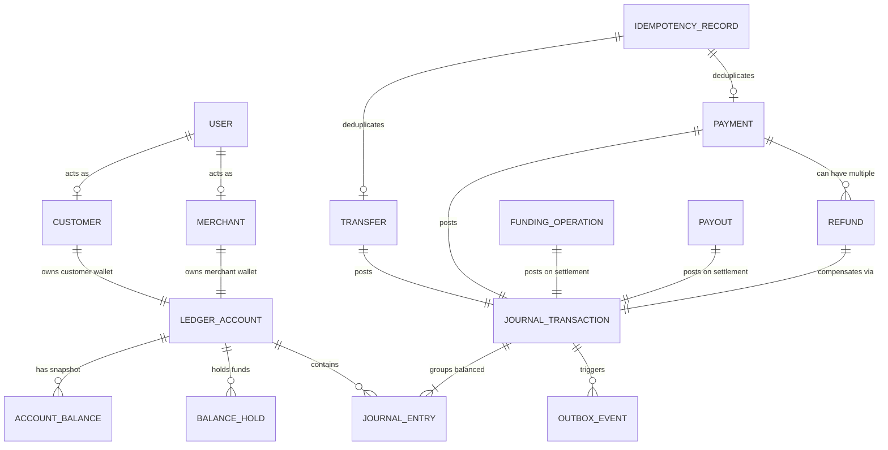

# LedgerGuard Domain Model Specification

## 1. Core Financial & Domain Glossary

This document formalizes the domain concepts, state models, and fundamental invariants of LedgerGuard.

---

### Identity & Actor Concepts

- **User**: The root security principal representing an authenticated entity in the platform. Users hold credentials and authenticate via JWT tokens.
- **Customer**: A User role representing an individual end-user who owns a personal wallet account, executes peer-to-peer transfers, deposits funds, and purchases goods/services.
- **Merchant**: A User role representing a commercial entity with a merchant settlement wallet, capable of accepting customer payments and initiating refunds.
- **Operations User (OPS)**: An administrative principal authorized to inspect system integrity, review discrepancies, monitor outbox pipelines, and trigger the Money Integrity Failure Lab.

---

### Double-Entry Accounting Concepts

- **Ledger Account (`ledger_accounts`)**: The fundamental unit of financial recording. Each account belongs to a classification (`ASSET`, `LIABILITY`, `REVENUE`, `EXPENSE`, `EQUITY`) and a specific type:
  - `CUSTOMER_WALLET`: Liability of the platform to a customer.
  - `MERCHANT_WALLET`: Liability of the platform to a merchant.
  - `PSP_CLEARING`: Asset representing in-transit funds held by an external banking/PSP partner.
  - `PLATFORM_RESERVE`: Asset/Equity backing initial or baseline platform liquidity.
  - `PLATFORM_FEES`: Revenue earned from transaction processing fees.
- **Journal Transaction (`journal_transactions`)**: An immutable atomic financial transaction grouping two or more balanced journal entries. It possesses a status (`POSTED`, `REVERSED`), a timestamp, and a transaction type (e.g., `TRANSFER`, `PAYMENT`, `REFUND`, `DEPOSIT`, `WITHDRAWAL`).
- **Journal Entry (`journal_entries`)**: An individual line item within a journal transaction. Every entry targets exactly one `ledger_account`, carries a monetary amount, and specifies an entry type (`DEBIT` or `CREDIT`).
- **Debit & Credit Rules**:
  - In our double-entry framework, asset accounts increase with Debits and decrease with Credits.
  - Liability and revenue accounts increase with Credits and decrease with Debits.
- **Money Value Object**: Represents a financial quantity defined by a standard ISO-4217 Currency (e.g., `INR`) and an exact integer quantity in minor units (e.g., paise, stored as a 64-bit signed integer `BIGINT`). Floating-point types (`float`, `double`) are strictly prohibited.

---

### Balances & Holds

- **Wallet**: An application-facing domain projection combining an owned `ledger_accounts` row and its derived `ledger_balance_snapshots` row. Each `CUSTOMER` or `MERCHANT` user possesses at most one owned wallet account (enforced via partial unique index). OPS users do not have wallets.
- **Account Balance Snapshot (`ledger_balance_snapshots`)**: A high-performance read-optimized derived snapshot reflecting the current state of a ledger account. Maintained atomically via PostgreSQL triggers on journal posting:
  - CREDIT-normal accounts (`CUSTOMER`, `MERCHANT`, `PLATFORM_FEES`): $\text{Balance} = \sum \text{Credits} - \sum \text{Debits}$
  - DEBIT-normal accounts (`PSP_CLEARING`, `PLATFORM_RESERVE`): $\text{Balance} = \sum \text{Debits} - \sum \text{Credits}$
- **Posted Balance**: The settled, historical sum of all debits and credits posted to an account up to the present moment.
- **Balance Hold (`balance_holds`)**: A temporary reservation of funds on a specific account (e.g., for an in-flight withdrawal or pending authorization). Holds prevent double-spending without immediately mutating posted ledger balances.
  - States: `ACTIVE`, `CONSUMED`, `RELEASED`, `EXPIRED`.
- **Available Balance**: The spendable balance calculated dynamically as:
  $$\text{Available Balance} = \text{Posted Balance} - \sum \text{Active Holds}$$

---

### Business Transactions

- **Transfer (`transfers`)**: A peer-to-peer internal fund movement between two `CUSTOMER_WALLET` accounts, debited from the sender and credited to the recipient atomically.
- **Payment (`payments`)**: A commercial transaction between a `CUSTOMER_WALLET` and a `MERCHANT_WALLET`, with dedicated metadata, payment lifecycle states (`CREATED`, `PROCESSING`, `SUCCEEDED`, `FAILED`), and optional platform fee splits.
- **Refund (`refunds`)**: A full or partial reversal of a previously settled payment. Refunds generate new compensating journal entries and enforce the invariant that $\sum \text{Refunds} \le \text{Original Payment Amount}$.
- **Funding Operation (`funding_operations`)**: An inflow of funds from an external bank or PSP into a `CUSTOMER_WALLET` (PSP Clearing $\to$ Customer Wallet).
- **Payout (`payouts`)**: An outflow of funds from a `CUSTOMER_WALLET` or `MERCHANT_WALLET` to an external bank account (Wallet $\to$ PSP Clearing), secured with balance holds during transit.

---

### Reliability & Operational Infrastructure

- **Idempotency Record (`idempotency_records`)**: An atomic persistence record mapping `(actor_user_id, operation, idempotency_key)` to a cryptographic SHA-256 request fingerprint, lifecycle status (`IN_PROGRESS`, `COMPLETED`), and committed result identifier (`result_id UUID`). Completed records are immutable.
- **Outbox Event (`outbox_events`)**: A reliable message buffer written inside the primary business database transaction and published asynchronously to Kafka via `FOR UPDATE SKIP LOCKED`.
- **Provider Operation (`provider_operations`)**: Tracks the state of an external call initiated to the PSP simulator, including attempt history, latency, and provider reference IDs.
- **Provider Event (`provider_events`)**: An immutable log of inbound webhooks received from the PSP simulator, enforcing signature verification and deduplication.
- **Reconciliation Run (`reconciliation_runs`) & Reconciliation Item (`reconciliation_items`)**: Records the execution, findings, discrepancy classification (`MATCH`, `MISSING_INTERNAL`, `MISSING_EXTERNAL`, `AMOUNT_MISMATCH`), and resolution actions of automated reconciliation jobs.
- **Audit Event (`audit_events`)**: An immutable, append-only operational log recording administrative decisions (manual reconciliation, account freeze/unfreeze, system reconfigurations).

---

## 2. Conceptual Relationships Diagram

---

## 3. Fundamental Domain Invariants

### Invariant 1: The Balanced Double-Entry Rule
Every posted journal transaction $T$ must satisfy:
$$\sum_{e \in T, e.\text{type} = \text{DEBIT}} e.\text{amount} = \sum_{e \in T, e.\text{type} = \text{CREDIT}} e.\text{amount}$$
An unbalanced transaction must be rejected by the posting engine with an immediate database rollback.

### Invariant 2: Immutability of Posted Financial History
- No `UPDATE` or `DELETE` SQL operations are permitted on `journal_transactions` or `journal_entries`.
- Erroneous or canceled transactions must be reversed by creating a new `JOURNAL_TRANSACTION` with opposing credit/debit entries.

### Invariant 3: Single-Currency Transaction Consistency
All entries within a single `journal_transaction` must share the exact same currency code. Multi-currency transactions or FX conversions are outside the boundary of a single journal entry posting.

### Invariant 4: Demonstration Currency Standard
- While the domain structures support standard ISO-4217 currency codes, the default demonstration currency is **Indian Rupee (`INR`)**.
- Monetary amounts are represented internally in **paise** (1 INR = 100 paise).
- Business logic is written agnostically to support arbitrary standard currencies without hard-coded currency-specific math.

### Invariant 5: Overdraft Prevention & Transfer Spending Bounds
- **Transfer Spending Decision (Phase 11)**: Internal wallet transfers (`TransferService`) acquire deterministic row-level locks on `LedgerBalanceSnapshot` and enforce `sourceSnapshot.balanceMinor >= transferAmountMinor`. If balance is insufficient, `InsufficientFundsException` is thrown, rolling back the transaction and leaving the idempotency key unpoisoned.
- **Available Balance & Holds (Phase 15 Roadmap)**: In future phases with balance holds:
$$\text{Available Balance} = \text{Posted Balance} - \sum \text{Active Holds} \ge 0$$
- **Generic Ledger vs. Transfer Service Distinction**: `LedgerPostingService` remains a pure, generic double-entry primitive without overdraft constraints (generic accounting postings may legitimately produce negative balances, e.g., fees or system adjustments). Overdraft restrictions are enforced as application-layer business rules in `TransferService`.
